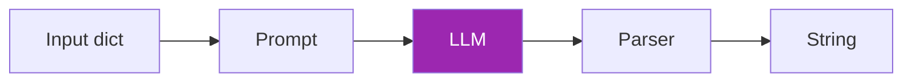

# Day 46: LangChain 🦜

<div class="lesson-meta">
⏱️ 4 ชั่วโมง &nbsp;|&nbsp; 📊 Intermediate &nbsp;|&nbsp; 📋 Prerequisites: Day 45
</div>

## 🎯 Learning Objectives

<ul class="objectives">
<li>เข้าใจ Runnable interface (core ของ LangChain)</li>
<li>เขียน LCEL (LangChain Expression Language)</li>
<li>ใช้ LangChain integrations (LLM, retriever, parser)</li>
<li>Migrate Anthropic SDK code → LangChain</li>
</ul>

---

## 1. LangChain คืออะไร

**LangChain** = framework สำหรับ compose LLM apps จาก building blocks:
- LLMs
- Prompts
- Output Parsers
- Retrievers
- Tools
- Memory
- Agents

---

## 2. Setup

```bash
pip install langchain langchain-anthropic langchain-community
```

```python
from langchain_anthropic import ChatAnthropic
from langchain_core.prompts import ChatPromptTemplate
from langchain_core.output_parsers import StrOutputParser

llm = ChatAnthropic(model="claude-sonnet-4-6")
```

---

## 3. Runnable — Building Block

ทุกอย่างใน LangChain เป็น `Runnable` — interface เดียวกัน

```python
# Runnable มี method ทั่วไป:
result = llm.invoke("Hello")           # sync
result = await llm.ainvoke("Hello")    # async
result = llm.stream("Hello")            # streaming
results = llm.batch(["q1", "q2"])      # parallel
```

---

## 4. LCEL — Compose ด้วย `|`

LCEL = chaining ด้วย `|` (Unix pipe)

```python
prompt = ChatPromptTemplate.from_template("Summarize: {text}")
parser = StrOutputParser()

# Chain = prompt → llm → parser
chain = prompt | llm | parser

result = chain.invoke({"text": "Long article here..."})
```

### เห็นภาพ:



---

## 5. ตัวอย่าง: RAG ด้วย LangChain

```python
from langchain_community.vectorstores import Qdrant
from langchain_huggingface import HuggingFaceEmbeddings
from langchain_core.runnables import RunnablePassthrough

# 1. Setup vector store
embeddings = HuggingFaceEmbeddings(model_name="all-mpnet-base-v2")
vectorstore = Qdrant.from_texts(my_docs, embeddings, location=":memory:")
retriever = vectorstore.as_retriever(search_kwargs={"k": 3})

# 2. RAG chain
rag_prompt = ChatPromptTemplate.from_template("""
Answer based on context. If not in context, say so.

Context: {context}
Question: {question}
""")

def format_docs(docs):
    return "\n\n".join(d.page_content for d in docs)

rag_chain = (
    {"context": retriever | format_docs, "question": RunnablePassthrough()}
    | rag_prompt
    | llm
    | StrOutputParser()
)

print(rag_chain.invoke("What is X?"))
```

→ 10 บรรทัด vs ~50 บรรทัดถ้าเขียน raw

---

## 6. Parallelism

```python
from langchain_core.runnables import RunnableParallel

# Run 2 chains parallel
analysis = RunnableParallel(
    sentiment=sentiment_chain,
    summary=summary_chain,
    keywords=keywords_chain,
)

result = analysis.invoke({"text": article})
# {"sentiment": "positive", "summary": "...", "keywords": [...]}
```

---

## 7. Memory & Conversation

```python
from langchain_core.runnables.history import RunnableWithMessageHistory
from langchain_community.chat_message_histories import ChatMessageHistory

store = {}
def get_history(session_id):
    if session_id not in store:
        store[session_id] = ChatMessageHistory()
    return store[session_id]

chain_with_history = RunnableWithMessageHistory(
    chain,
    get_history,
    input_messages_key="question",
    history_messages_key="history"
)

chain_with_history.invoke(
    {"question": "Who is the manager?"},
    config={"configurable": {"session_id": "user-123"}}
)
```

---

## 8. Streaming + Observability

```python
# Streaming
for chunk in rag_chain.stream({"question": "..."}):
    print(chunk, end="")

# LangSmith tracing (env var: LANGCHAIN_TRACING_V2=true)
# ทุก call จะ trace อัตโนมัติบน smith.langchain.com
```

---

## 9. When LangChain Hurts

| ❌ Anti-pattern | ✅ Better |
|----------------|----------|
| Use LangChain for single LLM call | Raw SDK |
| Use LangChain for stateful loop | LangGraph |
| Use LangChain for RAG-heavy app | LlamaIndex |
| Use LangChain because trendy | Pick framework after pain |

!!! warning "ระวัง"
    LangChain มี API ใหญ่และ breaking changes บ่อย — pin version และ test ก่อน upgrade

---

## 🛠️ Hands-on Exercise

!!! example "Exercise 1: Migrate"
    เอา Day 35 RAG ของคุณ → rewrite ด้วย LangChain → compare LOC

!!! example "Exercise 2: Parallel Chain"
    Build chain ที่ทำ 3 things parallel:
    1. Sentiment
    2. Summary
    3. Keywords

!!! example "Exercise 3: Conversational RAG"
    เพิ่ม memory ให้ RAG chain → ลอง multi-turn conversation

---

## ✅ Self-Check Quiz

<div class="quiz">

**Q1:** Runnable interface คืออะไร?

??? success "ดูคำตอบ"
    Interface unified ที่ทุก component (LLM, retriever, parser) implement — มี `invoke`, `stream`, `batch` ฯลฯ ทำให้ compose ด้วย `|` ได้

**Q2:** เมื่อไหร่ "ไม่ควร" ใช้ LangChain?

??? success "ดูคำตอบ"
    - Simple single-call app
    - Highly stateful workflow (ใช้ LangGraph แทน)
    - RAG-heavy ที่ต้อง advanced retrieval (ใช้ LlamaIndex)
    - ต้องการ minimal dependency

</div>

---

## 🔍 Cross-check & References

- 📘 [LangChain docs](https://python.langchain.com/)
- 📘 [LCEL Cookbook](https://python.langchain.com/docs/expression_language/cookbook/)
- 📺 [LangChain for LLM App Development (DLAI)](https://www.deeplearning.ai/courses/langchain)

[ต่อไป → Day 47: LangGraph :material-arrow-right:](day-47.md){ .md-button .md-button--primary }
