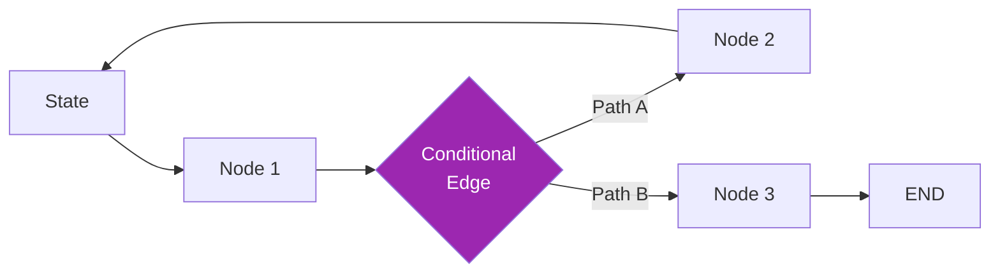
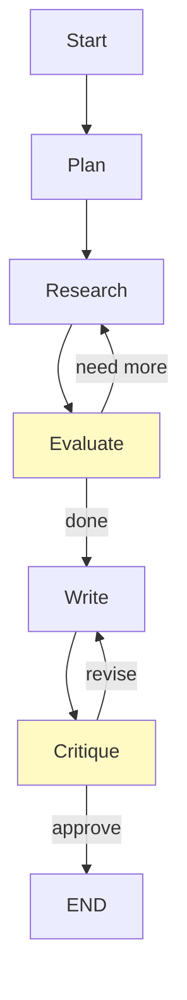

# Day 47: LangGraph 🔀

<div class="lesson-meta">
⏱️ 4 ชั่วโมง &nbsp;|&nbsp; 📊 Advanced &nbsp;|&nbsp; 📋 Prerequisites: Day 46
</div>

## 🎯 Learning Objectives

<ul class="objectives">
<li>เข้าใจว่า LangGraph แก้ปัญหา LangChain LCEL ตรงไหน</li>
<li>Build stateful graph workflow</li>
<li>Implement cycles, branches, conditional edges</li>
<li>Human-in-the-loop pattern</li>
</ul>

---

## 1. ทำไมต้อง LangGraph

LCEL ดีสำหรับ **linear pipeline** — แต่ agent workflows ต้องการ:
- **Cycles** (loop จนเจอเงื่อนไข)
- **Branches** (if-then-else)
- **State** (memory ระหว่าง steps)
- **Pause** (human-in-the-loop)

LangGraph = **DAG/state machine** สำหรับ workflows

---

## 2. Core Concepts



| Concept | คือ |
|---------|----|
| **State** | TypedDict ที่ pass ระหว่าง nodes |
| **Node** | Function ที่รับ state → return state update |
| **Edge** | Connection — direct หรือ conditional |
| **Graph** | Compiled to executable |

---

## 3. ตัวอย่างพื้นฐาน

```bash
pip install langgraph langchain-anthropic
```

```python
from typing import TypedDict, Annotated
from langgraph.graph import StateGraph, END
from langchain_anthropic import ChatAnthropic
from langchain_core.messages import HumanMessage

class AgentState(TypedDict):
    question: str
    answer: str
    iteration: int

llm = ChatAnthropic(model="claude-sonnet-4-6")

def think(state: AgentState) -> AgentState:
    resp = llm.invoke([HumanMessage(content=state["question"])])
    return {"answer": resp.content, "iteration": state["iteration"] + 1}

def review(state: AgentState) -> str:
    # ตัดสินใจ next step
    if state["iteration"] >= 3 or "complete" in state["answer"].lower():
        return "end"
    return "think_again"

# Build graph
workflow = StateGraph(AgentState)
workflow.add_node("think", think)
workflow.set_entry_point("think")
workflow.add_conditional_edges("think", review, {
    "end": END,
    "think_again": "think"
})

app = workflow.compile()
result = app.invoke({"question": "What is 2+2?", "answer": "", "iteration": 0})
```

---

## 4. Realistic Example: Research Agent



```python
class ResearchState(TypedDict):
    topic: str
    plan: list[str]
    findings: list[dict]
    draft: str
    feedback: str
    iterations: int

def plan(state):
    # Generate research plan
    resp = llm.invoke([HumanMessage(content=f"Plan research on: {state['topic']}. List 5 subtopics.")])
    return {"plan": parse_list(resp.content)}

def research(state):
    # Research next subtopic
    next_topic = state["plan"][len(state["findings"])]
    finding = do_web_research(next_topic)  # using web_search
    return {"findings": state["findings"] + [finding]}

def evaluate_research(state) -> str:
    if len(state["findings"]) >= len(state["plan"]):
        return "write"
    return "research"

def write(state):
    resp = llm.invoke([HumanMessage(content=f"Write report on {state['topic']} using: {state['findings']}")])
    return {"draft": resp.content}

def critique(state):
    resp = llm.invoke([HumanMessage(content=f"Critique this draft. Output FEEDBACK or DONE.\n\n{state['draft']}")])
    return {"feedback": resp.content, "iterations": state["iterations"] + 1}

def critique_decision(state) -> str:
    if "DONE" in state["feedback"] or state["iterations"] >= 3:
        return "end"
    return "revise"

# Build
g = StateGraph(ResearchState)
g.add_node("plan", plan)
g.add_node("research", research)
g.add_node("write", write)
g.add_node("critique", critique)

g.set_entry_point("plan")
g.add_edge("plan", "research")
g.add_conditional_edges("research", evaluate_research, {"research": "research", "write": "write"})
g.add_edge("write", "critique")
g.add_conditional_edges("critique", critique_decision, {"revise": "write", "end": END})

app = g.compile()
```

---

## 5. Human-in-the-Loop

```python
from langgraph.checkpoint.memory import MemorySaver

memory = MemorySaver()
app = g.compile(checkpointer=memory, interrupt_before=["critique"])

# Run จน pause ที่ critique
config = {"configurable": {"thread_id": "session-1"}}
state = app.invoke(initial_state, config)

# คนรีวิว draft แล้ว → resume
print(state["draft"])
input_review = input("Approve? (y/n): ")

if input_review == "y":
    # update state แล้ว continue
    app.update_state(config, {"feedback": "DONE"})
    final = app.invoke(None, config)
```

---

## 6. Visualization

```python
# แสดง graph ของคุณ
from IPython.display import Image
Image(app.get_graph().draw_mermaid_png())
```

→ ได้ diagram ของ workflow ตรงๆ — debug ง่าย

---

## 7. Use Cases

| Use case | LangGraph fits? |
|----------|----------------|
| Linear pipeline (in→LLM→out) | ❌ ใช้ LCEL |
| Agent ที่ loop | ✅ |
| Multi-step approval workflow | ✅ |
| Multi-agent ที่คุยกัน | ✅✅ (เก่งสุด) |
| Stateful chatbot ที่จำ session | ✅ |

---

## 🛠️ Hands-on Exercise

!!! example "Exercise 1: Conversion"
    Convert agent ของ Day 23 → LangGraph

!!! example "Exercise 2: Plan-Execute-Reflect"
    Build graph 4 nodes: Plan → Execute → Reflect → loop or END

!!! example "Exercise 3: Approval Workflow"
    Build workflow ที่ pause ให้ human approve ก่อน send email

---

## ✅ Self-Check Quiz

<div class="quiz">

**Q1:** State ใน LangGraph คืออะไร?

??? success "ดูคำตอบ"
    TypedDict ที่ส่งระหว่าง nodes — แต่ละ node อ่าน + return partial update; LangGraph merge ให้

**Q2:** ความต่างระหว่าง edge และ conditional_edge?

??? success "ดูคำตอบ"
    - `add_edge(a, b)` = always go from a to b
    - `add_conditional_edges(a, fn, mapping)` = ตาม fn ตัดสินใจ next node

**Q3:** Checkpointer ใช้ทำอะไร?

??? success "ดูคำตอบ"
    Persist state ของแต่ละ thread → resume ได้, human-in-the-loop, time-travel debugging

</div>

---

## 🔍 Cross-check & References

- 📘 [LangGraph docs](https://langchain-ai.github.io/langgraph/)
- 📺 [AI Agents in LangGraph (DLAI)](https://www.deeplearning.ai/courses/ai-agents-in-langgraph)
- 📦 [LangGraph examples](https://github.com/langchain-ai/langgraph/tree/main/examples)

[ต่อไป → Day 48: LlamaIndex :material-arrow-right:](day-48.md){ .md-button .md-button--primary }
