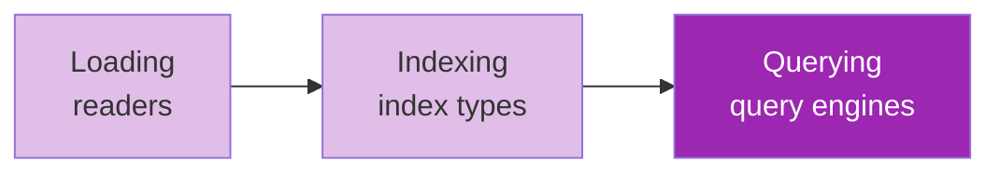

# Day 48: LlamaIndex 🦙

<div class="lesson-meta">
⏱️ 4 ชั่วโมง &nbsp;|&nbsp; 📊 Intermediate &nbsp;|&nbsp; 📋 Prerequisites: Day 45, Week 5-6
</div>

## 🎯 Learning Objectives

<ul class="objectives">
<li>เข้าใจ LlamaIndex architecture (data → index → query)</li>
<li>รู้จัก index types หลายๆ แบบ</li>
<li>Build agentic RAG ด้วย LlamaIndex</li>
<li>เห็นจุดแข็งเหนือ LangChain ในด้าน RAG</li>
</ul>

---

## 1. LlamaIndex คืออะไร

**LlamaIndex** = framework ที่ design first-class สำหรับ **RAG**

ต่างจาก LangChain ตรงไหน:
- LangChain = generic LLM framework
- LlamaIndex = RAG framework — มี abstraction ที่ลึกกว่าใน data layer

---

## 2. 3 Stages — RAG Lifecycle



---

## 3. Setup

```bash
pip install llama-index llama-index-llms-anthropic llama-index-embeddings-huggingface
```

```python
from llama_index.llms.anthropic import Anthropic
from llama_index.embeddings.huggingface import HuggingFaceEmbedding
from llama_index.core import Settings

Settings.llm = Anthropic(model="claude-sonnet-4-6")
Settings.embed_model = HuggingFaceEmbedding(model_name="all-mpnet-base-v2")
```

---

## 4. Quick Start

```python
from llama_index.core import VectorStoreIndex, SimpleDirectoryReader

# 1. Load
docs = SimpleDirectoryReader("data/").load_data()

# 2. Index
index = VectorStoreIndex.from_documents(docs)

# 3. Query
engine = index.as_query_engine()
print(engine.query("What is X?"))
```

**3 บรรทัด** สำหรับ RAG end-to-end!

---

## 5. Index Types

| Index | Use |
|-------|-----|
| **VectorStoreIndex** | Standard semantic search |
| **SummaryIndex** | Sequential queries over all docs |
| **TreeIndex** | Hierarchical retrieval |
| **KeywordTableIndex** | Keyword-based (sparse retrieval) |
| **KnowledgeGraphIndex** | Auto-build KG จาก docs |
| **PropertyGraphIndex** | Modern KG with metadata |

---

## 6. Advanced: Composable Query Engines

```python
from llama_index.core.query_engine import RouterQueryEngine
from llama_index.core.tools import QueryEngineTool

# 1. Sub-indexes
finance_idx = VectorStoreIndex.from_documents(finance_docs)
engineering_idx = VectorStoreIndex.from_documents(eng_docs)
legal_idx = VectorStoreIndex.from_documents(legal_docs)

# 2. Wrap as tools
tools = [
    QueryEngineTool.from_defaults(finance_idx.as_query_engine(),
                                  description="Finance docs: budgets, revenue, costs"),
    QueryEngineTool.from_defaults(engineering_idx.as_query_engine(),
                                  description="Engineering docs: architecture, code, RFCs"),
    QueryEngineTool.from_defaults(legal_idx.as_query_engine(),
                                  description="Legal: contracts, policies, compliance"),
]

# 3. Router picks the right one
router = RouterQueryEngine.from_defaults(query_engine_tools=tools)
print(router.query("What's our Q3 revenue forecast?"))  # → finance
```

---

## 7. Agentic RAG ใน LlamaIndex

```python
from llama_index.core.agent import FunctionCallingAgent

agent = FunctionCallingAgent.from_tools(
    tools=tools,  # query engine tools + external tools
    llm=Settings.llm,
    system_prompt="You are a research assistant. Use multiple tools as needed.",
    verbose=True
)

response = agent.chat("Compare Q3 revenue with engineering headcount growth")
# agent อาจเรียก finance tool + engineering tool + synthesize
```

---

## 8. Workflows (LlamaIndex's "LangGraph")

LlamaIndex มี **Workflows** — event-driven analogue:

```python
from llama_index.core.workflow import (
    Workflow, step, Event, StartEvent, StopEvent
)

class ResearchEvent(Event):
    topic: str

class MyWorkflow(Workflow):
    @step
    async def plan(self, ev: StartEvent) -> ResearchEvent:
        return ResearchEvent(topic="Plan finished")
    
    @step
    async def research(self, ev: ResearchEvent) -> StopEvent:
        return StopEvent(result="Done")

result = await MyWorkflow().run()
```

---

## 9. LlamaIndex vs LangChain — Quick Compare

| Feature | LlamaIndex | LangChain |
|---------|-----------|-----------|
| RAG depth | ✅✅ deep | ✅ ok |
| Stateful workflow | ✅ Workflows | ✅✅ LangGraph |
| Integrations | ✅ 200+ | ✅✅ 800+ |
| Community | medium | large |
| Multi-modal | ✅✅ | ✅ |
| Knowledge Graph native | ✅✅ | partial |

---

## 🛠️ Hands-on Exercise

!!! example "Exercise 1: Quick Start"
    Index folder docs → query 5 คำถาม

!!! example "Exercise 2: Router"
    สร้าง 3 query engines (3 domain) + RouterQueryEngine → ทดสอบ routing

!!! example "Exercise 3: Agent"
    Build agent ที่ใช้ 2 query engines + web_search → multi-source answer

---

## ✅ Self-Check Quiz

<div class="quiz">

**Q1:** เมื่อไหร่ LlamaIndex ดีกว่า LangChain?

??? success "ดูคำตอบ"
    เมื่อ app เป็น RAG-heavy — มี index types หลายแบบและ retrieval patterns ที่สำเร็จรูปกว่า

**Q2:** Composable Query Engine คืออะไร?

??? success "ดูคำตอบ"
    Query engine ที่ประกอบจาก sub-engines — router ตัดสินใจส่ง query ไปที่ engine ไหน หรือ aggregate ผลจากหลายๆ engine

</div>

---

## 🔍 Cross-check & References

- 📘 [LlamaIndex docs](https://docs.llamaindex.ai/)
- 📺 [Building Agentic RAG with LlamaIndex (DLAI)](https://www.deeplearning.ai/courses/building-agentic-rag-with-llamaindex)
- 📦 [LlamaIndex examples](https://github.com/run-llama/llama_index/tree/main/docs/docs/examples)

[ต่อไป → Day 49: DSPy :material-arrow-right:](day-49.md){ .md-button .md-button--primary }
