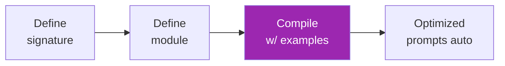

# Day 49: DSPy 🧪

<div class="lesson-meta">
⏱️ 3 ชั่วโมง &nbsp;|&nbsp; 📊 Advanced &nbsp;|&nbsp; 📋 Prerequisites: Day 46
</div>

## 🎯 Learning Objectives

<ul class="objectives">
<li>เข้าใจ paradigm shift: "เขียน program ไม่ใช่ prompts"</li>
<li>ใช้ DSPy Signatures + Modules</li>
<li>Compile/optimize ด้วย teleprompter</li>
<li>เห็นเมื่อไหร่ DSPy ดีกว่า manual prompt</li>
</ul>

---

## 1. ปัญหาของ Manual Prompting

```python
# เขียน prompt ดีๆ ใช้เวลานาน, manual tuning
prompt = """You are a expert classifier. Given a sentence, 
return one of: positive, negative, neutral.

Examples:
- "Love it" → positive
- "Terrible" → negative
...

Sentence: {input}
Label:"""
```

ปัญหา:
- Manual trial-error
- เปลี่ยน model = ต้อง retune prompt
- ไม่ scale กับหลาย task
- Examples ที่เลือกอาจ suboptimal

---

## 2. DSPy Paradigm



→ **คุณบอก "อะไร" — DSPy คิด "อย่างไร"**

---

## 3. Setup

```bash
pip install dspy-ai
```

```python
import dspy

lm = dspy.Claude(model="claude-sonnet-4-6")
dspy.settings.configure(lm=lm)
```

---

## 4. Signature — "What"

```python
class SentimentClassify(dspy.Signature):
    """Classify sentiment of a sentence."""
    sentence = dspy.InputField()
    sentiment = dspy.OutputField(desc="one of: positive, negative, neutral")
```

→ Declarative — ไม่ใช่ imperative prompt

---

## 5. Module — "How"

```python
classifier = dspy.Predict(SentimentClassify)
result = classifier(sentence="The food was great!")
print(result.sentiment)  # → "positive"
```

Modules ที่มี:
| Module | Use |
|--------|-----|
| `Predict` | Simple input→output |
| `ChainOfThought` | Auto-add reasoning step |
| `ProgramOfThought` | Generate code → execute |
| `ReAct` | Reasoning + tool use |
| `MultiChainComparison` | Multiple reasoning paths |

```python
# CoT version (auto)
cot_classifier = dspy.ChainOfThought(SentimentClassify)
result = cot_classifier(sentence="...")
print(result.rationale)  # → "I think this is positive because..."
print(result.sentiment)
```

---

## 6. Compile — Optimize Prompts Auto

```python
from dspy.teleprompt import BootstrapFewShot

# 1. Train set
trainset = [
    dspy.Example(sentence="Love it", sentiment="positive").with_inputs("sentence"),
    dspy.Example(sentence="Terrible", sentiment="negative").with_inputs("sentence"),
    # 10-30 examples
]

# 2. Metric
def metric(gold, pred, trace=None):
    return gold.sentiment == pred.sentiment

# 3. Compile
teleprompter = BootstrapFewShot(metric=metric, max_bootstrapped_demos=4)
compiled = teleprompter.compile(cot_classifier, trainset=trainset)

# Now use compiled version
result = compiled(sentence="The service was rude")
```

→ DSPy auto-selects best few-shot examples + reasoning steps

---

## 7. Multi-step Programs

```python
class RAGSignature(dspy.Signature):
    """Answer question using context."""
    context = dspy.InputField()
    question = dspy.InputField()
    answer = dspy.OutputField()

class RAGProgram(dspy.Module):
    def __init__(self):
        self.retrieve = dspy.Retrieve(k=3)
        self.answer = dspy.ChainOfThought(RAGSignature)
    
    def forward(self, question):
        context = self.retrieve(question).passages
        return self.answer(context=context, question=question)

rag = RAGProgram()
result = rag("What is X?")
```

---

## 8. Why DSPy

| Pain | DSPy fixes by |
|------|---------------|
| Manual tuning | Auto-optimization with metric |
| Model change → re-tune | Recompile, signature stays |
| Inconsistent quality | Systematic improvement |
| No version control of prompts | Compiled program is the artifact |

---

## 9. When NOT to use DSPy

- Single LLM call ที่ prompt ชัด
- Task without easy metric (creative writing)
- Team ไม่คุ้น declarative style
- No labeled examples to compile with

---

## 🛠️ Hands-on Exercise

!!! example "Exercise 1: First Signature"
    Define signature สำหรับ task ที่คุณทำบ่อย → ใช้ Predict + ChainOfThought

!!! example "Exercise 2: Compile"
    เตรียม 20 examples → compile → เปรียบเทียบ accuracy uncompiled vs compiled

!!! example "Exercise 3: RAG Program"
    Build RAGProgram + compile กับ Q&A pairs

---

## ✅ Self-Check Quiz

<div class="quiz">

**Q1:** DSPy "compile" คืออะไร?

??? success "ดูคำตอบ"
    Process ที่ DSPy ใช้ training set + metric เพื่อหา prompts/demonstrations ที่ดีที่สุด — analogous to compiling code, output คือ optimized program

**Q2:** Signature ต่างจาก prompt ยังไง?

??? success "ดูคำตอบ"
    - **Prompt**: imperative text "Do X with these examples"
    - **Signature**: declarative "Input is X, output is Y" — DSPy generate prompt ให้

</div>

---

## 🔍 Cross-check & References

- 📘 [DSPy docs](https://dspy.ai/)
- 📺 [DSPy: Build and Optimize Agentic Apps (DLAI)](https://www.deeplearning.ai/courses/dspy-build-optimize-agentic-apps)
- 📄 [DSPy paper](https://arxiv.org/abs/2310.03714)

[ต่อไป → Day 50: Pydantic :material-arrow-right:](day-50.md){ .md-button .md-button--primary }
