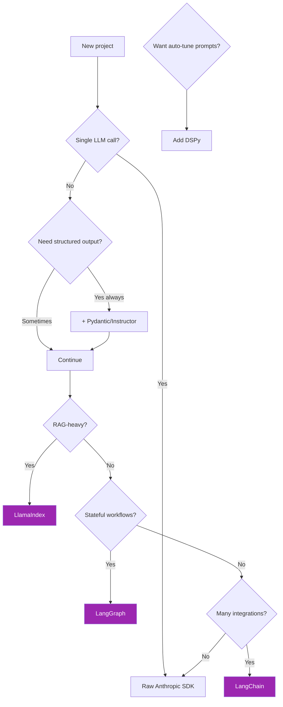
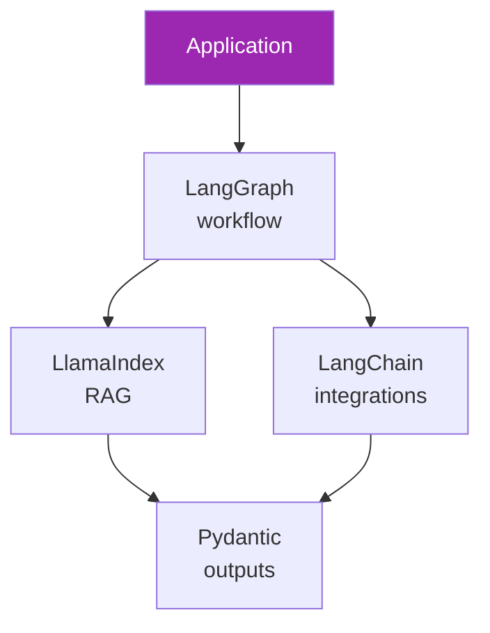
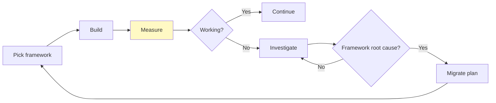

# Day 51: Framework Decision Matrix 📊

<div class="lesson-meta">
⏱️ 3 ชั่วโมง &nbsp;|&nbsp; 📊 Strategic &nbsp;|&nbsp; 📋 Prerequisites: Day 45-50
</div>

## 🎯 Learning Objectives

<ul class="objectives">
<li>มี decision framework ในการเลือก stack</li>
<li>เข้าใจ trade-offs ของแต่ละ framework</li>
<li>สามารถ defend choice ใน architecture review</li>
</ul>

---

## 1. Decision Tree (high-level)



---

## 2. Comparison Matrix

| Criterion | Raw SDK | Pydantic | DSPy | LangChain | LangGraph | LlamaIndex |
|-----------|---------|----------|------|-----------|-----------|-----------|
| Learning curve | ⭐ | ⭐⭐ | ⭐⭐⭐⭐ | ⭐⭐⭐ | ⭐⭐⭐⭐ | ⭐⭐⭐ |
| Boilerplate | High | Low | Low | Low | Med | Low |
| Type safety | ❌ | ✅✅ | ✅ | ⚠️ | ⚠️ | ⚠️ |
| RAG depth | DIY | DIY | OK | OK | DIY | ✅✅ |
| Stateful workflow | DIY | n/a | n/a | ⚠️ | ✅✅ | ✅ |
| Multi-agent | DIY | n/a | n/a | ✅ | ✅✅ | ✅ |
| Auto-prompt optimize | ❌ | ❌ | ✅✅ | ❌ | ❌ | ❌ |
| Vendor lock-in | None | None | Low | Med | Med | Low |
| Production-grade | ✅ | ✅ | ⚠️ early | ⚠️ unstable | ✅ | ✅ |
| Community size | Med | Huge | Small | Huge | Med | Med |

---

## 3. By Project Archetype

### Archetype A: Simple Customer Support Bot

**Need:** Q&A from FAQ + escalate when unsure  
**Stack:** Raw SDK + Pydantic for structured output

```python
# 50 lines of code is fine
client = Anthropic()
def respond(question): ...
def should_escalate(question, answer): ...
```

### Archetype B: Enterprise RAG Assistant

**Need:** Search 10K docs across teams, with citations  
**Stack:** LlamaIndex + Pydantic + Cohere Rerank

→ LlamaIndex มี Router, MultiModalIndex, ฯลฯ — productive ตั้งแต่วันแรก

### Archetype C: Multi-Step Agent (Code Review)

**Need:** Read PR → analyze → suggest → critique → finalize  
**Stack:** LangGraph + Pydantic + Anthropic SDK

→ LangGraph จัดการ state + branches + retry ได้ดี

### Archetype D: Classification System (10K queries/day)

**Need:** Categorize tickets with high accuracy  
**Stack:** DSPy + small model (Haiku)

→ DSPy compile prompt บน training data → ราคาถูก + แม่นยำกว่า manual

### Archetype E: Multi-Tool Research Assistant

**Need:** Web + DB + KB integration  
**Stack:** LangChain + LangGraph + LlamaIndex (hybrid!)

→ ใช้แต่ละ framework ใน layer ที่มันเก่ง

---

## 4. Multi-Framework Architecture

ไม่จำเป็นต้องเลือกแค่ตัวเดียว — รวมกันได้:



---

## 5. Anti-Patterns (อย่าทำ)

| ❌ Anti-pattern | ✅ Fix |
|----------------|-------|
| Use LangChain "เพราะดูดี" | Start raw, adopt when feel pain |
| Skip Pydantic เพราะ "เรื่อง type ไม่สำคัญ" | Always use for production |
| Use 3 frameworks ใน micro-feature | Pick 1, justify trade-off |
| Stick with framework after it's clearly wrong | Reconsider every 6 months |

---

## 6. Architecture Decision Record (ADR) Template

```markdown
# ADR-002: AI Framework Selection

## Status
Accepted (2026-Q3)

## Context
We're building [project]. Need to choose AI framework stack.
- Team has 3 engineers, all Python
- Use case: [RAG / agent / classification]
- Constraints: [latency, cost, compliance]

## Decision
We will use **[chosen stack]**.

## Rationale
- [point 1]
- [point 2]
- [point 3]

## Alternatives Considered
| Option | Pro | Con |
|--------|-----|-----|
| ... | ... | ... |

## Consequences
- Lock-in to [framework] for ~2 years
- Need [N] hours team training
- Compatible with our [other tooling]
```

---

## 7. Continuous Review



ดูทุก quarter:
- Cost per request
- Latency P95
- Dev velocity (story points/sprint)
- Bug rate
- Team satisfaction

---

## 🛠️ Hands-on Exercise

!!! example "Exercise 1: ADR สำหรับ Real Project"
    เขียน ADR ของ project ที่กำลังทำ (จริง) → ขอเพื่อนรีวิว

!!! example "Exercise 2: Migrate"
    เลือก feature ของคุณที่ใช้ raw SDK → migrate ไป framework + benchmark

!!! example "Exercise 3: Cost-Benefit"
    คำนวณ cost migration vs benefit สำหรับ project ปัจจุบัน

---

## ✅ Week 7 Self-Check

- [x] LangChain — chains, runnables, LCEL
- [x] LangGraph — stateful workflows
- [x] LlamaIndex — RAG-first patterns
- [x] DSPy — programmatic prompts
- [x] Pydantic — type-safe outputs
- [x] Decision matrix สำหรับ enterprise

---

## 🔍 Cross-check & References

- 📘 [Anthropic Engineering — Framework choice](https://www.anthropic.com/research/building-effective-agents)
- 📺 [Pair Programming with LLMs (DLAI)](https://www.deeplearning.ai/courses/pair-programming-llm)

---

:material-check-decagram: **จบ Week 7!** คุณเลือก stack ได้แล้ว

[ต่อไป → Week 8: Cloud Platforms :material-arrow-right:](../week-08/index.md){ .md-button .md-button--primary }
