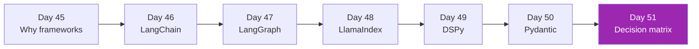

# Week 7: Frameworks Ecosystem 🧩

เมื่อ project ขึ้น scale → Anthropic SDK เปล่าๆ ไม่พอ — Week นี้ครอบคลุม 5 frameworks ที่ industry ใช้จริง

## รายวิชา

| Day | หัวข้อ | เวลา |
|-----|--------|------|
| 45 | Why frameworks vs raw SDK | 2h |
| 46 | LangChain — chains, runnables, LCEL | 4h |
| 47 | LangGraph — stateful workflows | 4h |
| 48 | LlamaIndex — index types, agents | 4h |
| 49 | DSPy — programmatic prompting | 3h |
| 50 | Pydantic + structured outputs | 3h |
| 51 | Decision matrix — เลือกตัวไหน | 3h |

## หลังจบ Week 7 คุณจะ

- [x] เลือก framework ที่เหมาะกับ project ได้
- [x] Build chain/workflow ด้วย LangGraph
- [x] Build RAG ด้วย LlamaIndex
- [x] รู้ว่าเมื่อไหร่ใช้ DSPy แทน manual prompting
- [x] ใช้ Pydantic ทำ type-safe LLM outputs

[เริ่ม Day 45 :material-arrow-right:](day-45.md){ .md-button .md-button--primary }
