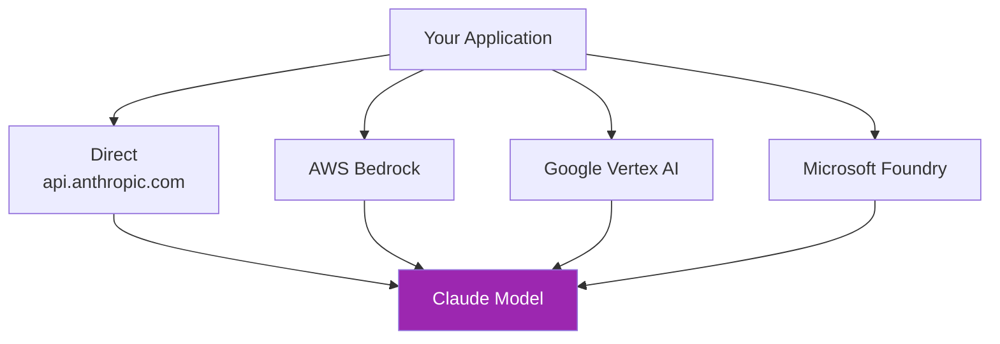
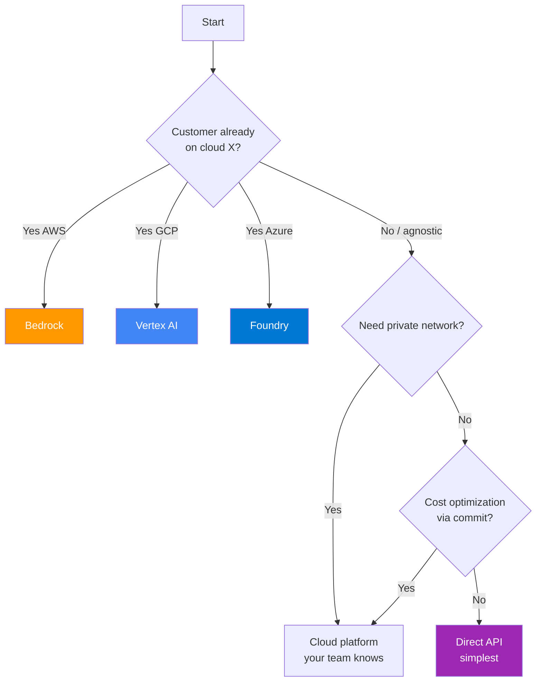
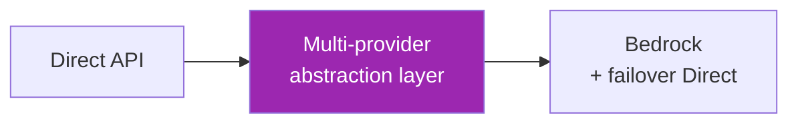

# Day 52: Architecture Options ☁️

<div class="lesson-meta">
⏱️ 3 ชั่วโมง &nbsp;|&nbsp; 📊 Strategic &nbsp;|&nbsp; 📋 Prerequisites: Day 11 (API)
</div>

## 🎯 Learning Objectives

<ul class="objectives">
<li>เห็น 4 ทางในการเข้าถึง Claude (Direct, AWS, GCP, Azure)</li>
<li>เปรียบเทียบ feature, cost, compliance, latency</li>
<li>เลือก path ที่เหมาะกับลูกค้า enterprise</li>
</ul>

---

## 1. 4 Ways to Access Claude



---

## 2. Detailed Comparison

| ด้าน | Direct API | AWS Bedrock | Vertex AI | Foundry (Azure) |
|------|-----------|-------------|-----------|-----------------|
| **Latest model first** | ✅ ที่นี่ก่อน | ⏱️ delay บ้าง | ⏱️ delay บ้าง | ⏱️ delay บ้าง |
| **Private network (PrivateLink/VPN)** | ⚠️ HTTPS only | ✅ VPC + PrivateLink | ✅ Private Service Connect | ✅ Private Endpoint |
| **Compliance (HIPAA, FedRAMP, etc.)** | partial | ✅ AWS suite | ✅ GCP suite | ✅ Azure suite |
| **Data residency** | US/EU | many regions | many regions | many regions |
| **Auth** | API key | IAM | IAM | RBAC |
| **Billing** | Anthropic | AWS | GCP | Azure |
| **Pricing** | List price | List + AWS markup | List + GCP markup | List + Azure markup |
| **Multi-model in same console** | Anthropic only | ✅ many vendors | ✅ many vendors | ✅ many vendors |
| **Cost commitment discount** | Tier system | ✅ Provisioned throughput | ✅ commitments | ✅ commitments |

---

## 3. Decision Framework



---

## 4. Use Case Examples

### Case 1: Healthcare Startup (HIPAA)
- Already on AWS
- Need HIPAA BAA → **AWS Bedrock** (Anthropic BAA via AWS)

### Case 2: SaaS Startup (Multi-region SaaS)
- Customers globally
- Want simplest setup → **Direct API** for v1, migrate to Bedrock when scale

### Case 3: Financial Services
- Strict regulatory in country (e.g. APAC)
- Data must stay in-region → **GCP Vertex AI Tokyo / AWS Bedrock APAC**

### Case 4: Enterprise on Microsoft 365
- AD-integrated, Azure-first → **Microsoft Foundry**

### Case 5: Multi-cloud Strategy
- Avoid lock-in → Wrap with **abstraction layer** (LangChain) + fallback policy

---

## 5. Total Cost of Ownership (TCO)

ไม่ใช่แค่ราคาต่อ token — รวม:

| Cost component | Notes |
|---------------|-------|
| Inference cost | Token in/out |
| Network egress | Free if same cloud, otherwise $ |
| Compute (your app) | EC2/GKE/AKS |
| Logging/monitoring | CloudWatch, Stackdriver, Log Analytics |
| Compliance audit | Cloud certifications save audit cost |
| Engineering time | Team familiar with cloud X = faster |

!!! tip "Hidden saver"
    Same-cloud deployment ลด **network egress** — สำคัญถ้า app ส่งข้อมูลใหญ่ๆ (RAG กับ long context)

---

## 6. Migration Patterns

ถ้าวันหนึ่งต้องย้าย:



ใช้ abstraction (LangChain `ChatAnthropic` vs `ChatBedrock`) → swap ได้

```python
# Today
from langchain_anthropic import ChatAnthropic
llm = ChatAnthropic(model="claude-sonnet-4-6")

# Tomorrow (same interface)
from langchain_aws import ChatBedrock
llm = ChatBedrock(model_id="anthropic.claude-sonnet-4-6-v1:0")
```

---

## 7. Latest Model Lag

ตอน Anthropic ปล่อย Opus 4.7 (พ.ค. 2026) — cloud platforms มัก delay 1-4 สัปดาห์

→ ถ้า "ต้องใช้ model ใหม่ล่าสุดเสมอ" → **Direct API**
→ ถ้า "เสถียร > ใหม่" → cloud platforms

---

## 🛠️ Hands-on Exercise

!!! example "Exercise 1: Customer Profile"
    คิด 5 customer scenarios → ตัดสินใจ path ของแต่ละ → defend

!!! example "Exercise 2: TCO Calculation"
    1M queries/month, Claude Sonnet → คำนวณ TCO บน:
    - Direct API
    - Bedrock (same VPC)
    - Vertex AI

!!! example "Exercise 3: Migration ADR"
    เขียน ADR สำหรับ migration Direct → Bedrock

---

## ✅ Self-Check Quiz

<div class="quiz">

**Q1:** เมื่อไหร่ Direct API ดีกว่า Cloud platform?

??? success "ดูคำตอบ"
    - Prototype/POC
    - ต้องใช้ model ใหม่ทันที (no delay)
    - ไม่มี compliance/network requirement
    - Single-tenant simple app

**Q2:** Hidden cost ที่คนลืม?

??? success "ดูคำตอบ"
    - Network egress (data transfer out of cloud)
    - Engineering ramp-up time for new platform
    - Monitoring/logging service cost

</div>

---

## 🔍 Cross-check & References

- 📘 [Claude on AWS Bedrock](https://claude.com/partners/claude-on-aws)
- 📘 [Claude on Vertex AI](https://claude.com/partners/google-cloud-vertex-ai)
- 📘 [Claude on Microsoft Foundry](https://claude.com/partners/microsoft-foundry)

[ต่อไป → Day 53: Bedrock setup :material-arrow-right:](day-53.md){ .md-button .md-button--primary }
