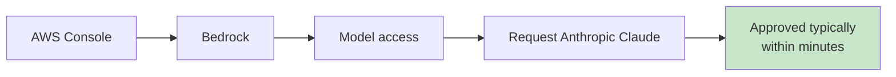
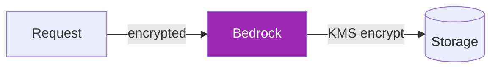
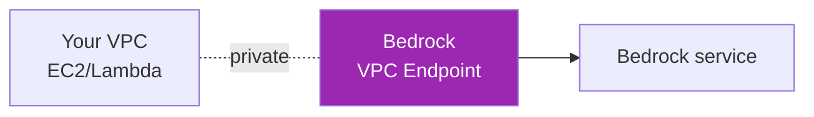

# Day 53: Claude on AWS Bedrock — Setup 🟧

<div class="lesson-meta">
⏱️ 4 ชั่วโมง &nbsp;|&nbsp; 📊 Intermediate &nbsp;|&nbsp; 📋 Prerequisites: Day 52, basic AWS
</div>

## 🎯 Learning Objectives

<ul class="objectives">
<li>เปิด Bedrock access สำหรับ Claude</li>
<li>เรียก Claude ผ่าน AWS SDK (Python)</li>
<li>Setup IAM policies + KMS encryption</li>
<li>Connect ผ่าน VPC + PrivateLink</li>
</ul>

---

## 1. Enable Model Access



Steps:
1. AWS Console → Bedrock
2. Left menu → **Model access**
3. **Modify model access** → check Anthropic Claude family
4. Submit (auto-approved สำหรับ most accounts)
5. Wait status = **Access granted**

---

## 2. Call Bedrock — Boto3

```bash
pip install boto3
```

```python
import boto3
import json

client = boto3.client("bedrock-runtime", region_name="us-east-1")

# Bedrock model IDs สำหรับ Claude
# (verify ใน Bedrock console - model IDs)
MODEL_ID = "anthropic.claude-sonnet-4-6-v1:0"  # example

body = {
    "anthropic_version": "bedrock-2023-05-31",
    "max_tokens": 1024,
    "messages": [
        {"role": "user", "content": "Hello Claude on Bedrock!"}
    ]
}

resp = client.invoke_model(
    modelId=MODEL_ID,
    body=json.dumps(body)
)

result = json.loads(resp["body"].read())
print(result["content"][0]["text"])
```

---

## 3. Converse API (Newer, Cleaner)

Bedrock มี Converse API ที่ unified ทุก vendor:

```python
client = boto3.client("bedrock-runtime", region_name="us-east-1")

resp = client.converse(
    modelId=MODEL_ID,
    messages=[
        {"role": "user", "content": [{"text": "Hello"}]}
    ],
    inferenceConfig={"maxTokens": 1024}
)

print(resp["output"]["message"]["content"][0]["text"])
```

→ **แนะนำใช้ Converse API** — เหมือนกันทุก vendor บน Bedrock

---

## 4. Streaming

```python
resp = client.converse_stream(
    modelId=MODEL_ID,
    messages=[{"role": "user", "content": [{"text": "Tell story"}]}],
    inferenceConfig={"maxTokens": 1000}
)

for event in resp["stream"]:
    if "contentBlockDelta" in event:
        text = event["contentBlockDelta"]["delta"].get("text", "")
        print(text, end="", flush=True)
```

---

## 5. IAM Policy

Minimum IAM policy สำหรับ caller:

```json
{
  "Version": "2012-10-17",
  "Statement": [
    {
      "Effect": "Allow",
      "Action": [
        "bedrock:InvokeModel",
        "bedrock:InvokeModelWithResponseStream",
        "bedrock:Converse",
        "bedrock:ConverseStream"
      ],
      "Resource": "arn:aws:bedrock:*::foundation-model/anthropic.claude-*"
    }
  ]
}
```

### Restrict by model (production)

```json
"Resource": [
  "arn:aws:bedrock:us-east-1::foundation-model/anthropic.claude-sonnet-4-6-v1:0"
]
```

---

## 6. KMS Encryption (encrypt at rest)



```python
# ใช้ customer-managed KMS key สำหรับ provisioned throughput / agents
resp = client.create_provisioned_model_throughput(
    modelUnits=1,
    provisionedModelName="my-claude-pt",
    modelId=MODEL_ID,
    customerEncryptionKeyId="arn:aws:kms:us-east-1:123:key/abc-def"
)
```

---

## 7. PrivateLink (VPC Endpoint)



Setup:
1. AWS Console → VPC → Endpoints
2. Create endpoint → service `com.amazonaws.<region>.bedrock-runtime`
3. Choose VPC + subnets
4. Security group: allow inbound 443 from your app SG
5. Policy: restrict by IAM principals (optional)

→ Traffic ไม่ออก internet เลย

---

## 8. CloudWatch Logging

```python
# Enable model invocation logging
bedrock_admin = boto3.client("bedrock")
bedrock_admin.put_model_invocation_logging_configuration(
    loggingConfig={
        "cloudWatchConfig": {
            "logGroupName": "/aws/bedrock/invocations",
            "roleArn": "arn:aws:iam::123:role/BedrockLoggingRole",
            "largeDataDeliveryS3Config": {
                "bucketName": "my-bedrock-logs",
                "keyPrefix": "claude/"
            }
        },
        "textDataDeliveryEnabled": True,
        "imageDataDeliveryEnabled": False,
        "embeddingDataDeliveryEnabled": True
    }
)
```

→ ทุก invocation จะ log ลง CloudWatch + S3 — สำคัญสำหรับ audit

---

## 9. Cost Tracking

```python
# Tag requests สำหรับ cost allocation
resp = client.converse(
    modelId=MODEL_ID,
    messages=[...],
    inferenceConfig={"maxTokens": 1024}
    # Note: requestMetadata in invoke_model body for tagging
)

# View usage:
# AWS Console → Cost Explorer → group by service: Bedrock → tag
```

---

## 🛠️ Hands-on Exercise

!!! example "Exercise 1: Hello Bedrock"
    1. Enable model access
    2. ลอง Converse API กับ "Hello"
    3. ลอง streaming

!!! example "Exercise 2: Restricted IAM"
    สร้าง user ใหม่ + IAM policy ที่ allow เฉพาะ Sonnet → ทดสอบ deny กับ Opus

!!! example "Exercise 3: VPC Endpoint"
    Setup VPC endpoint → run Lambda ใน private subnet ที่เรียก Bedrock ผ่าน endpoint → ตรวจสอบไม่ใช้ NAT

---

## ✅ Self-Check Quiz

<div class="quiz">

**Q1:** Converse API vs InvokeModel?

??? success "ดูคำตอบ"
    - InvokeModel = vendor-specific schema (Anthropic version-specific)
    - Converse = unified API across vendors — recommended for portability

**Q2:** ทำไมต้อง PrivateLink?

??? success "ดูคำตอบ"
    - ข้อมูล ไม่ออก public internet
    - Compliance (HIPAA, PCI, gov)
    - ลด network cost
    - Lower latency

</div>

---

## 🔍 Cross-check & References

- 📘 [Bedrock Documentation](https://docs.aws.amazon.com/bedrock/)
- 📘 [Converse API](https://docs.aws.amazon.com/bedrock/latest/userguide/conversation-inference.html)
- 📘 [Claude with Amazon Bedrock (Anthropic Course)](https://claude.com/courses/claude-with-amazon-bedrock)

[ต่อไป → Day 54: Bedrock Agents :material-arrow-right:](day-54.md){ .md-button .md-button--primary }
