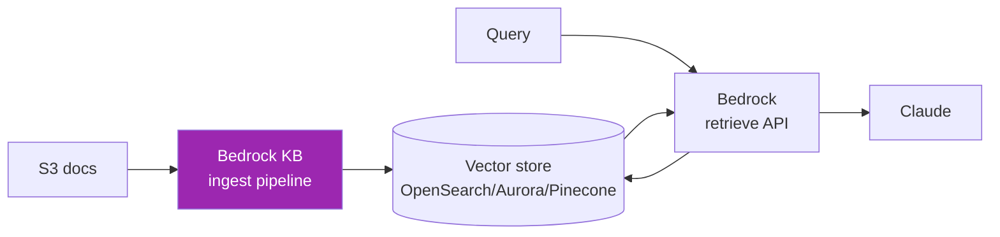
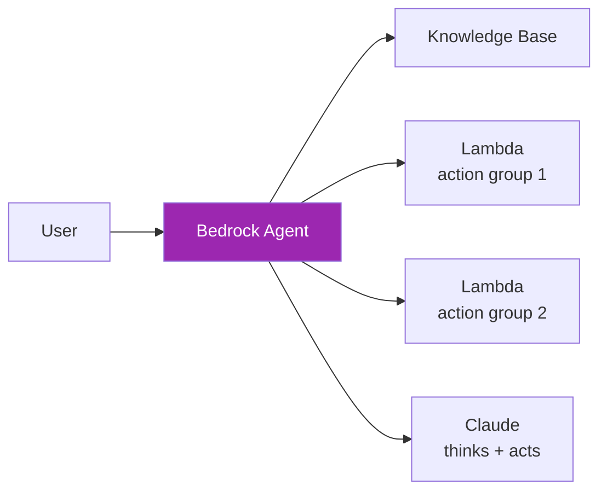

# Day 54: Bedrock Knowledge Bases & Agents 🤖

<div class="lesson-meta">
⏱️ 4 ชั่วโมง &nbsp;|&nbsp; 📊 Advanced &nbsp;|&nbsp; 📋 Prerequisites: Day 53, Week 5
</div>

## 🎯 Learning Objectives

<ul class="objectives">
<li>Setup Bedrock Knowledge Base (managed RAG)</li>
<li>เปรียบเทียบกับ self-managed RAG ใน Week 5-6</li>
<li>Create Bedrock Agent ที่ใช้ tools + KB</li>
<li>เห็นเมื่อไหร่ Bedrock Agents ดีกว่า code เอง</li>
</ul>

---

## 1. Bedrock Knowledge Base — Managed RAG



Bedrock จัดการ:
- **Chunking** (configurable strategy)
- **Embedding** (Titan, Cohere)
- **Vector store** (OpenSearch Serverless, RDS Postgres, Pinecone, MongoDB Atlas)
- **Retrieval API**

---

## 2. Setup

### Step 1: เตรียม data ใน S3

```bash
aws s3 cp ./docs/ s3://my-claude-kb/docs/ --recursive
```

### Step 2: Create Knowledge Base (Console)

1. Bedrock Console → Knowledge bases → Create
2. Name + IAM role (auto-create OK)
3. Data source: S3 bucket
4. Chunking strategy: Default (300 tokens, 20% overlap) หรือ custom
5. Embedding model: Titan Embeddings G1 หรือ Cohere
6. Vector store: OpenSearch Serverless (auto-create)
7. Sync data

### Step 3: Retrieve API

```python
import boto3

agent_runtime = boto3.client("bedrock-agent-runtime", region_name="us-east-1")

resp = agent_runtime.retrieve_and_generate(
    input={"text": "What's our refund policy?"},
    retrieveAndGenerateConfiguration={
        "type": "KNOWLEDGE_BASE",
        "knowledgeBaseConfiguration": {
            "knowledgeBaseId": "ABCDEF123456",
            "modelArn": "arn:aws:bedrock:us-east-1::foundation-model/anthropic.claude-sonnet-4-6-v1:0"
        }
    }
)

print(resp["output"]["text"])
for ref in resp["citations"]:
    print(ref["retrievedReferences"])
```

→ RAG ในไม่กี่บรรทัด

---

## 3. Trade-off vs Self-managed RAG

| ด้าน | Bedrock KB | Self-managed (Week 5-6) |
|------|-----------|------------------------|
| Setup time | นาที | วัน |
| Customization | จำกัด | full control |
| Chunking strategies | ✅ basic | ✅ advanced (Day 34) |
| Re-ranking | partial | full |
| Hybrid retrieval | basic | advanced |
| Cost | Per query + storage | Vector DB + compute |
| Vendor lock-in | AWS-only | Portable |

→ **Bedrock KB** = production-fast แต่ปรับยาก
→ **Self-managed** = ปรับได้แต่ต้อง engineering

---

## 4. Bedrock Agents

Bedrock Agents = managed multi-step agent ที่:
- เชื่อม Knowledge Base
- เรียก Lambda (action group) เป็น tools
- จัดการ orchestration เอง



---

## 5. Create Bedrock Agent

### OpenAPI schema for Lambda action

```yaml
openapi: 3.0.0
info:
  title: Order Service
  version: 1.0.0
paths:
  /orders/{order_id}:
    get:
      summary: Get order details
      parameters:
        - name: order_id
          in: path
          required: true
          schema:
            type: string
      responses:
        '200':
          description: Order details
```

### Lambda function

```python
def lambda_handler(event, context):
    function = event["function"]
    if function == "GET_/orders/{order_id}":
        order_id = event["parameters"][0]["value"]
        order = fetch_order(order_id)
        return {
            "response": {
                "actionGroup": event["actionGroup"],
                "function": function,
                "functionResponse": {
                    "responseBody": {
                        "TEXT": {"body": json.dumps(order)}
                    }
                }
            }
        }
```

### Console setup

1. Bedrock → Agents → Create
2. Name + IAM role
3. Foundation model: Claude
4. Instructions: "You are a customer support agent..."
5. Action groups: select Lambda + OpenAPI schema
6. Knowledge base: select KB created earlier
7. Test in Agent test window
8. Prepare + alias for production

---

## 6. Invoke Agent

```python
resp = agent_runtime.invoke_agent(
    agentId="AGENTID123",
    agentAliasId="ALIASID",
    sessionId="user-session-123",
    inputText="Where's my order #5678?"
)

# Stream events
for event in resp["completion"]:
    if "chunk" in event:
        print(event["chunk"]["bytes"].decode(), end="")
```

---

## 7. When to use Bedrock Agents

✅ **Good fit:**
- AWS-native architecture (Lambda, S3, RDS)
- Want managed orchestration
- Simple→medium complexity tasks
- Multi-tenant SaaS that uses customer's AWS account

❌ **Not ideal:**
- Multi-cloud
- Complex orchestration (use LangGraph instead)
- Need latest Claude features (release lag)
- Heavy customization of prompts

---

## 🛠️ Hands-on Exercise

!!! example "Exercise 1: Setup KB"
    Upload 10 docs ลง S3 → create KB → retrieve_and_generate ลอง 5 คำถาม

!!! example "Exercise 2: Bedrock Agent"
    Create agent + 1 Lambda action (e.g., get_weather) + KB → test

!!! example "Exercise 3: Compare"
    เทียบ Bedrock KB vs Week 5 self-managed บน:
    - Setup time
    - Cost per query
    - Accuracy บน 20 test cases

---

## ✅ Self-Check Quiz

<div class="quiz">

**Q1:** Bedrock KB เก็บ vector ที่ไหน?

??? success "ดูคำตอบ"
    Options: OpenSearch Serverless (default), Aurora PostgreSQL with pgvector, Pinecone, MongoDB Atlas, Redis Enterprise Cloud, Neptune

**Q2:** Bedrock Agent vs custom code (LangGraph)?

??? success "ดูคำตอบ"
    - Bedrock Agent: managed, AWS-native, fast setup, จำกัด customization
    - LangGraph: full control, portable, ต้อง host เอง

</div>

---

## 🔍 Cross-check & References

- 📘 [Bedrock Knowledge Bases](https://docs.aws.amazon.com/bedrock/latest/userguide/knowledge-base.html)
- 📘 [Bedrock Agents](https://docs.aws.amazon.com/bedrock/latest/userguide/agents.html)
- 📘 [Claude with Amazon Bedrock (course)](https://claude.com/courses/claude-with-amazon-bedrock)

[ต่อไป → Day 55: Bedrock production :material-arrow-right:](day-55.md){ .md-button .md-button--primary }
