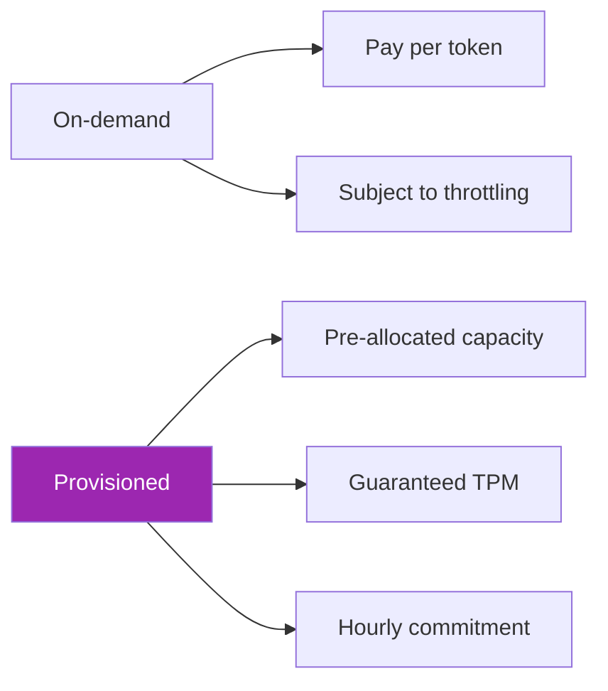
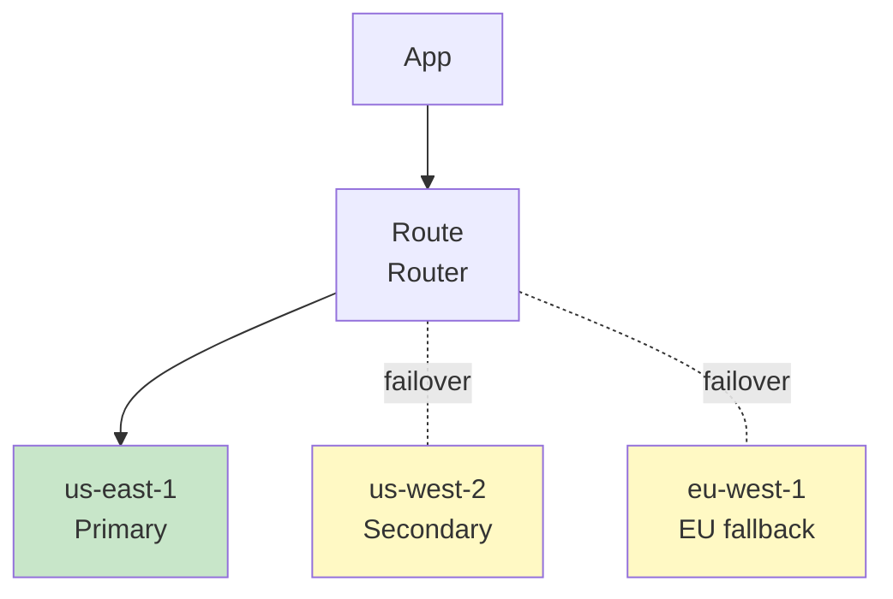
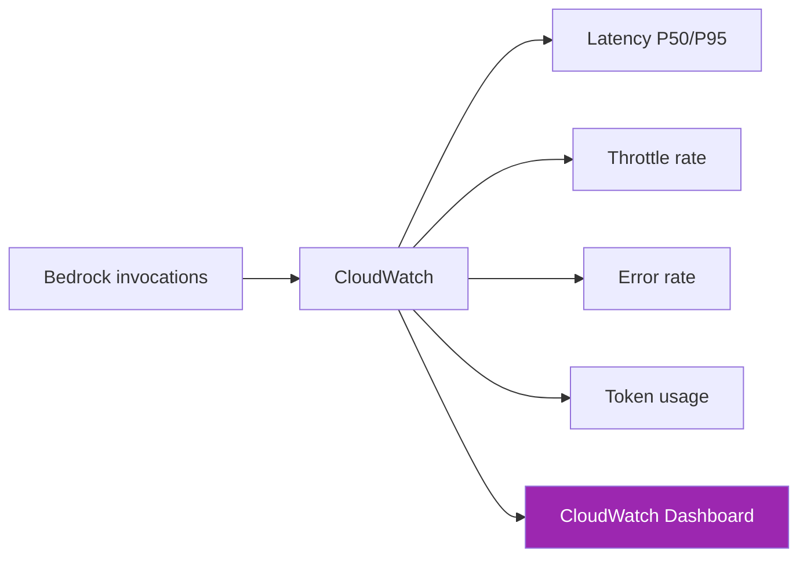

# Day 55: Bedrock Production Patterns 🏭

<div class="lesson-meta">
⏱️ 3 ชั่วโมง &nbsp;|&nbsp; 📊 Advanced &nbsp;|&nbsp; 📋 Prerequisites: Day 53-54
</div>

## 🎯 Learning Objectives

<ul class="objectives">
<li>เข้าใจ Bedrock service quotas และจัดการ</li>
<li>Implement retry + backoff</li>
<li>เลือก provisioned throughput vs on-demand</li>
<li>Design multi-region failover</li>
</ul>

---

## 1. Service Quotas

Bedrock มี throttling ระดับ account + region + model:

| Quota | Default | Adjustable |
|-------|---------|-----------|
| Requests per minute (RPM) | varies | yes (via support) |
| Tokens per minute (TPM) | varies | yes |
| Tokens per day | varies | yes |
| Concurrent requests | varies | yes |

ดู: AWS Console → Service Quotas → Bedrock

!!! warning "Plan ahead"
    Production traffic spike + default quota = throttle → ต้อง request เพิ่มก่อน launch

---

## 2. Retry Pattern

```python
import boto3
from botocore.config import Config
import time, random

# Built-in retry config
config = Config(
    retries={
        "max_attempts": 5,
        "mode": "adaptive"  # AWS smart retry
    },
    read_timeout=120
)
client = boto3.client("bedrock-runtime", config=config)
```

### Custom retry with backoff

```python
from botocore.exceptions import ClientError

def call_with_retry(fn, max_retries=5):
    for attempt in range(max_retries):
        try:
            return fn()
        except ClientError as e:
            code = e.response["Error"]["Code"]
            if code in ["ThrottlingException", "ServiceUnavailableException"]:
                wait = (2 ** attempt) + random.random()
                print(f"Retry {attempt+1} after {wait:.1f}s ({code})")
                time.sleep(wait)
            else:
                raise
    raise Exception("Max retries exceeded")

# ใช้
result = call_with_retry(lambda: client.converse(...))
```

---

## 3. Provisioned Throughput



| When to choose | On-demand | Provisioned |
|---------------|----------|-------------|
| Bursty traffic | ✅ | ❌ |
| Stable high volume | ⚠️ | ✅✅ |
| Predictable cost | ❌ | ✅ |
| Latency-critical SLA | ⚠️ | ✅ |
| New project | ✅ | ❌ |

```python
bedrock = boto3.client("bedrock")

# Purchase provisioned throughput
resp = bedrock.create_provisioned_model_throughput(
    modelUnits=2,  # 2 units = ~2x base throughput
    provisionedModelName="prod-claude-sonnet",
    modelId="anthropic.claude-sonnet-4-6-v1:0",
    commitmentDuration="OneMonth"  # or SixMonths for discount
)

# ใช้ ARN ใน inference
provisioned_arn = resp["provisionedModelArn"]
client.converse(modelId=provisioned_arn, messages=[...])
```

---

## 4. Multi-Region Failover



```python
REGIONS = [
    ("us-east-1", "primary"),
    ("us-west-2", "secondary"),
    ("eu-west-1", "tertiary"),
]

def invoke_with_failover(messages, model_id):
    last_err = None
    for region, label in REGIONS:
        try:
            client = boto3.client("bedrock-runtime", region_name=region)
            resp = client.converse(
                modelId=model_id,
                messages=messages,
                inferenceConfig={"maxTokens": 1024}
            )
            return resp, region
        except Exception as e:
            print(f"Region {region} ({label}) failed: {e}")
            last_err = e
    raise last_err
```

!!! warning "Data residency"
    Multi-region failover อาจขัด compliance — ระบุ allowed regions ตามกฎหมายลูกค้า

---

## 5. Cross-Region Inference Profiles (Newer Feature)

แทน manual failover — Bedrock มี **Inference Profiles** ที่ automatic spread load ข้าม regions:

```python
# Use cross-region inference
resp = client.converse(
    modelId="us.anthropic.claude-sonnet-4-6-v1:0",  # "us." prefix
    messages=[...]
)
```

ระบบจะเลือก region ที่ available เอง

---

## 6. Caching at Application Layer

```python
import hashlib, json
from functools import lru_cache

def cache_key(messages):
    return hashlib.sha256(json.dumps(messages).encode()).hexdigest()

@lru_cache(maxsize=1000)
def cached_invoke(key, messages_json):
    messages = json.loads(messages_json)
    return client.converse(
        modelId=MODEL_ID,
        messages=messages,
        inferenceConfig={"maxTokens": 500}
    )

# ใช้ Bedrock prompt caching เพิ่มอีก layer (Anthropic feature)
```

---

## 7. Cost Optimization Checklist

- [ ] Right-size model (Haiku for simple, Sonnet for medium, Opus only for complex)
- [ ] Enable prompt caching (Anthropic feature on Bedrock)
- [ ] Use batch inference for offline (cheaper)
- [ ] Cache hot responses at app layer
- [ ] Monitor token usage per feature
- [ ] Set budget alerts in AWS Budgets
- [ ] Tag invocations for cost allocation

---

## 8. Monitoring Dashboard



Metrics ที่สำคัญ:
- `InvocationLatency` (P50, P95, P99)
- `InvocationThrottles`
- `InvocationClientErrors`
- `InvocationServerErrors`
- `InputTokenCount`, `OutputTokenCount`

---

## 🛠️ Hands-on Exercise

!!! example "Exercise 1: Retry Logic"
    Implement retry กับ exponential backoff → simulate throttling

!!! example "Exercise 2: Failover"
    Build multi-region client → simulate region failure → verify fallback

!!! example "Exercise 3: Dashboard"
    สร้าง CloudWatch dashboard กับ 5 key metrics → screenshot

---

## ✅ Self-Check Quiz

<div class="quiz">

**Q1:** เมื่อไหร่ Provisioned Throughput คุ้ม?

??? success "ดูคำตอบ"
    Steady high-volume traffic (24/7) + need guaranteed SLA — typically ≥ 1M tokens/hour sustained. Bursty workload = on-demand ดีกว่า

**Q2:** Cross-region inference profile ต่างจาก manual failover?

??? success "ดูคำตอบ"
    - Inference profile: AWS routes automatically, no code change needed
    - Manual: ต้องเขียน fallback logic เอง แต่ control เต็มที่

</div>

---

## 🔍 Cross-check & References

- 📘 [Bedrock Quotas](https://docs.aws.amazon.com/bedrock/latest/userguide/quotas.html)
- 📘 [Provisioned Throughput](https://docs.aws.amazon.com/bedrock/latest/userguide/prov-throughput.html)
- 📘 [Cross-region Inference](https://docs.aws.amazon.com/bedrock/latest/userguide/cross-region-inference.html)

[ต่อไป → Day 56: Vertex AI :material-arrow-right:](day-56.md){ .md-button .md-button--primary }
