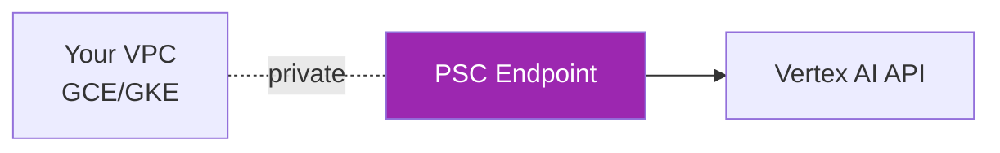

# Day 56: Claude on Vertex AI 🔵

<div class="lesson-meta">
⏱️ 4 ชั่วโมง &nbsp;|&nbsp; 📊 Intermediate &nbsp;|&nbsp; 📋 Prerequisites: Day 52, basic GCP
</div>

## 🎯 Learning Objectives

<ul class="objectives">
<li>Enable Claude บน Vertex AI Model Garden</li>
<li>Call Claude ผ่าน Vertex AI SDK</li>
<li>Setup IAM + service account</li>
<li>เข้าใจความแตกต่างจาก Bedrock</li>
</ul>

---

## 1. Vertex AI vs Bedrock

| | Vertex AI | Bedrock |
|--|-----------|---------|
| Console | GCP | AWS |
| Auth | Service account / ADC | IAM |
| Pricing | GCP markup | AWS markup |
| Network | Private Service Connect (PSC) | PrivateLink |
| Compliance | GCP suite | AWS suite |
| Latest Claude | similar lag | similar lag |

---

## 2. Setup

### Step 1: Enable Claude in Model Garden

1. GCP Console → Vertex AI → Model Garden
2. Search "Claude" → Click model card
3. Click **Enable** (request access if first time)
4. Accept TOS

### Step 2: Create service account

```bash
# CLI
gcloud iam service-accounts create claude-caller \
  --display-name "Claude API caller"

gcloud projects add-iam-policy-binding $PROJECT_ID \
  --member="serviceAccount:claude-caller@$PROJECT_ID.iam.gserviceaccount.com" \
  --role="roles/aiplatform.user"

gcloud iam service-accounts keys create key.json \
  --iam-account=claude-caller@$PROJECT_ID.iam.gserviceaccount.com
```

### Step 3: Set credentials

```bash
export GOOGLE_APPLICATION_CREDENTIALS=./key.json
export GOOGLE_CLOUD_PROJECT=my-project
```

---

## 3. Call Claude via Vertex SDK

```bash
pip install google-cloud-aiplatform google-auth
```

```python
from google import genai
from google.genai import types

client = genai.Client(
    vertexai=True,
    project="my-project",
    location="us-east5"  # supported region for Claude
)

# Note: model IDs on Vertex use Anthropic naming
resp = client.models.generate_content(
    model="claude-sonnet-4-6@001",
    contents=[
        types.Content(role="user", parts=[types.Part(text="Hello Claude on Vertex!")])
    ]
)

print(resp.text)
```

### Alternative: Anthropic Vertex SDK

```bash
pip install "anthropic[vertex]"
```

```python
from anthropic import AnthropicVertex

client = AnthropicVertex(
    project_id="my-project",
    region="us-east5"
)

msg = client.messages.create(
    model="claude-sonnet-4-6@20260120",  # Vertex specific
    max_tokens=1024,
    messages=[{"role": "user", "content": "Hello"}]
)

print(msg.content[0].text)
```

→ Same Anthropic SDK API ที่คุณเรียนใน Week 1-4!

---

## 4. Streaming

```python
with client.messages.stream(
    model="claude-sonnet-4-6@20260120",
    max_tokens=1000,
    messages=[{"role": "user", "content": "Tell story"}]
) as stream:
    for text in stream.text_stream:
        print(text, end="", flush=True)
```

---

## 5. Tool Use

API identical กับ Direct API:

```python
tools = [{
    "name": "get_weather",
    "description": "Get weather",
    "input_schema": {
        "type": "object",
        "properties": {"city": {"type": "string"}},
        "required": ["city"]
    }
}]

msg = client.messages.create(
    model="claude-sonnet-4-6@20260120",
    max_tokens=1024,
    tools=tools,
    messages=[{"role": "user", "content": "Weather in Bangkok?"}]
)
```

---

## 6. IAM Permissions

Minimum role: `roles/aiplatform.user`

หรือ custom role:

```yaml
# claude-caller-role.yaml
title: "Claude Caller"
description: "Call Claude on Vertex AI"
includedPermissions:
- aiplatform.endpoints.predict
- aiplatform.publishers.consumeModel
stage: GA
```

```bash
gcloud iam roles create claudeCaller \
  --project=$PROJECT_ID \
  --file=claude-caller-role.yaml
```

---

## 7. Private Service Connect (PSC)



Setup:
1. Create PSC endpoint to `aiplatform.googleapis.com`
2. Update DNS to resolve to PSC IP
3. Test from VM in private subnet (no public IP)

---

## 8. Cloud Logging Integration

Vertex AI auto-logs to **Cloud Logging**:

```
gcloud logging read 'resource.type="aiplatform.googleapis.com/PublisherModel"' \
  --limit 10 --format json
```

แต่ Vertex AI **ไม่ log request/response content** by default — ถ้าต้องการต้อง wrap code เอง

---

## 9. Cost Tracking

```bash
# Label your requests
gcloud config set core/disable_usage_reporting false

# In code, use Vertex AI labels
```

```python
# Via gcloud labels on the project
# Or via budget alerts:
gcloud billing budgets create \
  --billing-account=$ACCOUNT_ID \
  --display-name="Claude monthly budget" \
  --budget-amount=10000USD
```

---

## 🛠️ Hands-on Exercise

!!! example "Exercise 1: Hello Vertex"
    Enable Claude → call ผ่าน AnthropicVertex SDK → print response

!!! example "Exercise 2: Migrate"
    เอา code Day 12 (tool use) → swap จาก `Anthropic()` → `AnthropicVertex()` — ตรวจสอบทำงานเหมือนกัน

!!! example "Exercise 3: PSC"
    Setup PSC + test from private VM → verify no public traffic

---

## ✅ Self-Check Quiz

<div class="quiz">

**Q1:** ทำไม use AnthropicVertex แทน google.genai?

??? success "ดูคำตอบ"
    - SDK เหมือน Direct API ของ Anthropic — portable code
    - Feature parity ดีกว่า google.genai กับ Claude features
    - Migration path ง่ายกว่า

**Q2:** ความต่างของ region ใน Vertex vs Bedrock?

??? success "ดูคำตอบ"
    - Vertex AI: us-east5, europe-west1, asia-southeast1 ... (region แยกตาม availability)
    - Bedrock: us-east-1, us-west-2, eu-* ... (AWS regions)
    - แต่ละ cloud มี availability set ของตัวเอง — เลือกตาม data residency

</div>

---

## 🔍 Cross-check & References

- 📘 [Vertex AI Model Garden — Claude](https://cloud.google.com/vertex-ai/generative-ai/docs/partner-models/use-claude)
- 📘 [Anthropic Vertex SDK](https://docs.claude.com/en/api/claude-on-vertex-ai)
- 📘 [Private Service Connect](https://cloud.google.com/vpc/docs/private-service-connect)

[ต่อไป → Day 57: Vertex AI Agent Builder :material-arrow-right:](day-57.md){ .md-button .md-button--primary }
