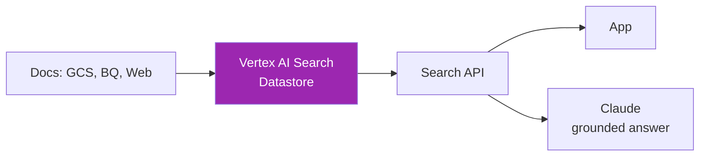

# Day 57: Vertex AI Agent Builder 🛠️

<div class="lesson-meta">
⏱️ 4 ชั่วโมง &nbsp;|&nbsp; 📊 Advanced &nbsp;|&nbsp; 📋 Prerequisites: Day 56
</div>

## 🎯 Learning Objectives

<ul class="objectives">
<li>สร้าง Vertex AI Search datastore (managed RAG)</li>
<li>Build Agent ผ่าน Agent Builder</li>
<li>เชื่อม Claude + Vertex AI Search grounding</li>
<li>เปรียบเทียบกับ Bedrock Agents</li>
</ul>

---

## 1. Vertex AI Search (formerly Discovery Engine)



Features:
- Auto-chunk + embed
- Full-text + semantic
- Schema-aware (BQ, structured data)
- "Out-of-the-box" relevance tuning
- Multi-modal (text, PDF, images)

---

## 2. Setup Search Datastore

### Console:
1. Vertex AI → Search & Conversation → Apps → Create
2. App type: **Search**
3. Data store → Connect: Cloud Storage / BigQuery / Web
4. Industry vertical: General / Healthcare / Financial Services / Media
5. Index & deploy (~10-30 min)

### Python (via Discovery Engine API):

```bash
pip install google-cloud-discoveryengine
```

```python
from google.cloud import discoveryengine_v1 as de

client = de.SearchServiceClient()

request = de.SearchRequest(
    serving_config=f"projects/{PROJECT_ID}/locations/global/collections/default_collection/dataStores/{DATASTORE_ID}/servingConfigs/default_config",
    query="What is our refund policy?",
    page_size=10
)

response = client.search(request)
for result in response.results:
    print(result.document.derived_struct_data)
```

---

## 3. Grounding กับ Claude

วิธีที่ 1: **Retrieve → Pass to Claude manually**

```python
from anthropic import AnthropicVertex

claude = AnthropicVertex(project_id=PROJECT_ID, region="us-east5")

def grounded_answer(question: str):
    # 1. Search Vertex AI Search
    search_results = client.search(de.SearchRequest(
        serving_config=SERVING_CONFIG,
        query=question,
        page_size=5
    ))
    
    contexts = "\n".join([
        r.document.derived_struct_data["content"]
        for r in search_results.results
    ])
    
    # 2. Ask Claude with context
    resp = claude.messages.create(
        model="claude-sonnet-4-6@20260120",
        max_tokens=1024,
        system="Answer using only the provided context. Cite sources.",
        messages=[{
            "role": "user",
            "content": f"Q: {question}\n\nContext:\n{contexts}"
        }]
    )
    return resp.content[0].text
```

วิธีที่ 2: **Agent Builder จัดการเอง (UI-driven)**

---

## 4. Agent Builder (Conversational AI)

1. Vertex AI → Conversational Agents → Create agent
2. Type: **Generative agent** (with LLM)
3. Foundation model: Claude (ถ้า available ใน region)
4. Instructions: "You're a customer support agent..."
5. **Tools**:
   - Data store tool (link to Vertex AI Search)
   - Custom function tools (Cloud Functions)
   - Open API tools
6. Test playground
7. Deploy via:
   - Dialogflow CX integration
   - Web app
   - Phone (with Telephony Gateway)
   - Custom embed

---

## 5. Define Function Tool

```python
# Cloud Function entry
import functions_framework

@functions_framework.http
def get_order_status(request):
    order_id = request.get_json()["order_id"]
    # ... query DB
    return {"status": "shipped", "tracking": "TRK123"}
```

OpenAPI spec for the function:

```yaml
openapi: 3.0.0
info:
  title: Order Status API
  version: 1.0.0
paths:
  /status:
    post:
      operationId: get_order_status
      requestBody:
        content:
          application/json:
            schema:
              type: object
              properties:
                order_id: {type: string}
      responses:
        '200':
          description: Order status
```

→ Upload spec ใน Agent Builder → agent เรียกฟังก์ชันได้

---

## 6. Bedrock Agents vs Vertex Agent Builder

| | Bedrock Agents | Vertex Agent Builder |
|--|---------------|---------------------|
| Setup | OpenAPI + Lambda | OpenAPI + Cloud Functions |
| Knowledge Base | Bedrock KB | Vertex AI Search |
| Models available | Anthropic + others | Gemini + Claude + others |
| Console UX | basic | richer (built on Dialogflow CX) |
| Telephony out-of-box | ❌ | ✅ |
| Multi-channel | DIY | ✅ Web, Phone, Chat |

---

## 7. Use Cases

✅ **Vertex Agent Builder ดีตอน:**
- ลูกค้าอยู่บน GCP
- ต้องการ phone/voice channel
- ใช้ Dialogflow CX อยู่แล้ว
- Need BigQuery integration deep

❌ **Avoid เมื่อ:**
- Multi-cloud strategy
- Need latest Claude features immediately
- ทีมไม่คุ้น GCP

---

## 🛠️ Hands-on Exercise

!!! example "Exercise 1: Search Datastore"
    Upload docs (GCS) → create datastore → ลอง search 5 คำถาม

!!! example "Exercise 2: Grounded Q&A"
    Build grounded_answer() function → ลอง 10 คำถาม → compare กับ no-grounding

!!! example "Exercise 3: Agent + Tool"
    Create agent + 1 Cloud Function tool → test in playground

---

## ✅ Self-Check Quiz

<div class="quiz">

**Q1:** Vertex AI Search ดีกว่า self-managed RAG ตอนไหน?

??? success "ดูคำตอบ"
    - Quick setup (ไม่ต้อง pipeline)
    - Industry-tuned (Healthcare, Finance)
    - BigQuery integration
    - Schema-aware structured data search
    - Multi-modal built-in

**Q2:** Function tool ใน Agent Builder ต้อง host ที่ไหน?

??? success "ดูคำตอบ"
    - Cloud Functions (recommended)
    - Cloud Run
    - External API (HTTPS endpoint)
    - On-prem with public endpoint

</div>

---

## 🔍 Cross-check & References

- 📘 [Vertex AI Search](https://cloud.google.com/enterprise-search)
- 📘 [Vertex AI Agent Builder](https://cloud.google.com/products/agent-builder)
- 📘 [Conversational Agents](https://cloud.google.com/dialogflow/cx/docs)

[ต่อไป → Day 58: Microsoft Foundry :material-arrow-right:](day-58.md){ .md-button .md-button--primary }
