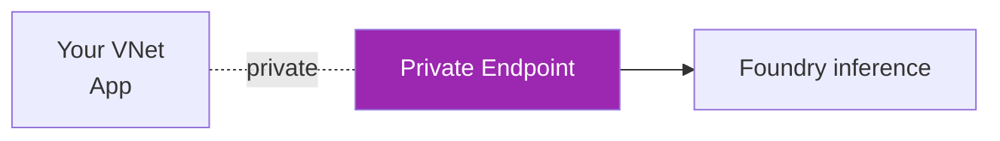

# Day 58: Claude on Microsoft Foundry 🟦

<div class="lesson-meta">
⏱️ 3 ชั่วโมง &nbsp;|&nbsp; 📊 Intermediate &nbsp;|&nbsp; 📋 Prerequisites: Day 52, basic Azure
</div>

## 🎯 Learning Objectives

<ul class="objectives">
<li>เปิดใช้ Claude บน Azure AI Foundry</li>
<li>Call ผ่าน Azure SDK + Entra ID auth</li>
<li>Setup Private Endpoint + RBAC</li>
<li>เห็นจุดต่างจาก Bedrock / Vertex</li>
</ul>

---

## 1. Azure AI Foundry คืออะไร

**Azure AI Foundry** = unified platform สำหรับ AI บน Azure
- Models from Microsoft, OpenAI, Mistral, **Anthropic** ฯลฯ
- Project workspace concept
- Integrated with Entra ID (formerly Azure AD)

---

## 2. Setup

### Step 1: Create Foundry Project

1. Azure Portal → AI Foundry → Create project
2. Choose subscription + resource group
3. Region (e.g., East US 2)
4. Hub creation (or use existing)
5. Deploy

### Step 2: Deploy Claude Model

1. AI Foundry portal → Model catalog
2. Filter by provider: **Anthropic**
3. Select Claude Sonnet → Deploy
4. Deployment name: `claude-sonnet-deploy`
5. Pricing: Pay-as-you-go (Standard) or PTU (Provisioned)

### Step 3: Get endpoint + credentials

```bash
# Endpoint
ENDPOINT="https://<project>.openai.azure.com/"  # or foundry endpoint

# Use Entra ID (recommended) instead of API key
az login
```

---

## 3. Call Claude

### Option A: Anthropic SDK with Azure proxy

```bash
pip install "anthropic[azure]" azure-identity
```

```python
from anthropic import AnthropicVertex
# Note: Anthropic SDK has Azure support; check current docs for exact class
# Foundry typically exposes Anthropic-compatible endpoint
```

### Option B: Foundry Inference SDK

```bash
pip install azure-ai-inference azure-identity
```

```python
from azure.ai.inference import ChatCompletionsClient
from azure.ai.inference.models import SystemMessage, UserMessage
from azure.identity import DefaultAzureCredential

client = ChatCompletionsClient(
    endpoint="https://<your-project>.services.ai.azure.com/models",
    credential=DefaultAzureCredential()
)

resp = client.complete(
    model="claude-sonnet-4-6",  # deployment name
    messages=[
        SystemMessage(content="You're helpful"),
        UserMessage(content="Hello!")
    ],
    max_tokens=1024
)

print(resp.choices[0].message.content)
```

→ **Verify SDK and model names** — Foundry/Anthropic integration evolves quickly

---

## 4. Entra ID + RBAC

Use Entra ID (no API keys) — best practice for production:

```python
from azure.identity import DefaultAzureCredential, ManagedIdentityCredential

# Local dev → DefaultAzureCredential (uses az login)
# In Azure VM/Container → ManagedIdentityCredential automatically

credential = DefaultAzureCredential()
```

### Assign Role

```bash
# Cognitive Services User role
az role assignment create \
  --assignee user@company.com \
  --role "Cognitive Services User" \
  --scope /subscriptions/$SUB/resourceGroups/$RG/providers/Microsoft.MachineLearningServices/workspaces/$WS
```

Custom role example:

```json
{
  "Name": "Claude Caller",
  "Actions": ["Microsoft.MachineLearningServices/workspaces/inference/action"],
  "AssignableScopes": ["/subscriptions/<sub>"]
}
```

---

## 5. Private Endpoint



Setup:
1. Foundry project → Networking → Private endpoint
2. VNet + subnet
3. Private DNS zone (`privatelink.openai.azure.com`)
4. App routes via VNet → no public internet

---

## 6. Logging — Azure Monitor

```bash
# Enable diagnostic settings on Foundry project
az monitor diagnostic-settings create \
  --resource $WORKSPACE_ID \
  --name claude-logs \
  --logs '[{"category":"ModelInference","enabled":true}]' \
  --workspace $LOG_ANALYTICS_WORKSPACE_ID
```

Query in Log Analytics:

```kusto
AzureDiagnostics
| where Category == "ModelInference"
| where ResourceProvider == "MICROSOFT.MACHINELEARNINGSERVICES"
| project TimeGenerated, OperationName, model_s, total_tokens_d
| order by TimeGenerated desc
```

---

## 7. PTU — Provisioned Throughput Units

| | Standard (PAYG) | PTU (Provisioned) |
|--|----------------|-------------------|
| Pricing | Per token | Hourly capacity |
| Capacity | Shared pool | Dedicated |
| Latency | Variable | Predictable |
| Throughput SLA | Best-effort | Guaranteed |

→ Use PTU for high-volume production, PAYG for dev/test

---

## 8. Compliance Highlights

Foundry มี compliance certifications ครบ:
- SOC 1/2/3
- ISO 27001/27018
- HIPAA (with BAA)
- FedRAMP High
- PCI DSS

→ Best fit สำหรับ ลูกค้า healthcare / government / financial regulated

---

## 🛠️ Hands-on Exercise

!!! example "Exercise 1: Deploy Claude"
    Create Foundry project → deploy Claude → call ด้วย `az login` auth

!!! example "Exercise 2: Migrate"
    Migrate Day 56 code (Vertex) → Foundry version → compare line-by-line

!!! example "Exercise 3: Private Endpoint"
    Setup PE + DNS zone → test from Azure VM in VNet

---

## ✅ Self-Check Quiz

<div class="quiz">

**Q1:** ทำไม Entra ID > API key?

??? success "ดูคำตอบ"
    - No secret to manage / rotate
    - RBAC integration
    - Audit trail per user/service principal
    - Auto-rotation via managed identity

**Q2:** PTU เหมาะกับ workload แบบไหน?

??? success "ดูคำตอบ"
    - Steady high-volume (24/7)
    - SLA-bound (e.g., agent helpline)
    - Latency-sensitive (predictable)
    - Sufficient utilization to justify upfront commit (≥ 70% typically)

</div>

---

## 🔍 Cross-check & References

- 📘 [Azure AI Foundry Docs](https://learn.microsoft.com/en-us/azure/ai-foundry/)
- 📘 [Claude on Azure Foundry](https://claude.com/partners/microsoft-foundry)
- 📘 [Private endpoints for Foundry](https://learn.microsoft.com/en-us/azure/ai-foundry/how-to/configure-private-link)

[ต่อไป → Day 59: Multi-cloud :material-arrow-right:](day-59.md){ .md-button .md-button--primary }
