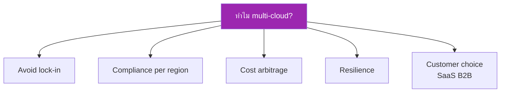
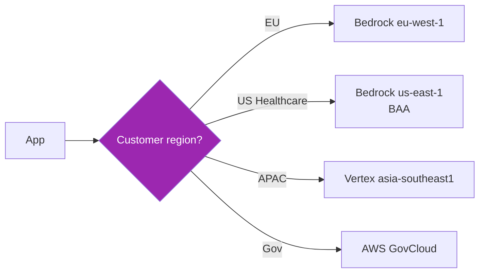
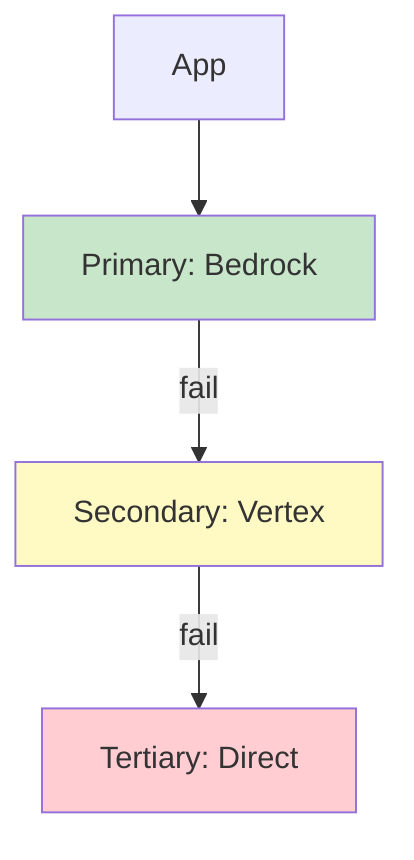
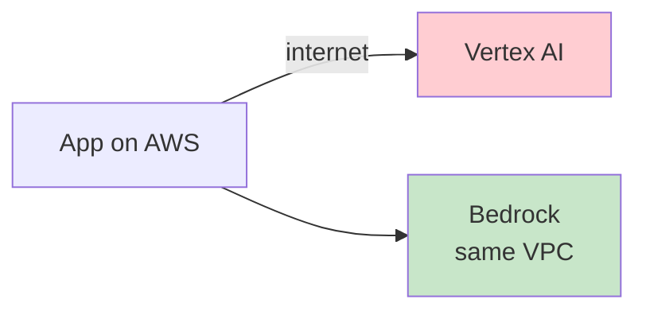
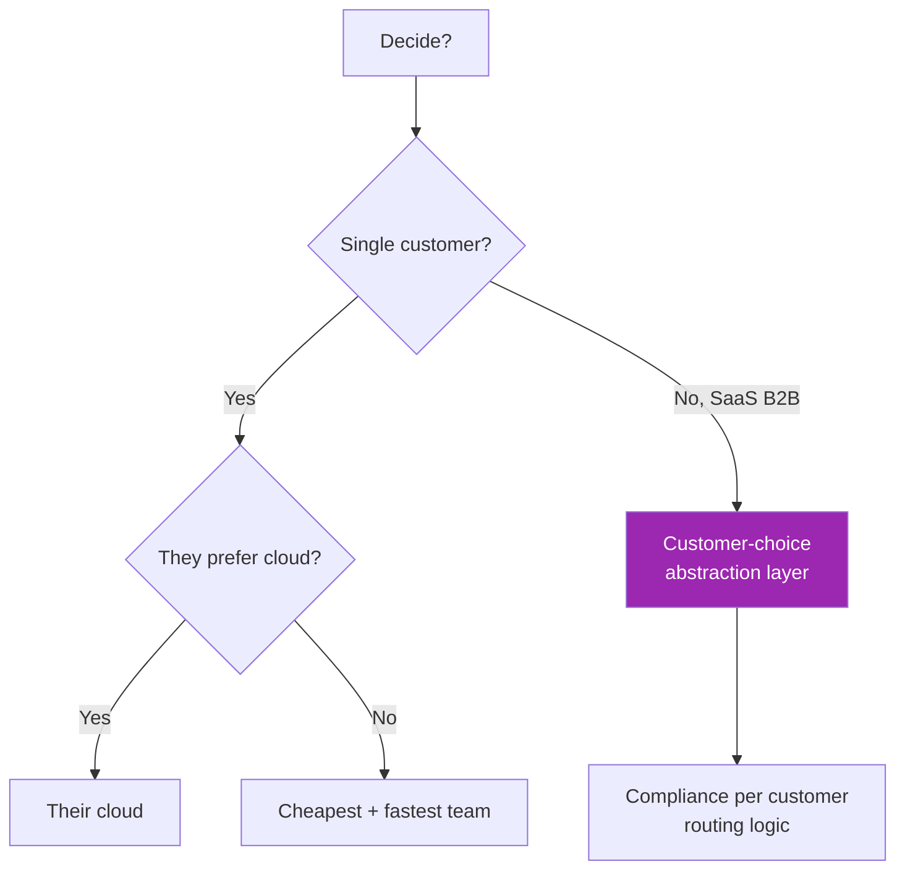

# Day 59: Multi-cloud Strategy 🌐

<div class="lesson-meta">
⏱️ 3 ชั่วโมง &nbsp;|&nbsp; 📊 Strategic &nbsp;|&nbsp; 📋 Prerequisites: Day 53, 56, 58
</div>

## 🎯 Learning Objectives

<ul class="objectives">
<li>เข้าใจ data residency / sovereignty</li>
<li>Design abstraction layer สำหรับ portability</li>
<li>Failover patterns across clouds</li>
<li>Compliance mapping (HIPAA, SOC2, FedRAMP, PDPA)</li>
</ul>

---

## 1. ทำไมต้อง Multi-cloud



แต่ระวัง — **multi-cloud = complexity ↑**

| Pros | Cons |
|------|------|
| No vendor lock-in | 3x ops overhead |
| Best feature per cloud | Network egress cost |
| Disaster recovery | Auth/IAM disparity |
| Customer flexibility | Skill gap (3 platforms) |

---

## 2. Data Residency Requirements

| Regulation | Region | Storage |
|-----------|--------|---------|
| GDPR | EU | EU data centers |
| PDPA Thailand | Thailand-friendly | Local + SEA OK |
| HIPAA (US) | US | US + BAA required |
| FedRAMP (US Gov) | US Gov regions | US-only |
| China PIPL | China | In-country (separate stack) |
| Australia Gov | AU | AU only |



---

## 3. Abstraction Layer Pattern

ปกป้องจาก lock-in ด้วย provider abstraction:

```python
from abc import ABC, abstractmethod
from typing import Iterator

class ClaudeProvider(ABC):
    @abstractmethod
    def chat(self, messages, model, max_tokens, **kwargs): ...
    
    @abstractmethod
    def stream(self, messages, model, max_tokens, **kwargs) -> Iterator[str]: ...

class DirectProvider(ClaudeProvider):
    def __init__(self):
        from anthropic import Anthropic
        self.client = Anthropic()
    def chat(self, messages, model, max_tokens, **kwargs):
        return self.client.messages.create(model=model, messages=messages, max_tokens=max_tokens, **kwargs)
    # ... stream

class BedrockProvider(ClaudeProvider):
    def __init__(self, region):
        import boto3
        self.client = boto3.client("bedrock-runtime", region_name=region)
    def chat(self, messages, model, max_tokens, **kwargs):
        # Convert to Converse API format
        ...

class VertexProvider(ClaudeProvider):
    def __init__(self, project_id, region):
        from anthropic import AnthropicVertex
        self.client = AnthropicVertex(project_id=project_id, region=region)
    def chat(self, messages, model, max_tokens, **kwargs):
        return self.client.messages.create(model=model, messages=messages, max_tokens=max_tokens, **kwargs)

class FoundryProvider(ClaudeProvider):
    def __init__(self, endpoint):
        from azure.ai.inference import ChatCompletionsClient
        from azure.identity import DefaultAzureCredential
        self.client = ChatCompletionsClient(endpoint=endpoint, credential=DefaultAzureCredential())
    def chat(self, messages, model, max_tokens, **kwargs):
        return self.client.complete(model=model, messages=messages, max_tokens=max_tokens, **kwargs)

# Factory
def get_provider(env="direct") -> ClaudeProvider:
    if env == "direct": return DirectProvider()
    if env == "bedrock": return BedrockProvider(region="us-east-1")
    if env == "vertex": return VertexProvider(project_id="...", region="us-east5")
    if env == "foundry": return FoundryProvider(endpoint="...")
```

→ Swap by config — code ไม่ต้องแก้

---

## 4. Failover Pattern (Cross-cloud)



```python
PROVIDERS = [
    BedrockProvider(region="us-east-1"),
    VertexProvider(project_id="...", region="us-east5"),
    DirectProvider(),  # last resort
]

def chat_with_failover(messages, **kwargs):
    last_err = None
    for p in PROVIDERS:
        try:
            return p.chat(messages, **kwargs)
        except Exception as e:
            last_err = e
            log_failure(p, e)
    raise last_err
```

!!! warning "Failover compliance check"
    Failover ระหว่าง cloud อาจขัด compliance — ระบุ allowed providers per customer

---

## 5. LangChain Abstraction (off-the-shelf)

```python
# Just swap import
from langchain_anthropic import ChatAnthropic       # direct
from langchain_aws import ChatBedrock                # AWS
from langchain_google_vertexai import ChatVertexAI   # GCP
from langchain_openai import AzureChatOpenAI         # Azure (with Foundry-compat endpoint)

# All implement BaseChatModel — same interface
llm = ChatBedrock(model_id="anthropic.claude-sonnet-4-6-v1:0")
# OR
llm = ChatAnthropic(model="claude-sonnet-4-6")
```

---

## 6. Customer Choice Pattern (B2B SaaS)

```python
# Configuration per customer
customer_config = {
    "acme-corp": {"provider": "bedrock", "region": "us-east-1"},
    "eu-pharma": {"provider": "bedrock", "region": "eu-west-1"},
    "tokyo-bank": {"provider": "vertex", "region": "asia-northeast1"},
    "us-hospital": {"provider": "foundry", "endpoint": "<azure-hipaa>"},
}

def get_provider_for_customer(cust_id):
    cfg = customer_config[cust_id]
    return get_provider(env=cfg["provider"], **{k:v for k,v in cfg.items() if k!="provider"})
```

→ ลูกค้าแต่ละรายอยู่ใน cloud ของตัวเอง — compliance separate

---

## 7. Network Egress Cost

⚠️ ถ้า app ที่ AWS แต่เรียก Claude ที่ Azure → ออก internet → egress charge



แนวทาง:
- **Co-locate**: App + Claude ใน cloud เดียวกัน
- **Cache**: cache hot responses
- **Compress**: ส่ง context summarize

---

## 8. Compliance Mapping

| Requirement | AWS Bedrock | Vertex AI | Foundry |
|------------|-------------|-----------|---------|
| HIPAA BAA | ✅ via AWS | ✅ via GCP | ✅ via MS |
| SOC 2 Type II | ✅ | ✅ | ✅ |
| ISO 27001 | ✅ | ✅ | ✅ |
| FedRAMP High | ✅ GovCloud | ✅ Assured Workloads | ✅ Gov |
| PCI DSS | ✅ | ✅ | ✅ |
| GDPR | ✅ EU regions | ✅ EU regions | ✅ EU regions |

!!! note "BAA process"
    HIPAA-covered customer ต้อง **execute BAA** กับ cloud provider ก่อน — ไม่ใช่ "checkbox" ใน console

---

## 9. Decision Framework Recap



---

## 🛠️ Hands-on Exercise

!!! example "Exercise 1: Abstraction Layer"
    Build ClaudeProvider abstract + 2 concrete implementations (your choice)

!!! example "Exercise 2: Failover"
    Implement chat_with_failover() → simulate primary failure → verify

!!! example "Exercise 3: Compliance Matrix"
    เขียน compliance matrix สำหรับ 3 ลูกค้า (Healthcare, EU SaaS, Asia retail) → ระบุ provider+region per customer

---

## ✅ Self-Check Quiz

<div class="quiz">

**Q1:** ทำไม abstraction layer สำคัญใน B2B SaaS?

??? success "ดูคำตอบ"
    ลูกค้าแต่ละรายอาจต้อง cloud/region ต่างกัน เพื่อ compliance — abstraction ช่วยให้ codebase เดียวรองรับทุก customer

**Q2:** Failover ระหว่าง cloud อันตรายอย่างไร?

??? success "ดูคำตอบ"
    - อาจขัด data residency (EU data → US during failover)
    - Compliance breach (HIPAA, GDPR)
    - Hidden cost (cross-cloud egress)
    - ต้อง opt-in per customer ใน contract

</div>

---

## 🔍 Cross-check & References

- 📘 [AWS Compliance](https://aws.amazon.com/compliance/services-in-scope/)
- 📘 [GCP Compliance](https://cloud.google.com/security/compliance)
- 📘 [Azure Compliance Offerings](https://learn.microsoft.com/en-us/azure/compliance/)
- 📘 [PDPA Thailand](https://www.pdpc.or.th/) — for SEA enterprise

[ต่อไป → Day 60: Mini-project :material-arrow-right:](day-60.md){ .md-button .md-button--primary }
