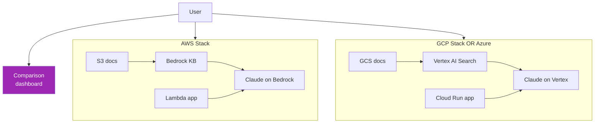

# Day 60: Mini-Project — Multi-Cloud Deploy 🚀

<div class="lesson-meta">
⏱️ 5 ชั่วโมง &nbsp;|&nbsp; 📊 Project &nbsp;|&nbsp; 📋 Prerequisites: Week 8
</div>

## 🎯 Project Goal

Deploy **same RAG application** บน 2 cloud platforms:
1. AWS (Bedrock + S3 + Lambda)
2. Choose: GCP (Vertex AI + GCS + Cloud Run) **หรือ** Azure (Foundry + Blob + Functions)

แล้ว measure: **TCO + latency + feature parity**

---

## 1. Architecture



---

## 2. Same Code, Different Provider

```python
# main.py — runs on both clouds
import os
from abc import ABC

class CloudProvider(ABC):
    def search(self, query): ...
    def generate(self, q, context): ...

class AWSProvider(CloudProvider):
    def __init__(self):
        import boto3
        self.bedrock_agent = boto3.client("bedrock-agent-runtime")
        self.bedrock = boto3.client("bedrock-runtime")
    def search_and_answer(self, q):
        resp = self.bedrock_agent.retrieve_and_generate(
            input={"text": q},
            retrieveAndGenerateConfiguration={
                "type": "KNOWLEDGE_BASE",
                "knowledgeBaseConfiguration": {
                    "knowledgeBaseId": os.getenv("KB_ID"),
                    "modelArn": os.getenv("CLAUDE_ARN")
                }
            }
        )
        return resp["output"]["text"], resp.get("citations", [])

class GCPProvider(CloudProvider):
    def __init__(self):
        from google.cloud import discoveryengine_v1 as de
        from anthropic import AnthropicVertex
        self.search = de.SearchServiceClient()
        self.claude = AnthropicVertex(
            project_id=os.getenv("GCP_PROJECT"),
            region="us-east5"
        )
    def search_and_answer(self, q):
        # Search
        results = self.search.search(de.SearchRequest(
            serving_config=os.getenv("SERVING_CONFIG"),
            query=q, page_size=5
        ))
        contexts = "\n".join(r.document.derived_struct_data["content"] for r in results.results)
        # Generate
        resp = self.claude.messages.create(
            model="claude-sonnet-4-6@20260120",
            max_tokens=1024,
            messages=[{"role": "user", "content": f"Q: {q}\n\nContext:\n{contexts}"}]
        )
        return resp.content[0].text, results.results

# Factory
def make_provider():
    cloud = os.getenv("CLOUD", "aws")
    return {"aws": AWSProvider(), "gcp": GCPProvider()}[cloud]
```

---

## 3. Deployment

### AWS

```yaml
# serverless.yml
service: claude-rag-aws
provider:
  name: aws
  region: us-east-1
  runtime: python3.12
functions:
  api:
    handler: handler.lambda_handler
    environment:
      CLOUD: aws
      KB_ID: ${ssm:/claude/kb_id}
      CLAUDE_ARN: arn:aws:bedrock:us-east-1::foundation-model/anthropic.claude-sonnet-4-6-v1:0
    events:
      - httpApi: 'POST /chat'
```

```bash
serverless deploy
```

### GCP

```bash
# Cloud Run deploy
gcloud run deploy claude-rag-gcp \
  --source . \
  --region us-east5 \
  --set-env-vars CLOUD=gcp,GCP_PROJECT=$PROJECT,SERVING_CONFIG=$SC \
  --allow-unauthenticated
```

---

## 4. Load Testing

```python
# load_test.py
import asyncio, aiohttp, time, statistics

ENDPOINTS = {
    "aws": "https://aws-endpoint.amazonaws.com/chat",
    "gcp": "https://claude-rag-gcp-xxx.run.app/chat",
}
QUESTIONS = [
    "What is our refund policy?",
    "How do I reset my password?",
    # ... 100 questions
]

async def test_endpoint(name, url):
    async with aiohttp.ClientSession() as s:
        latencies = []
        for q in QUESTIONS:
            start = time.time()
            async with s.post(url, json={"question": q}) as resp:
                _ = await resp.json()
            latencies.append((time.time() - start) * 1000)
        return name, {
            "p50": statistics.median(latencies),
            "p95": statistics.quantiles(latencies, n=20)[18],
            "p99": statistics.quantiles(latencies, n=100)[98],
        }

async def main():
    results = await asyncio.gather(*[test_endpoint(n, u) for n, u in ENDPOINTS.items()])
    for n, m in results:
        print(f"{n}: {m}")

asyncio.run(main())
```

---

## 5. TCO Calculation

```python
def estimate_monthly_cost(provider, queries_per_month):
    avg_input_tokens = 2000  # query + context
    avg_output_tokens = 300
    
    PRICING = {
        "aws_bedrock_sonnet": {"input": 3.0, "output": 15.0},  # per 1M tokens
        "gcp_vertex_sonnet": {"input": 3.0, "output": 15.0},
        "azure_foundry_sonnet": {"input": 3.0, "output": 15.0}
    }
    # Note: Verify pricing on each cloud's pricing page; may have small variations
    
    p = PRICING[provider]
    total_input = queries_per_month * avg_input_tokens / 1_000_000 * p["input"]
    total_output = queries_per_month * avg_output_tokens / 1_000_000 * p["output"]
    
    # Add infra cost
    INFRA_BASE = {
        "aws_bedrock_sonnet": 50,  # KB OpenSearch min cost
        "gcp_vertex_sonnet": 30,
        "azure_foundry_sonnet": 40
    }
    
    return total_input + total_output + INFRA_BASE[provider]

for p in ["aws_bedrock_sonnet", "gcp_vertex_sonnet"]:
    print(f"{p}: ${estimate_monthly_cost(p, 100_000):.2f}/mo (100K queries)")
```

---

## 6. Comparison Report Template

```markdown
# Multi-Cloud Claude RAG — Comparison Report

## Deployment
| Aspect | AWS | GCP |
|--------|-----|-----|
| Setup time | X hours | Y hours |
| Lines of infra code | A | B |
| Service catalog | Bedrock KB + Lambda | Vertex Search + Cloud Run |

## Performance (100 queries)
| Metric | AWS | GCP |
|--------|-----|-----|
| P50 latency | X ms | Y ms |
| P95 latency | X ms | Y ms |
| P99 latency | X ms | Y ms |
| Error rate | X% | Y% |

## Cost (per month at 100K queries)
| Item | AWS | GCP |
|------|-----|-----|
| Compute | $X | $Y |
| Storage | $X | $Y |
| Inference | $X | $Y |
| Network | $X | $Y |
| **Total** | **$X** | **$Y** |

## Feature Parity
- [x] RAG with citations: AWS ✅ / GCP ✅
- [x] Streaming: AWS ✅ / GCP ✅
- [ ] Specific feature X: AWS ✅ / GCP ⚠️

## Recommendation
Based on [criteria], we recommend [cloud] for [reason].
```

---

## 7. Deliverables

!!! example "Submit GitHub repo + report"
    1. `main.py` with both providers
    2. AWS infra (serverless.yml หรือ Terraform)
    3. GCP infra (Cloud Run + datastore config)
    4. `load_test.py` results
    5. Comparison report (template ข้างบน)
    6. README + diagram
    7. ADR documenting choice

---

## 8. Scoring Rubric

| เกณฑ์ | คะแนน |
|------|------|
| Same app works on both clouds | / 25 |
| RAG accuracy ≥ 70% บน 20 test cases | / 20 |
| Load test ครบ + report | / 15 |
| TCO calculation + assumptions | / 15 |
| Comparison report quality | / 15 |
| Documentation + ADR | / 10 |
| **รวม** | **/ 100** |

---

## ✅ Week 8 Self-Check

- [x] Direct API vs Cloud platforms
- [x] AWS Bedrock setup + KB + Agents + production
- [x] Vertex AI + Agent Builder
- [x] Microsoft Foundry
- [x] Multi-cloud strategy + abstraction
- [x] Deploy same app on 2 clouds + measure

---

## 🔍 Cross-check & References

- 📘 [Claude on Cloud Platforms overview](https://claude.com/partners)
- 📘 [Terraform AWS Provider](https://registry.terraform.io/providers/hashicorp/aws/latest)
- 📘 [Terraform Google Provider](https://registry.terraform.io/providers/hashicorp/google/latest)

---

:material-check-decagram: **จบ Month 2!** คุณ deploy Claude บน enterprise cloud ได้แล้ว

[ต่อไป → Month 3 / Week 9: Advanced Agents :material-arrow-right:](../week-09/index.md){ .md-button .md-button--primary }
