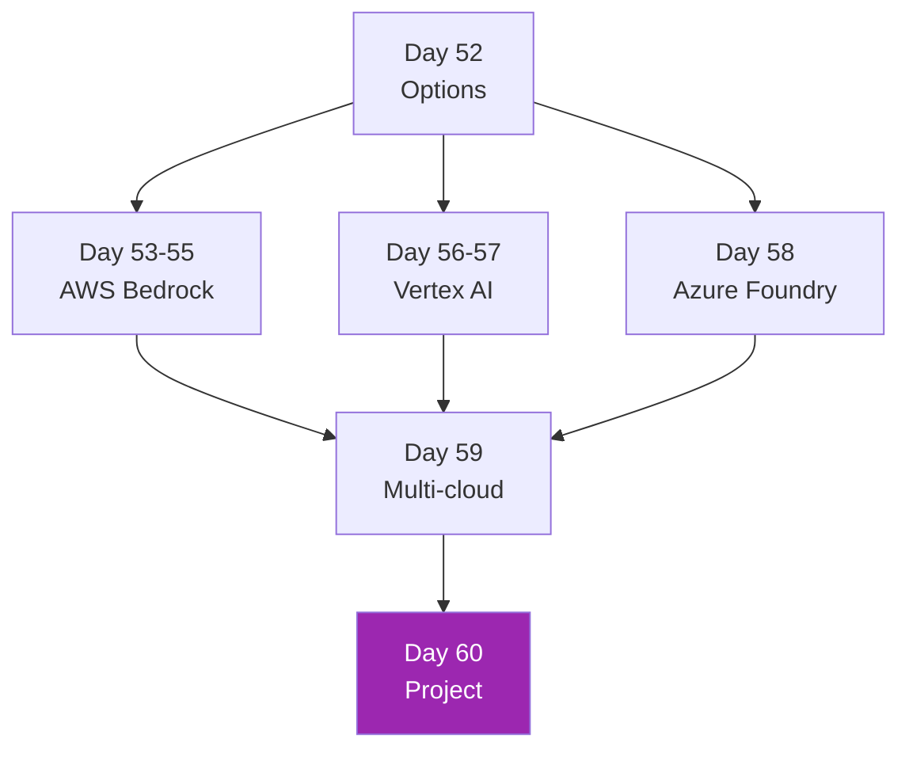

# Week 8: Claude on Cloud ☁️

Enterprise ส่วนใหญ่ใช้ Claude **ผ่าน cloud platforms** เพราะ compliance, network, cost commitment — Week นี้ครอบคลุมทั้ง 3 cloud หลัก

## รายวิชา (9 วัน)

| Day | หัวข้อ | เวลา |
|-----|-------|------|
| 52 | Direct API vs Bedrock vs Vertex vs Foundry | 3h |
| 53 | AWS Bedrock Setup (IAM, VPC, PrivateLink) | 4h |
| 54 | Bedrock Knowledge Bases & Agents | 4h |
| 55 | Bedrock Production Patterns | 4h |
| 56 | Google Vertex AI Setup | 4h |
| 57 | Vertex AI Agent Builder | 4h |
| 58 | Microsoft Foundry (Azure) | 3h |
| 59 | Multi-cloud Strategy & Compliance | 3h |
| 60 | Mini Project — Deploy 2 clouds, compare TCO | 5h |

[เริ่ม Day 52 :material-arrow-right:](day-52.md){ .md-button .md-button--primary }
