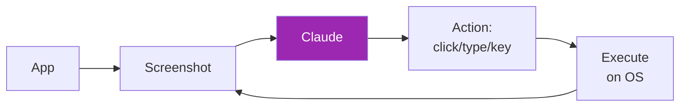
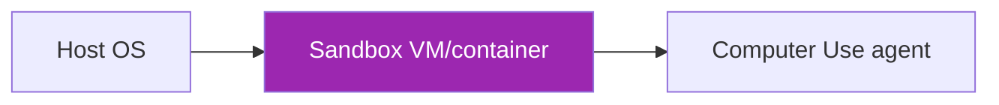

# Day 61: Computer Use API 🖱️

<div class="lesson-meta">
⏱️ 4 ชั่วโมง &nbsp;|&nbsp; 📊 Advanced &nbsp;|&nbsp; 📋 Prerequisites: Day 12 (Tools)
</div>

## 🎯 Learning Objectives

<ul class="objectives">
<li>เข้าใจสถาปัตยกรรม Computer Use</li>
<li>Setup environment สำหรับ Computer Use</li>
<li>เขียน agent ทำ GUI tasks</li>
<li>เห็นจุดเสี่ยง + best practices</li>
</ul>

---

## 1. Computer Use คืออะไร

Claude **ดู screenshot** แล้ว **สั่ง action** (click, type, scroll) — เหมือนคนใช้คอม



ต่างจาก browser automation:
- Computer Use = OS-level (any app)
- Browser = web-only

---

## 2. Use Cases

✅ **Good fit:**
- Legacy desktop apps (no API)
- Cross-app workflows (Excel → email → ERP)
- QA automation
- Accessibility tools

❌ **Avoid:**
- High-frequency tasks (slow + costly)
- Mission-critical (still experimental)
- Anything ที่มี API — ใช้ API แทน

---

## 3. Setup (Docker Reference Impl)

```bash
# Anthropic ให้ reference Docker image
docker run --rm -it \
  -e ANTHROPIC_API_KEY=$ANTHROPIC_API_KEY \
  -v $(pwd)/agent:/home/computeruse \
  -p 5900:5900 -p 8501:8501 -p 6080:6080 -p 8080:8080 \
  ghcr.io/anthropics/anthropic-quickstarts:computer-use-demo-latest
```

→ Open http://localhost:8080 → ลอง demo

---

## 4. Tool Definition

```python
from anthropic import Anthropic

client = Anthropic()

response = client.beta.messages.create(
    model="claude-opus-4-7",
    max_tokens=1024,
    tools=[
        {
            "type": "computer_20250124",  # check current version
            "name": "computer",
            "display_width_px": 1024,
            "display_height_px": 768,
            "display_number": 1
        },
        {
            "type": "text_editor_20250124",
            "name": "str_replace_editor"
        },
        {
            "type": "bash_20250124",
            "name": "bash"
        }
    ],
    messages=[{"role": "user", "content": "Open Firefox and search for AI news"}],
    betas=["computer-use-2025-01-24"]
)
```

→ **Important:** verify current beta version on Anthropic docs

---

## 5. Action Loop

```python
def execute_computer_action(action_block):
    action = action_block.input["action"]
    if action == "screenshot":
        return take_screenshot()  # returns base64 PNG
    elif action == "left_click":
        x, y = action_block.input["coordinate"]
        click(x, y)
        return take_screenshot()
    elif action == "type":
        text = action_block.input["text"]
        type_text(text)
        return take_screenshot()
    elif action == "key":
        key = action_block.input["text"]
        press_key(key)
        return take_screenshot()
    # ... more actions

def agent_loop(user_task, max_iter=20):
    messages = [{"role": "user", "content": user_task}]
    for _ in range(max_iter):
        resp = client.beta.messages.create(...)
        if resp.stop_reason == "end_turn":
            return resp
        # Handle tool_use
        results = []
        for block in resp.content:
            if block.type == "tool_use":
                result = execute_computer_action(block)
                results.append({
                    "type": "tool_result",
                    "tool_use_id": block.id,
                    "content": [{
                        "type": "image",
                        "source": {"type": "base64", "media_type": "image/png", "data": result}
                    }]
                })
        messages.append({"role": "assistant", "content": resp.content})
        messages.append({"role": "user", "content": results})
```

---

## 6. Best Practices

### a. Sandboxing



- **Never** run on production machine
- Use VM/container — destroy after session
- Network: allow-list only needed domains
- Resource limits (CPU, memory, time)

### b. Action Confirmation

For sensitive actions (delete, send, pay) → **pause for human approval**

### c. Screenshot Privacy

- Don't ส่ง screenshot ที่มี PII ไป LLM
- Mask sensitive areas (account numbers, etc.)
- Audit log every action

---

## 7. Error Recovery

```python
def safe_click(x, y, retries=3):
    for i in range(retries):
        try:
            click(x, y)
            # Verify by re-screenshot + LLM check
            if verify_action_succeeded():
                return True
        except Exception as e:
            log_error(e)
    return False
```

---

## 8. Limitations

- Slow (each iteration = screenshot + LLM call + execute)
- Costly (vision tokens)
- Brittle (UI change = workflow break)
- Limited to what's visible on screen

---

## 🛠️ Hands-on Exercise

!!! example "Exercise 1: Docker Demo"
    Run Anthropic Docker demo → ลอง 3 tasks (browse, fill form, screenshot)

!!! example "Exercise 2: Custom Task"
    เขียน agent ที่ open spreadsheet + add data + save

!!! example "Exercise 3: Safety Layer"
    Add human-in-the-loop confirmation ก่อน destructive actions

---

## ✅ Self-Check Quiz

<div class="quiz">

**Q1:** ทำไม Computer Use ต้อง sandbox?

??? success "ดูคำตอบ"
    - Agent อาจ click ผิด → ลบ files / send messages
    - Prompt injection จาก screenshot content
    - Limit blast radius if compromised

**Q2:** เมื่อไหร่ "ไม่ควร" ใช้ Computer Use?

??? success "ดูคำตอบ"
    - มี API ของ app อยู่แล้ว (เร็วกว่า + ถูกกว่ามาก)
    - High-frequency tasks
    - Production-critical workflow without monitoring
    - Tasks ที่ต้อง 100% reliable

</div>

---

## 🔍 Cross-check & References

- 📘 [Computer Use Docs](https://docs.claude.com/en/docs/agents-and-tools/computer-use)
- 📦 [Quickstart Repo](https://github.com/anthropics/anthropic-quickstarts/tree/main/computer-use-demo)
- 📺 [Computer Use Course (Anthropic)](https://claude.com/courses)

[ต่อไป → Day 62: Code Sandboxing :material-arrow-right:](day-62.md){ .md-button .md-button--primary }
