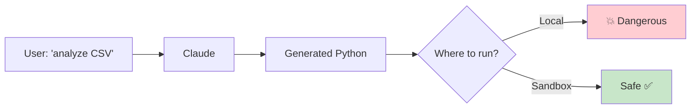
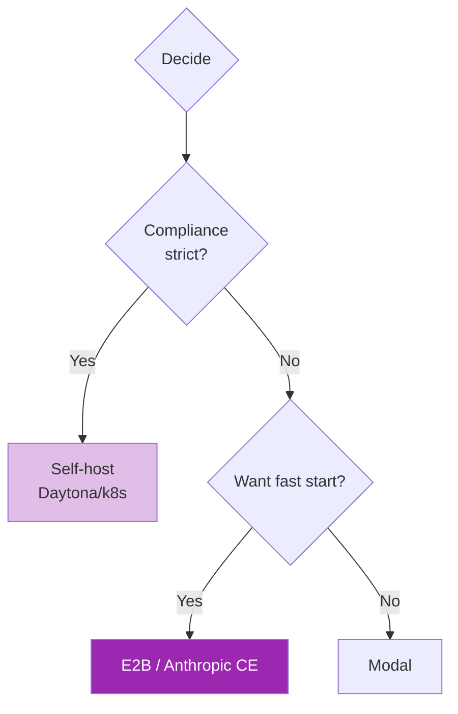

# Day 62: Code Execution Sandboxing 🧪

<div class="lesson-meta">
⏱️ 3 ชั่วโมง &nbsp;|&nbsp; 📊 Advanced &nbsp;|&nbsp; 📋 Prerequisites: Day 12 (Tools)
</div>

## 🎯 Learning Objectives

<ul class="objectives">
<li>เข้าใจทำไม code execution ต้อง sandbox</li>
<li>ใช้ E2B sandbox</li>
<li>ใช้ Anthropic Code Execution tool</li>
<li>เทียบ self-host vs managed</li>
</ul>

---

## 1. ปัญหา: LLM-generated Code



ความเสี่ยง:
- File system damage
- Network exfiltration
- Resource exhaustion (DOS)
- Privilege escalation
- Secret leakage (env vars)

→ **NEVER** run LLM-generated code on production machine

---

## 2. Solutions Overview

| Solution | Type | Best for |
|----------|------|---------|
| **E2B** | Managed sandbox-as-a-service | Quick start, agent code exec |
| **Anthropic Code Execution Tool** | Beta managed tool | Anthropic-native, basic |
| **Modal** | Serverless containers | Data tasks, ML workloads |
| **Daytona** | Self-host sandbox | Compliance, large scale |
| **Docker + jail** | DIY | Custom needs |
| **Firecracker microVM** | DIY low-level | Multi-tenant security |

---

## 3. E2B Sandbox

```bash
pip install e2b-code-interpreter anthropic
```

```python
from e2b_code_interpreter import Sandbox
from anthropic import Anthropic

client = Anthropic()

def run_code_in_sandbox(code: str):
    with Sandbox() as sandbox:
        execution = sandbox.run_code(code)
        return {
            "stdout": execution.logs.stdout,
            "stderr": execution.logs.stderr,
            "result": [r.dict() for r in execution.results]
        }

# Tool def
tools = [{
    "name": "execute_python",
    "description": "Execute Python code in sandbox. Returns stdout/stderr/result.",
    "input_schema": {
        "type": "object",
        "properties": {"code": {"type": "string"}},
        "required": ["code"]
    }
}]

def code_agent(task: str):
    messages = [{"role": "user", "content": task}]
    for _ in range(8):
        resp = client.messages.create(
            model="claude-sonnet-4-6",
            max_tokens=2000,
            tools=tools,
            messages=messages
        )
        if resp.stop_reason == "end_turn":
            return resp.content[0].text
        # Tool use
        results = []
        for block in resp.content:
            if block.type == "tool_use":
                result = run_code_in_sandbox(block.input["code"])
                results.append({
                    "type": "tool_result",
                    "tool_use_id": block.id,
                    "content": str(result)
                })
        messages.append({"role": "assistant", "content": resp.content})
        messages.append({"role": "user", "content": results})

# Try
print(code_agent("Calculate first 50 prime numbers"))
```

---

## 4. E2B with File Upload

```python
with Sandbox() as sandbox:
    # Upload file to sandbox
    with open("data.csv", "rb") as f:
        sandbox.files.write("/home/user/data.csv", f)
    
    # Run analysis
    exec = sandbox.run_code("""
import pandas as pd
df = pd.read_csv('/home/user/data.csv')
print(df.describe())
df.groupby('category')['sales'].sum().plot(kind='bar')
""")
    
    # Download artifacts (e.g., generated chart)
    for result in exec.results:
        if result.png:  # base64
            with open("chart.png", "wb") as f:
                import base64
                f.write(base64.b64decode(result.png))
```

---

## 5. Anthropic Code Execution Tool

Anthropic ให้ code execution เป็น built-in tool (beta):

```python
import anthropic

client = anthropic.Anthropic()

resp = client.beta.messages.create(
    model="claude-opus-4-7",
    max_tokens=2000,
    tools=[{
        "type": "code_execution_20250522",  # check current version
        "name": "code_execution"
    }],
    messages=[{"role": "user", "content": "Compute fibonacci(100)"}],
    betas=["code-execution-2025-05-22"]
)
```

Claude จะ:
1. Generate code
2. Run in managed sandbox
3. Get result
4. Continue reasoning

→ **Pro**: ง่ายมาก, ไม่ต้อง infra
→ **Con**: ไม่ persist state, จำกัด time/resource

---

## 6. Modal — Serverless Sandbox

```bash
pip install modal
modal token new
```

```python
import modal

app = modal.App("code-agent")

@app.function(
    image=modal.Image.debian_slim().pip_install("pandas", "matplotlib"),
    timeout=60,
    cpu=1.0,
    memory=512
)
def run_user_code(code: str):
    exec_globals = {}
    try:
        exec(code, exec_globals)
        return {"success": True, "output": exec_globals.get("result")}
    except Exception as e:
        return {"success": False, "error": str(e)}

# Call from Claude tool handler
result = run_user_code.remote(code_from_claude)
```

Modal pros: 
- Serverless = pay-per-use
- Custom images
- GPU support if needed
- Network policy

---

## 7. Security Best Practices

| Layer | What |
|-------|------|
| **Network** | Disable internet OR allow-list |
| **Filesystem** | Read-only base, writable /tmp only |
| **Resources** | CPU/RAM/time limits |
| **Secrets** | Never inject API keys into sandbox |
| **Timeouts** | < 60s typically |
| **Monitoring** | Log all executions |
| **Output size** | Truncate large outputs |
| **No persistence** | Fresh sandbox per task |

---

## 8. Self-host vs Managed Decision



---

## 🛠️ Hands-on Exercise

!!! example "Exercise 1: E2B Hello"
    Run hello world ใน E2B → ลอง matplotlib chart generation

!!! example "Exercise 2: Data Agent"
    Build agent ที่ upload CSV → analyze → return summary + chart

!!! example "Exercise 3: Anthropic CE"
    ลอง built-in code execution tool — compare DX vs E2B

---

## ✅ Self-Check Quiz

<div class="quiz">

**Q1:** ทำไม NEVER run LLM code locally?

??? success "ดูคำตอบ"
    - Prompt injection อาจหลอกให้ exfiltrate
    - Bug ใน code อาจลบ files
    - Resource exhaustion
    - Secret leakage

**Q2:** Anthropic CE vs E2B?

??? success "ดูคำตอบ"
    - CE: ง่ายสุด, managed, จำกัด feature
    - E2B: customizable, persistent state, more libs

</div>

---

## 🔍 Cross-check & References

- 📘 [E2B Docs](https://e2b.dev/docs)
- 📘 [Anthropic Code Execution](https://docs.claude.com/en/docs/agents-and-tools/tool-use/code-execution-tool)
- 📘 [Modal](https://modal.com/docs)

[ต่อไป → Day 63: Agent Skills :material-arrow-right:](day-63.md){ .md-button .md-button--primary }
