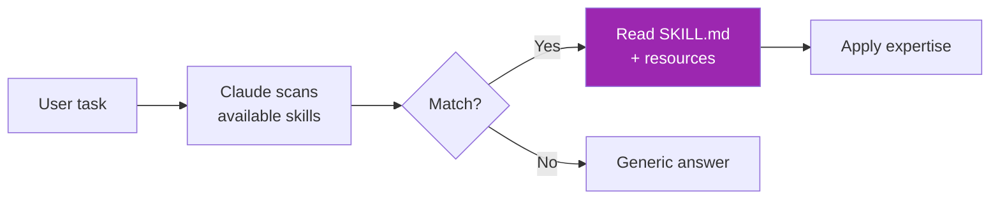
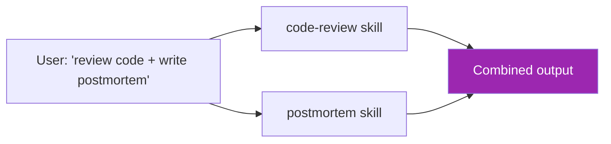

# Day 63: Agent Skills 🧰

<div class="lesson-meta">
⏱️ 3 ชั่วโมง &nbsp;|&nbsp; 📊 Advanced &nbsp;|&nbsp; 📋 Prerequisites: Day 12 (Tools)
</div>

## 🎯 Learning Objectives

<ul class="objectives">
<li>เข้าใจ concept ของ "Agent Skills"</li>
<li>Build skill folder structure</li>
<li>เห็น metadata-driven invocation</li>
<li>Compose multiple skills</li>
</ul>

---

## 1. Skills คืออะไร

**Skills** = packaged expertise — folder ที่ Claude อ่านได้:
- `SKILL.md` — metadata + how-to
- Resource files (templates, references)
- Helper scripts (executable)

→ คล้าย "extension" สำหรับ Claude

---

## 2. Skill Lifecycle



---

## 3. Skill Structure

```
my-skill/
├── SKILL.md           # required — what & when
├── reference.md       # optional — detailed docs
├── examples/          # optional — sample outputs
│   ├── good.docx
│   └── bad.docx
└── helpers/           # optional — scripts
    └── format.py
```

### SKILL.md template

```markdown
---
name: financial-report
description: Use when generating quarterly/annual financial reports. Triggers on phrases like "quarterly report", "financial summary", or when discussing P&L, balance sheets, cash flow.
---

# Financial Report Skill

## When to use
- User asks for quarterly/annual financial report
- Mentions P&L, balance sheet, cash flow
- Provides financial data

## How to use
1. Read `reference.md` for our company's standard format
2. Use template at `templates/quarterly.docx`
3. Generate report following structure: Summary → P&L → Balance Sheet → Cash Flow → Notes
4. Run `helpers/validate.py` to check format compliance

## Examples
See `examples/good-q3-2024.docx` for ideal output.
```

---

## 4. Skill Description Best Practices

The `description` field is critical — Claude uses it to decide if skill applies

✅ **Good description:**
> "Use when generating quarterly/annual financial reports. Triggers on phrases like 'quarterly report', 'financial summary', or when discussing P&L, balance sheets, cash flow."

❌ **Bad description:**
> "Financial stuff"

**Rules:**
- Concrete triggers
- Mention specific phrases
- State the deliverable
- Cover variations

---

## 5. Skills ใน Claude Code

Claude Code อ่าน skills จาก `.claude/skills/` folder:

```
.claude/
└── skills/
    ├── code-review/
    │   └── SKILL.md
    ├── deployment/
    │   └── SKILL.md
    └── postmortem/
        └── SKILL.md
```

ตอน Claude Code start session มันเห็น list of skills แล้วใช้เมื่อ task match

---

## 6. Example: Code Review Skill

`code-review/SKILL.md`:

```markdown
---
name: code-review
description: Use when user asks to review code, look for issues in a PR, audit security, or check code quality.
---

# Code Review Skill

## Steps
1. Read PR diff or specified files
2. Check against `checklist.md` items
3. Run lint/test if available
4. Generate review using `template.md` format

## Severity levels
- Blocker — must fix
- Major — should fix
- Minor — nice to fix
- Suggestion — optional improvement

## See
- `checklist.md` for full review checklist
- `template.md` for review format
```

`code-review/checklist.md`:

```markdown
## Security
- [ ] No hardcoded secrets
- [ ] Input validation
- [ ] SQL injection / XSS prevention
- [ ] Auth checks
...

## Quality
- [ ] Functions < 50 lines
- [ ] Clear naming
- [ ] Tests added
...
```

`code-review/template.md`:

```markdown
## Summary
<one paragraph>

## Blockers 🛑
- ...

## Major Issues 🟠
- ...

## Suggestions 💡
- ...

## Tests
- Coverage: <%>
- New tests added: <yes/no>
```

---

## 7. Composing Skills

Skills compose naturally — user task อาจ trigger 2+ skills:



→ Claude อ่านทั้ง 2 skills เข้ามาแล้ว apply ตามลำดับ logical

---

## 8. Skills vs Tools — เมื่อไหร่ใช้แต่ละแบบ

| | Tool | Skill |
|--|------|-------|
| Schema | structured input | natural language guide |
| Code | external | embedded (file references) |
| Best for | API calls, function exec | format conventions, methodology, templates |
| Example | `get_weather()` | "How to write Quarterly Report" |

→ Tools = capabilities, Skills = expertise

---

## 9. Distribution

Skills ดี:
- Easy to **version** (git)
- Easy to **share** (folder = artifact)
- Easy to **audit** (read SKILL.md)
- Easy to **update** (edit reference docs)

→ Like libraries for LLM agents

---

## 🛠️ Hands-on Exercise

!!! example "Exercise 1: First Skill"
    สร้าง skill ของคุณ (e.g., "weekly-status-update") — minimum: SKILL.md + 1 reference

!!! example "Exercise 2: Code Review Skill"
    ใช้ template ข้างบน → run บน real PR — observe Claude follow checklist

!!! example "Exercise 3: Compose"
    สร้าง 2 skills แล้ว trigger ทั้งคู่ใน task เดียว — check output

---

## ✅ Self-Check Quiz

<div class="quiz">

**Q1:** Skills ต่างจาก system prompt อย่างไร?

??? success "ดูคำตอบ"
    - System prompt = always loaded
    - Skill = loaded on-demand เมื่อ trigger match
    - Skills versioned + shareable
    - Multiple skills compose, system prompt = monolithic

**Q2:** ทำไม description ต้องเขียนดี?

??? success "ดูคำตอบ"
    Claude ใช้ description ตัดสินใจ load skill หรือไม่ — description ที่ vague = skill ไม่ถูกใช้ตอนต้องการ

</div>

---

## 🔍 Cross-check & References

- 📘 [Agent Skills (Anthropic)](https://docs.claude.com/en/docs/agents-and-tools/agent-skills)
- 📦 [Anthropic Skills Repo](https://github.com/anthropics/skills)
- 📺 [Building Effective Agents](https://www.anthropic.com/research/building-effective-agents)

[ต่อไป → Day 64: Browser Agents :material-arrow-right:](day-64.md){ .md-button .md-button--primary }
