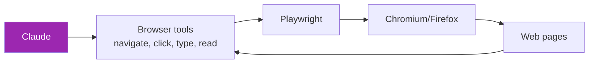

# Day 64: Browser Agents 🌐

<div class="lesson-meta">
⏱️ 4 ชั่วโมง &nbsp;|&nbsp; 📊 Advanced &nbsp;|&nbsp; 📋 Prerequisites: Day 12, 61
</div>

## 🎯 Learning Objectives

<ul class="objectives">
<li>เปรียบเทียบ Browser agents vs Computer Use</li>
<li>Setup Playwright + Claude integration</li>
<li>Build web research agent</li>
<li>Best practices: anti-bot, rate limit, accessibility</li>
</ul>

---

## 1. Browser Agents vs Computer Use

| | Browser Agent | Computer Use |
|--|---------------|--------------|
| Scope | Web only | Any OS app |
| Speed | Fast (DOM access) | Slow (vision) |
| Accuracy | High (structured) | Medium |
| Cost | Low | High (vision tokens) |
| Setup | Playwright | Docker + VNC |
| Best for | Scraping, form fill | Legacy apps |

→ Web task → **Browser agent ดีกว่า**

---

## 2. Architecture



---

## 3. Setup

```bash
pip install playwright anthropic
playwright install chromium
```

---

## 4. Tool Suite Design

```python
from playwright.sync_api import sync_playwright
from anthropic import Anthropic

client = Anthropic()

TOOLS = [
    {
        "name": "navigate",
        "description": "Navigate to URL",
        "input_schema": {
            "type": "object",
            "properties": {"url": {"type": "string"}},
            "required": ["url"]
        }
    },
    {
        "name": "click",
        "description": "Click element by CSS selector or text",
        "input_schema": {
            "type": "object",
            "properties": {
                "selector": {"type": "string", "description": "CSS selector"},
                "text": {"type": "string", "description": "Element text to find"}
            }
        }
    },
    {
        "name": "type_text",
        "description": "Type text into input element",
        "input_schema": {
            "type": "object",
            "properties": {
                "selector": {"type": "string"},
                "text": {"type": "string"}
            },
            "required": ["selector", "text"]
        }
    },
    {
        "name": "read_page",
        "description": "Get text content of current page",
        "input_schema": {"type": "object", "properties": {}}
    },
    {
        "name": "extract_html",
        "description": "Get simplified HTML (key elements only)",
        "input_schema": {
            "type": "object",
            "properties": {"selector": {"type": "string", "default": "body"}}
        }
    }
]
```

---

## 5. Browser Agent Implementation

```python
class BrowserAgent:
    def __init__(self):
        self.pw = sync_playwright().start()
        self.browser = self.pw.chromium.launch(headless=True)
        self.page = self.browser.new_page()
    
    def navigate(self, url):
        self.page.goto(url, wait_until="domcontentloaded")
        return f"Navigated to {url}"
    
    def click(self, selector=None, text=None):
        if text:
            self.page.get_by_text(text).click()
        else:
            self.page.click(selector)
        return f"Clicked"
    
    def type_text(self, selector, text):
        self.page.fill(selector, text)
        return f"Typed into {selector}"
    
    def read_page(self):
        return self.page.inner_text("body")[:5000]
    
    def extract_html(self, selector="body"):
        return self.page.inner_html(selector)[:8000]
    
    def execute(self, tool_name, args):
        method = getattr(self, tool_name)
        return method(**args)
    
    def close(self):
        self.browser.close()
        self.pw.stop()

def agent_loop(task: str, max_iter=10):
    agent = BrowserAgent()
    messages = [{"role": "user", "content": task}]
    try:
        for _ in range(max_iter):
            resp = client.messages.create(
                model="claude-sonnet-4-6",
                max_tokens=2000,
                tools=TOOLS,
                messages=messages
            )
            if resp.stop_reason == "end_turn":
                return resp.content[0].text
            results = []
            for block in resp.content:
                if block.type == "tool_use":
                    result = agent.execute(block.name, block.input)
                    results.append({
                        "type": "tool_result",
                        "tool_use_id": block.id,
                        "content": str(result)
                    })
            messages.append({"role": "assistant", "content": resp.content})
            messages.append({"role": "user", "content": results})
    finally:
        agent.close()

# Try
print(agent_loop("Go to wikipedia.org, search for 'AI agents', summarize the article"))
```

---

## 6. Accessibility Tree (Better than HTML)

แทน raw HTML → ส่ง a11y tree ลด tokens:

```python
def get_accessibility_snapshot(page):
    return page.accessibility.snapshot()

# Output ตัวอย่าง:
# {role: "WebArea", name: "...", children: [
#   {role: "heading", name: "AI Agents"},
#   {role: "textbox", name: "Search", focused: True},
#   ...
# ]}
```

→ Claude เข้าใจ structure ดี + ใช้ tokens น้อยกว่า HTML

---

## 7. Stealth Mode (Anti-bot)

หลายเว็บ block ก่อน:

```python
from playwright_stealth import stealth_sync

browser = pw.chromium.launch(headless=False)  # headed less suspicious
context = browser.new_context(
    user_agent="Mozilla/5.0 (Windows NT 10.0; Win64; x64)...",
    viewport={"width": 1920, "height": 1080}
)
page = context.new_page()
stealth_sync(page)  # apply stealth tricks
```

!!! warning "Ethics"
    Respect `robots.txt`, rate limits, ToS  
    Don't bypass auth/CAPTCHAs ที่ไม่ได้รับอนุญาต  
    Site owners block bots for legit reasons

---

## 8. Real-world Patterns

### a. Research Agent
- Multi-step web research
- Summarize findings
- Cite URLs

### b. Form Filler
- Read PDF/email
- Extract data
- Fill web form
- **Human approve** before submit

### c. Monitoring Agent
- Check site daily
- Compare to last snapshot
- Alert on change

### d. QA Tester
- Test user flows
- Verify against spec
- Report failures

---

## 9. Cost Optimization

- ใช้ a11y tree ไม่ใช่ full HTML (~10x tokens น้อยกว่า)
- Cache page content
- Use Haiku for navigation, Opus for understanding
- Set max_iter strictly
- Implement timeouts

---

## 🛠️ Hands-on Exercise

!!! example "Exercise 1: Wikipedia Research"
    Build agent: "ค้นหา 5 ประวัติของ AI researchers แล้วสร้างสรุป"

!!! example "Exercise 2: Form Filler"
    Build agent ที่อ่าน data จาก JSON → กรอกฟอร์มทดสอบ

!!! example "Exercise 3: A11y vs HTML"
    เปรียบเทียบ token usage 2 approaches → measure cost

---

## ✅ Self-Check Quiz

<div class="quiz">

**Q1:** ทำไม a11y tree ดีกว่า HTML?

??? success "ดูคำตอบ"
    - ลด tokens (~10x)
    - มี structure ที่ LLM เข้าใจ (roles)
    - Skip styling/scripting noise
    - Closer to "what user sees"

**Q2:** Ethics ของ browser agents?

??? success "ดูคำตอบ"
    - Respect robots.txt + ToS
    - Rate-limit (no DOS)
    - Don't bypass auth/CAPTCHA
    - Don't scrape PII
    - Disclose AI agent in some contexts

</div>

---

## 🔍 Cross-check & References

- 📘 [Playwright Python](https://playwright.dev/python/)
- 📦 [Claude in Chrome (Anthropic)](https://claude.com/products/chrome)
- 📺 [Building AI Browser Agents (DLAI)](https://www.deeplearning.ai/courses/building-ai-browser-agents)

[ต่อไป → Day 65: Spec-driven dev :material-arrow-right:](day-65.md){ .md-button .md-button--primary }
