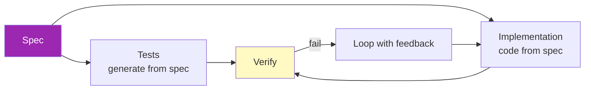

# Day 65: Spec-Driven Development 📋

<div class="lesson-meta">
⏱️ 3 ชั่วโมง &nbsp;|&nbsp; 📊 Methodology &nbsp;|&nbsp; 📋 Prerequisites: Day 14 (Claude Code)
</div>

## 🎯 Learning Objectives

<ul class="objectives">
<li>เข้าใจปรัชญา spec-driven กับ AI</li>
<li>เขียน spec ที่ AI implement ตามได้</li>
<li>Spec → Test → Implementation flow</li>
<li>Use Kiro / spec-kit-style workflows</li>
</ul>

---

## 1. ปัญหา: "Vibe Coding" with AI

```python
# วิธีที่หลายคนใช้ AI
"Build me a user auth API" 
→ AI generates 500 lines 
→ user reviews chaos
→ "no, change this"
→ AI regenerates
→ ... 10 iterations later, lost
```

ปัญหา:
- Spec อยู่ใน user's head — AI guess
- ไม่มี test เป็น ground truth
- Iteration นาน
- Hard to verify "done"

---

## 2. Spec-Driven Paradigm



→ Spec = single source of truth — AI fills in gap

---

## 3. Spec Format

### Minimal Spec Template

```markdown
# Feature: User Authentication API

## Goal
Allow users to register, login, and reset password.

## Inputs/Outputs
### POST /register
- Input: {email, password}
- Output: 201 {user_id, token} OR 400 error
- Rules:
  - Email valid format
  - Password min 8 chars, 1 uppercase, 1 digit
  - Email unique
  - Returns JWT valid for 24h

### POST /login
- Input: {email, password}
- Output: 200 {token} OR 401
...

## Non-functional
- Response time < 200ms p95
- Rate limit: 10/min per IP
- Audit log all auth events

## Out of scope
- Social login (Phase 2)
- 2FA (Phase 2)

## Acceptance criteria
- [ ] All endpoints work per spec
- [ ] Unit tests cover happy + error paths
- [ ] Integration tests
- [ ] Rate limit enforced
- [ ] Audit logs visible
```

---

## 4. Workflow Steps

### Step 1: Write spec WITH Claude

```
You: "Help me write a spec for [feature]. Ask me questions until you have enough detail to give precise inputs/outputs and edge cases."

Claude: [asks 10-15 clarifying questions]

You: [answers]

Claude: [drafts spec]

You: [refines]
```

### Step 2: Generate tests from spec

```
You: "Read spec.md → generate test cases (Pytest) that comprehensively cover spec."

Claude: [generates test_auth.py with 30 tests]
```

### Step 3: Implement

```
You: "Read spec.md and test_auth.py → implement to make all tests pass."

Claude: [generates auth.py]
```

### Step 4: Verify

```bash
pytest test_auth.py
# 28 pass, 2 fail
```

### Step 5: Iterate

```
You: "Tests test_register_duplicate and test_jwt_expiry fail with [error]. Fix without breaking other tests."

Claude: [updates code]
```

---

## 5. Tools — Kiro, spec-kit Style

### Kiro (AI IDE that's spec-first)

```
.kiro/
├── specs/
│   ├── auth.md
│   └── billing.md
└── steering.md  # global guidance
```

When you ask Claude (via Kiro) to implement, it auto-loads relevant spec

### spec-kit pattern (DIY)

```
my-project/
├── specs/
│   ├── 001-auth.md
│   ├── 002-billing.md
│   └── INDEX.md
├── src/
└── tests/
```

Convention: Claude reads spec for any feature before coding

---

## 6. Tests as Living Spec

→ Tests = executable spec — if test passes, behavior is correct

```python
# test_auth.py
def test_register_with_weak_password():
    """Spec: passwords must be 8+ chars, 1 upper, 1 digit"""
    resp = client.post("/register", json={"email": "x@y.com", "password": "weak"})
    assert resp.status_code == 400
    assert "password" in resp.json()["error"].lower()

def test_register_returns_jwt_valid_24h():
    """Spec: token valid 24h"""
    resp = client.post("/register", json={"email": "x@y.com", "password": "Strong123"})
    token = resp.json()["token"]
    decoded = jwt.decode(token, SECRET, algorithms=["HS256"])
    exp = decoded["exp"] - decoded["iat"]
    assert exp == 24 * 3600
```

→ Spec บางส่วน "อยู่ใน" tests

---

## 7. Anti-patterns

| ❌ | ✅ |
|---|---|
| "Just write the code, I'll review" | Write spec first |
| Vague spec ("make it nice") | Concrete I/O + rules |
| 1000-line spec | Sliceable (one feature = one spec) |
| Spec without acceptance criteria | Always include criteria |
| Tests after code | Tests from spec, code after |

---

## 8. When NOT Spec-Driven

- Exploration / prototype
- 1-off script
- Throwaway demo
- Pair-discovery sessions

→ Use spec-driven for **production code** + **team work**

---

## 🛠️ Hands-on Exercise

!!! example "Exercise 1: Write Spec"
    เลือก feature ที่จะ implement → write spec → ขอ Claude review → improve

!!! example "Exercise 2: Full Flow"
    Spec → tests → impl → verify (4 steps แยก commits)

!!! example "Exercise 3: Bigger Project"
    Break monolith spec → 5 sliceable feature specs → implement 1

---

## ✅ Self-Check Quiz

<div class="quiz">

**Q1:** ทำไม spec-driven > vibe coding?

??? success "ดูคำตอบ"
    - Shared understanding (team + AI)
    - Test-driven from spec = guaranteed coverage
    - Fewer iteration cycles
    - Onboarding easier (read specs)

**Q2:** ขนาด spec ควรเท่าไหร่?

??? success "ดูคำตอบ"
    - 1 spec = 1 feature/slice
    - Implementable ใน 1-2 days
    - Ifเขียน 5000+ words → break apart

</div>

---

## 🔍 Cross-check & References

- 📺 [Kiro IDE](https://kiro.dev/)
- 📦 [GitHub spec-kit](https://github.com/github/spec-kit)
- 📘 [Building Effective Agents](https://www.anthropic.com/research/building-effective-agents)

[ต่อไป → Day 66: Doc AI intro :material-arrow-right:](day-66.md){ .md-button .md-button--primary }
