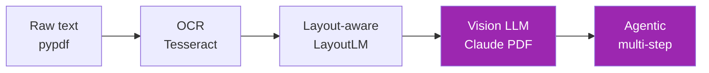

# Day 66: Document AI — Intro 📄

<div class="lesson-meta">
⏱️ 3 ชั่วโมง &nbsp;|&nbsp; 📊 Intermediate &nbsp;|&nbsp; 📋 Prerequisites: Day 8 (PDF), Day 12 (Tools)
</div>

## 🎯 Learning Objectives

<ul class="objectives">
<li>เข้าใจ pipeline ของ Document AI</li>
<li>เปรียบเทียบ raw PDF text vs OCR vs Agentic</li>
<li>ใช้ Claude PDF vision capability</li>
<li>เห็น tradeoff ของ each approach</li>
</ul>

---

## 1. Spectrum of Document Processing



| Approach | Best for | Accuracy | Cost |
|----------|---------|----------|------|
| Raw text extract | Born-digital simple PDF | High | $ |
| OCR | Scanned text | Medium | $ |
| Layout-aware | Forms, tables | High | $$ |
| Vision LLM | Mixed (text+image+chart) | Very High | $$$ |
| Agentic | Multi-step workflows | Highest | $$$$ |

---

## 2. Born-Digital PDF — Quick Win

```bash
pip install pypdf
```

```python
from pypdf import PdfReader

reader = PdfReader("report.pdf")
text = "\n".join(page.extract_text() for page in reader.pages)
```

→ ใช้กับ digital PDF (Word export, web reports) — fast + cheap

❌ Fail กับ:
- Scanned PDF
- Image-heavy
- Complex tables
- Hand-written

---

## 3. OCR Path

```bash
pip install pytesseract pillow pdf2image
# Install tesseract binary separately
```

```python
import pytesseract
from pdf2image import convert_from_path

pages = convert_from_path("scanned.pdf", dpi=300)
text = "\n".join(pytesseract.image_to_string(p) for p in pages)
```

ภาษาไทย:
```python
pytesseract.image_to_string(img, lang="tha+eng")
```

ปัญหา OCR:
- Layout lost (everything is "blob")
- Tables broken
- Order ผิดถ้าหน้ามี multi-column

---

## 4. Claude PDF Support (Direct)

Claude รับ PDF ตรงๆ ผ่าน vision:

```python
import base64
from anthropic import Anthropic

client = Anthropic()

with open("report.pdf", "rb") as f:
    pdf_data = base64.standard_b64encode(f.read()).decode()

resp = client.messages.create(
    model="claude-sonnet-4-6",
    max_tokens=2000,
    messages=[{
        "role": "user",
        "content": [
            {"type": "document", "source": {
                "type": "base64",
                "media_type": "application/pdf",
                "data": pdf_data
            }},
            {"type": "text", "text": "Summarize this report and extract all tables as Markdown."}
        ]
    }]
)
print(resp.content[0].text)
```

→ Claude เห็นทั้ง text + images + layouts → จัดการ complex docs ได้

---

## 5. Structured Extraction with Pydantic

```python
from pydantic import BaseModel
from typing import List

class Invoice(BaseModel):
    invoice_number: str
    date: str
    vendor: str
    line_items: List[dict]  # [{description, quantity, unit_price, total}]
    subtotal: float
    tax: float
    total: float

# Use as tool input_schema
tools = [{
    "name": "save_invoice",
    "description": "Save extracted invoice",
    "input_schema": Invoice.model_json_schema()
}]

resp = client.messages.create(
    model="claude-sonnet-4-6",
    max_tokens=2000,
    tools=tools,
    tool_choice={"type": "tool", "name": "save_invoice"},
    messages=[{
        "role": "user",
        "content": [
            {"type": "document", "source": {...pdf}},
            {"type": "text", "text": "Extract invoice details"}
        ]
    }]
)

for block in resp.content:
    if block.type == "tool_use":
        invoice = Invoice(**block.input)
        print(invoice)
```

→ Type-safe structured extraction ใน 1 call

---

## 6. Complex Docs — Tables

Claude vision is good with tables — preserve structure:

```python
prompt = """
Extract all tables from this document. For each table:
1. Title/caption
2. Column headers
3. All data rows
4. Output as Markdown table

If a table spans pages, merge it. Skip headers/footers.
"""
```

---

## 7. Charts & Figures

```python
prompt = """
For each chart in the document:
1. Type (bar/line/pie/etc)
2. Title
3. Axes labels
4. Key data points (extract values if visible)
5. Insight/finding
"""
```

→ Claude อ่าน chart ได้ดี — แต่ตัวเลขเล็กๆ อาจอ่านพลาด ให้ verify

---

## 8. Limitations

- **Multi-page context limit** — PDF ใหญ่อาจเกิน context
  - Solution: split + summarize, or use RAG
- **Handwritten** — accuracy variable
- **Stamps/seals** — partial
- **Watermarks** — may obscure text

---

## 🛠️ Hands-on Exercise

!!! example "Exercise 1: Compare Approaches"
    Take 1 PDF (scanned) → extract ผ่าน:
    1. pypdf (likely empty)
    2. OCR
    3. Claude vision
    Compare quality + cost + time

!!! example "Exercise 2: Invoice Extractor"
    Build Invoice extractor (Pydantic) → ทดสอบกับ 5 sample invoices

!!! example "Exercise 3: Table Extraction"
    Scanned table → Claude vision → Markdown — check accuracy

---

## ✅ Self-Check Quiz

<div class="quiz">

**Q1:** เมื่อไหร่ไม่ใช้ Claude vision (ใช้ pypdf)?

??? success "ดูคำตอบ"
    - Born-digital simple PDF
    - High volume (cost)
    - No tables/charts/images
    - Speed-critical (vision slow)

**Q2:** ทำไม structured extraction ต้องใช้ Pydantic + tool?

??? success "ดูคำตอบ"
    - Type safety
    - Auto-validation
    - JSON schema constrains output
    - Downstream API compatible

</div>

---

## 🔍 Cross-check & References

- 📘 [Claude PDF Support](https://docs.claude.com/en/docs/build-with-claude/pdf-support)
- 📺 [Document Analysis with LlamaIndex (DLAI)](https://www.deeplearning.ai/short-courses/document-analysis-with-llamaindex/)
- 📦 [LandingAI Agentic Doc](https://github.com/landing-ai/agentic-doc) (Day 95)

[ต่อไป → Day 67: Voice Agents intro :material-arrow-right:](day-67.md){ .md-button .md-button--primary }
