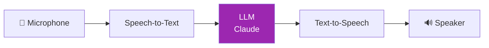
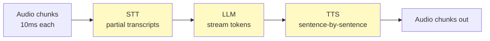
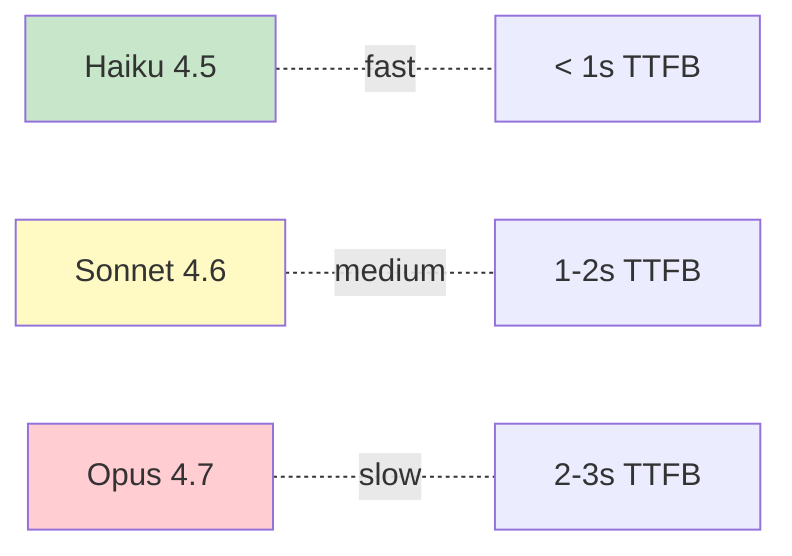

# Day 67: Voice Agents — Intro 🎙️

<div class="lesson-meta">
⏱️ 3 ชั่วโมง &nbsp;|&nbsp; 📊 Intermediate &nbsp;|&nbsp; 📋 Prerequisites: Day 11 (API)
</div>

## 🎯 Learning Objectives

<ul class="objectives">
<li>เข้าใจ voice agent pipeline (STT → LLM → TTS)</li>
<li>เห็น latency budgets ของ real-time voice</li>
<li>รู้จัก tools: LiveKit, Deepgram, ElevenLabs</li>
<li>Build simple voice loop</li>
</ul>

→ **Note**: Day 91-93 จะลึกขึ้นเรื่อง production deployment

---

## 1. Voice Agent Pipeline



**Latency budget** (target: < 1.5s end-to-end):
- STT: 100-300ms
- LLM (TTFB): 400-800ms
- TTS: 100-300ms
- Network: 50-200ms

→ ทุก component ต้องเร็ว — vital สำหรับ user experience

---

## 2. Component Choices

| Component | Options |
|-----------|---------|
| **STT** | Deepgram, AssemblyAI, OpenAI Whisper, Google Cloud Speech |
| **LLM** | Claude (Haiku for speed), GPT-4o, Gemini |
| **TTS** | ElevenLabs, Azure Speech, OpenAI TTS, Cartesia |
| **Orchestration** | LiveKit, Pipecat, Vocode, Google ADK |

---

## 3. Streaming All The Way

แต่ละ step ต้อง streaming เพื่อความเร็ว:



→ ไม่ wait full audio → ไม่ wait full transcript → ไม่ wait full LLM response

---

## 4. Simple Demo — Pipecat

```bash
pip install pipecat-ai
```

```python
from pipecat.pipeline.pipeline import Pipeline
from pipecat.services.deepgram import DeepgramSTTService
from pipecat.services.anthropic import AnthropicLLMService
from pipecat.services.elevenlabs import ElevenLabsTTSService
from pipecat.transports.daily.transport import DailyTransport

# Define pipeline
stt = DeepgramSTTService(api_key=DEEPGRAM_KEY)
llm = AnthropicLLMService(api_key=ANTHROPIC_KEY, model="claude-haiku-4-5-20251001")
tts = ElevenLabsTTSService(api_key=ELEVENLABS_KEY, voice_id="...")

transport = DailyTransport(room_url, token, bot_name)

pipeline = Pipeline([
    transport.input(),     # mic in
    stt,
    llm,
    tts,
    transport.output()     # speaker out
])

# Run
import asyncio
from pipecat.pipeline.runner import PipelineRunner
runner = PipelineRunner()
asyncio.run(runner.run(pipeline))
```

→ Pipecat handle streaming + interruption + VAD (voice activity detection)

---

## 5. Why Haiku for Voice



ในบทสนทนาแบบ voice — pause > 1s = unnatural feel — Haiku ตอบจริงๆ ทันที

หากต้อง reasoning ลึก → quick Haiku → escalate to Sonnet behind scene → speak Haiku answer + "let me check more"

---

## 6. Turn-Taking & Interruption

User ขัด AI ที่กำลังพูด → AI ต้อง stop, listen → respond

```python
# Pipecat handles this via VAD + barge-in
# Custom logic example:

class VoiceState:
    def __init__(self):
        self.bot_speaking = False
    
    def on_user_speech_start(self):
        if self.bot_speaking:
            self.stop_tts()  # interrupt
            self.cancel_llm()  # stop generation
            self.bot_speaking = False
    
    def on_bot_speech_start(self):
        self.bot_speaking = True
```

---

## 7. Function Calling in Voice

Voice agent ต้องเรียก tools ได้ — แต่ status ต้อง audible:

```
User: "What's my account balance?"
Bot: "Let me check..."  ← audible feedback
[behind: call get_balance() tool]
Bot: "Your balance is $1,234.56"
```

→ Pattern: filler phrases ระหว่าง tool call ถ้า > 1s

---

## 8. Voice-Specific Prompting

```python
SYSTEM = """You are a voice assistant. Your responses are spoken aloud.

Rules:
- Be concise (1-3 sentences typical)
- No markdown / bullets — flowing speech
- No URLs or long numbers (read short)
- Use natural fillers ('let me see', 'sure')
- If reading list, max 3 items
- Pronounce ambiguous proper nouns clearly
"""
```

---

## 9. Cost Considerations

| Component | Per minute cost (approx) |
|-----------|---------------------|
| Deepgram STT | $0.0043 |
| Claude Haiku LLM | $0.001-0.005 |
| ElevenLabs TTS | $0.02-0.05 |
| LiveKit/Daily room | $0.005 |
| **Total per minute** | ~$0.03-0.06 |

→ Voice แพงกว่า text chat 50-100x — design economics carefully

---

## 🛠️ Hands-on Exercise

!!! example "Exercise 1: Pipecat Demo"
    Run Pipecat hello-world — chat กับ Claude ด้วยเสียง

!!! example "Exercise 2: Tool Calling"
    เพิ่ม 1 tool (e.g., get_weather) → ลอง voice flow

!!! example "Exercise 3: Latency Measurement"
    Measure: mic input → first audio out — target < 1.5s p50

---

## ✅ Self-Check Quiz

<div class="quiz">

**Q1:** ทำไม streaming everywhere?

??? success "ดูคำตอบ"
    ลด latency — แต่ละ stage เริ่มทำงานก่อน stage ก่อนหน้าจบ → overlapping = faster end-to-end

**Q2:** Haiku ดีกว่า Opus ใน voice เพราะ?

??? success "ดูคำตอบ"
    - TTFB เร็ว — สำคัญสุดใน voice
    - Cost ถูก — voice expensive
    - คำตอบสั้น = natural conversation pace
    - Opus ใช้เมื่อต้อง reasoning เชิงลึกเท่านั้น

</div>

---

## 🔍 Cross-check & References

- 📦 [Pipecat](https://github.com/pipecat-ai/pipecat)
- 📦 [LiveKit Agents](https://docs.livekit.io/agents/)
- 📺 [Building AI Voice Agents (DLAI)](https://www.deeplearning.ai/courses/building-ai-voice-agents-for-production)
- 📘 [Google Agent Development Kit (ADK)](https://google.github.io/adk-docs/)

---

:material-check-decagram: **จบ Week 9!** ก้าวเข้าสู่ Multi-Agent

[ต่อไป → Week 10: Multi-Agent :material-arrow-right:](../week-10/index.md){ .md-button .md-button--primary }
