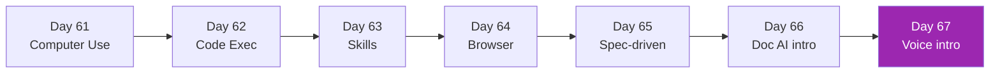

# Week 9: Advanced Agents 🤖

ขยายความสามารถ agent ผ่าน specialized capabilities — เริ่ม Month 3

## รายวิชา

| Day | หัวข้อ | เวลา |
|-----|--------|------|
| 61 | Computer Use API deep | 4h |
| 62 | Code execution sandboxing (E2B) | 3h |
| 63 | Agent Skills | 3h |
| 64 | Browser Agents (Playwright + Claude) | 4h |
| 65 | Spec-driven development | 3h |
| 66 | Document AI — intro | 3h |
| 67 | Voice Agents — intro | 3h |

[เริ่ม Day 61 :material-arrow-right:](day-61.md){ .md-button .md-button--primary }
