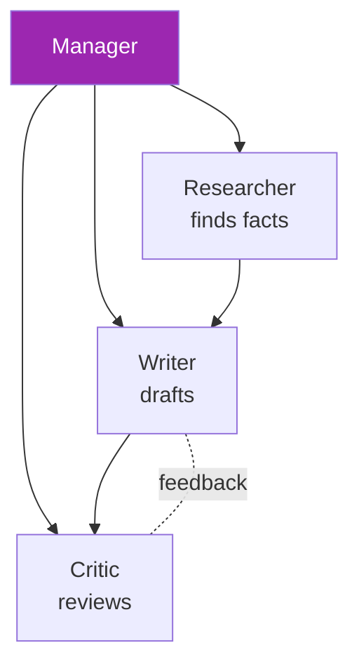
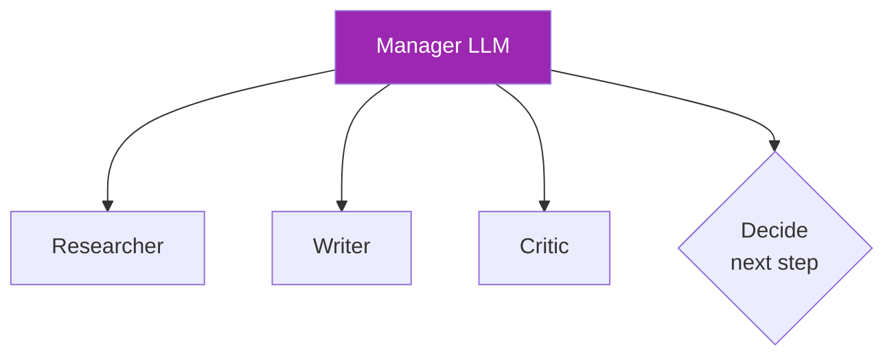

# Day 68: CrewAI 👥

<div class="lesson-meta">
⏱️ 4 ชั่วโมง &nbsp;|&nbsp; 📊 Intermediate &nbsp;|&nbsp; 📋 Prerequisites: Day 47 (LangGraph)
</div>

## 🎯 Learning Objectives

<ul class="objectives">
<li>เข้าใจ role-based multi-agent pattern</li>
<li>Build crew (researcher + writer + critic)</li>
<li>เห็นจุดแข็ง/อ่อนกับ LangGraph</li>
</ul>

---

## 1. CrewAI Concept



แต่ละ agent มี:
- **Role** (e.g., "Senior Research Analyst")
- **Goal** (e.g., "Find accurate facts")
- **Backstory** (context)
- **Tools** (web search, etc.)

---

## 2. Setup

```bash
pip install crewai crewai-tools
```

```python
from crewai import Agent, Task, Crew, Process
from crewai_tools import SerperDevTool
import os
os.environ["ANTHROPIC_API_KEY"] = "..."

# Define agents
researcher = Agent(
    role="Senior Research Analyst",
    goal="Find accurate, recent information on {topic}",
    backstory="You're a meticulous researcher with 10 years experience.",
    tools=[SerperDevTool()],
    llm="anthropic/claude-sonnet-4-6",
    verbose=True
)

writer = Agent(
    role="Tech Content Writer",
    goal="Write engaging article based on research",
    backstory="You write for tech audiences with clarity.",
    llm="anthropic/claude-sonnet-4-6",
    verbose=True
)

critic = Agent(
    role="Editor",
    goal="Review article for accuracy and quality",
    backstory="20 years magazine editor.",
    llm="anthropic/claude-opus-4-7",
    verbose=True
)
```

---

## 3. Tasks

```python
research_task = Task(
    description="Research the topic: {topic}. Output: 10 bullet facts with sources.",
    expected_output="10 facts with citations",
    agent=researcher
)

write_task = Task(
    description="Write 800-word article using research from previous task.",
    expected_output="Markdown article",
    agent=writer,
    context=[research_task]  # depends on research
)

review_task = Task(
    description="Review article. List issues. If pass, output 'APPROVED'.",
    expected_output="Review notes or APPROVED",
    agent=critic,
    context=[write_task]
)
```

---

## 4. Crew Execution

```python
crew = Crew(
    agents=[researcher, writer, critic],
    tasks=[research_task, write_task, review_task],
    process=Process.sequential,  # or Process.hierarchical
    verbose=True
)

result = crew.kickoff(inputs={"topic": "AI agents in 2026"})
print(result)
```

---

## 5. Hierarchical Process



Manager agent ตัดสินใจ delegate task ไหนให้ใคร

```python
crew = Crew(
    agents=[researcher, writer, critic],
    tasks=[main_task],
    process=Process.hierarchical,
    manager_llm="anthropic/claude-opus-4-7",  # uses Opus as manager
    verbose=True
)
```

---

## 6. CrewAI vs LangGraph

| | CrewAI | LangGraph |
|--|--------|-----------|
| Mental model | Roles + tasks | Graph + state |
| Setup | High-level | Low-level |
| Customization | Limited | Full |
| Visibility | Verbose mode | get_graph() |
| Best for | Standard patterns | Custom flows |
| Learning curve | Easier | Steeper |

→ **CrewAI** = quick proof, productive
→ **LangGraph** = complex enterprise workflows

---

## 7. Tools Across Agents

```python
from crewai_tools import (
    SerperDevTool,         # web search
    ScrapeWebsiteTool,
    DirectoryReadTool,
    FileReadTool,
    PDFSearchTool,
)

# Share tool across agents
search = SerperDevTool()

researcher = Agent(..., tools=[search])
fact_checker = Agent(..., tools=[search])
```

---

## 8. Memory in CrewAI

```python
crew = Crew(
    agents=[...],
    tasks=[...],
    memory=True,  # enable short + long term memory
    embedder={"provider": "openai", "config": {"model": "text-embedding-3-small"}}
)
```

→ CrewAI manage memory พื้นฐานเอง

---

## 9. Real-world Example

### Customer Support Crew

```python
classifier = Agent(role="Ticket Classifier", goal="Categorize and prioritize", ...)
investigator = Agent(role="Issue Investigator", goal="Diagnose root cause", tools=[db_tool, log_tool], ...)
responder = Agent(role="Customer Communicator", goal="Reply with empathy", ...)
escalator = Agent(role="Escalation Manager", goal="Decide if human needed", ...)

tasks = [classify_task, investigate_task, respond_task, escalate_task]
```

---

## 🛠️ Hands-on Exercise

!!! example "Exercise 1: 3-Agent Crew"
    Build researcher + writer + critic — run บน topic "AI in healthcare"

!!! example "Exercise 2: Hierarchical"
    Convert sequential → hierarchical → compare output quality + cost

!!! example "Exercise 3: Tools"
    Add web search + file read tools → agents collaborate on knowledge synthesis

---

## ✅ Self-Check Quiz

<div class="quiz">

**Q1:** Sequential vs Hierarchical?

??? success "ดูคำตอบ"
    - Sequential: fixed task order, deterministic
    - Hierarchical: manager LLM dynamically delegates, more flexible แต่แพง + non-deterministic

**Q2:** CrewAI > LangGraph เมื่อ?

??? success "ดูคำตอบ"
    - Standard role-based workflows (researcher/writer/etc.)
    - Quick POC
    - Team ไม่คุ้น graph paradigm
    - Don't need fine-grained control

</div>

---

## 🔍 Cross-check & References

- 📘 [CrewAI Docs](https://docs.crewai.com/)
- 📺 [Multi AI Agent Systems with crewAI (DLAI)](https://www.deeplearning.ai/courses/multi-ai-agent-systems-with-crewai)
- 📦 [CrewAI examples](https://github.com/joaomdmoura/crewAI-examples)

[ต่อไป → Day 69: LangGraph Multi-Agent :material-arrow-right:](day-69.md){ .md-button .md-button--primary }
