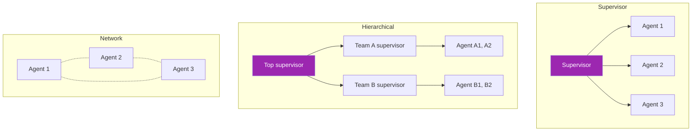

# Day 69: LangGraph Multi-Agent 🔗

<div class="lesson-meta">
⏱️ 4 ชั่วโมง &nbsp;|&nbsp; 📊 Advanced &nbsp;|&nbsp; 📋 Prerequisites: Day 47
</div>

## 🎯 Learning Objectives

<ul class="objectives">
<li>เข้าใจ 3 patterns: Supervisor, Hierarchical, Network</li>
<li>Implement Supervisor pattern ด้วย LangGraph</li>
<li>Handoff agents via routing</li>
</ul>

---

## 1. 3 Architectures



| | Supervisor | Hierarchical | Network |
|--|------------|--------------|---------|
| Routing | Central | Multi-level | Peer-to-peer |
| Use case | Tool routing | Large org | Collaboration |
| Complexity | Low | Medium | High |

---

## 2. Supervisor Pattern (Most Common)

Supervisor LLM decides which agent to route to:

```python
from langgraph.graph import StateGraph, END, START
from typing import TypedDict, Literal
from langchain_anthropic import ChatAnthropic
from langchain_core.messages import HumanMessage, AIMessage

class State(TypedDict):
    messages: list
    next: str  # routing decision

llm = ChatAnthropic(model="claude-sonnet-4-6")

def supervisor(state: State) -> dict:
    # Supervisor decides next agent
    sys = """You're the supervisor. Based on conversation, route to one of:
- researcher: gather facts
- coder: write code
- writer: format report
- FINISH: done"""
    
    last_msg = state["messages"][-1].content
    resp = llm.invoke([
        AIMessage(content=sys),
        HumanMessage(content=f"Conversation:\n{last_msg}\n\nWho's next?")
    ])
    
    # Parse decision
    text = resp.content.lower()
    if "finish" in text:
        return {"next": END}
    for agent in ["researcher", "coder", "writer"]:
        if agent in text:
            return {"next": agent}
    return {"next": END}

def researcher_agent(state: State) -> dict:
    resp = llm.invoke([HumanMessage(content=f"Research: {state['messages'][-1].content}")])
    return {"messages": state["messages"] + [AIMessage(content=resp.content, name="researcher")]}

def coder_agent(state: State) -> dict:
    resp = llm.invoke([HumanMessage(content=f"Write code for: {state['messages'][-1].content}")])
    return {"messages": state["messages"] + [AIMessage(content=resp.content, name="coder")]}

def writer_agent(state: State) -> dict:
    resp = llm.invoke([HumanMessage(content=f"Format as report: {state['messages']}")])
    return {"messages": state["messages"] + [AIMessage(content=resp.content, name="writer")]}

# Build graph
g = StateGraph(State)
g.add_node("supervisor", supervisor)
g.add_node("researcher", researcher_agent)
g.add_node("coder", coder_agent)
g.add_node("writer", writer_agent)

g.add_edge(START, "supervisor")
g.add_conditional_edges("supervisor", lambda s: s["next"], {
    "researcher": "researcher", "coder": "coder", "writer": "writer", END: END
})
# After each agent returns to supervisor
g.add_edge("researcher", "supervisor")
g.add_edge("coder", "supervisor")
g.add_edge("writer", "supervisor")

app = g.compile()

# Run
result = app.invoke({"messages": [HumanMessage(content="Build me an API for users + write docs")], "next": ""})
```

---

## 3. Hierarchical (Teams)

For larger workflows:

```python
# Team 1: Engineering
engineering_team = build_team_graph(["coder", "tester", "reviewer"])

# Team 2: Marketing
marketing_team = build_team_graph(["copywriter", "designer", "seo"])

# Top supervisor routes to teams
def top_supervisor(state) -> dict:
    # Decide engineering_team vs marketing_team
    ...

top = StateGraph(State)
top.add_node("top_supervisor", top_supervisor)
top.add_node("engineering_team", engineering_team)
top.add_node("marketing_team", marketing_team)
top.add_conditional_edges("top_supervisor", router, {...})
```

→ Useful for very large org-like systems

---

## 4. Network (Peer-to-Peer)

Agents can hand off to each other directly:

```python
# Each agent has access to "handoff" tool
HANDOFF_TOOLS = [
    {"name": "transfer_to_researcher", "description": "Pass to research agent"},
    {"name": "transfer_to_coder", "description": "Pass to code agent"},
]

# Each agent's logic includes routing via handoff tools
```

→ More autonomous but harder to debug — use sparingly

---

## 5. Handoff Pattern

When agent A wants to pass to agent B:

```python
def coder_agent(state: State) -> dict:
    resp = llm.invoke(...tools=HANDOFF_TOOLS...)
    
    for block in resp.content:
        if block.type == "tool_use" and block.name == "transfer_to_writer":
            return {"messages": [...], "next": "writer"}  # explicit handoff
    return {"messages": [...]}
```

---

## 6. Real Example: Research → Code → Docs

```
User: "Build a weather API in FastAPI with docs"

Supervisor → Researcher (find API design patterns)
Researcher → Supervisor
Supervisor → Coder (write the API)
Coder → Supervisor
Supervisor → Writer (write OpenAPI docs)
Writer → Supervisor
Supervisor → END (done)
```

---

## 7. Shared State Best Practices

```python
class TeamState(TypedDict):
    messages: Annotated[list, operator.add]  # accumulate
    artifacts: dict  # files generated
    iteration: int
    completed_steps: list[str]
```

- ใช้ `Annotated[..., operator.add]` to accumulate messages
- Track completed steps to prevent loops
- Cap iteration count

---

## 8. Observability

```python
# Stream events
for event in app.stream({"messages": [...]}, stream_mode="updates"):
    print(event)  # see each node's update
```

→ LangSmith integration ทำให้ trace ทั้ง graph

---

## 🛠️ Hands-on Exercise

!!! example "Exercise 1: Supervisor Pattern"
    Build supervisor + 3 agents → test routing

!!! example "Exercise 2: Add Handoff"
    Let coder hand off to tester directly (no supervisor middleman for tight loop)

!!! example "Exercise 3: Hierarchical"
    Build 2-team hierarchical system

---

## ✅ Self-Check Quiz

<div class="quiz">

**Q1:** Supervisor pattern ดีกว่า direct routing เมื่อไหร่?

??? success "ดูคำตอบ"
    - Routing logic ซับซ้อน
    - Centralized monitoring needed
    - Easier to debug
    - Predictable flow

**Q2:** เมื่อไหร่ Network pattern คุ้ม?

??? success "ดูคำตอบ"
    - Agents มี domain expertise ที่ต้อง coordinate sans manager
    - High-trust autonomous scenarios
    - Research/exploratory work
    - แต่ debug ยาก — ใช้สนับสนุน Supervisor

</div>

---

## 🔍 Cross-check & References

- 📘 [LangGraph Multi-Agent Workflows](https://langchain-ai.github.io/langgraph/concepts/multi_agent/)
- 📺 [LangGraph: Build Stateful Agents (DLAI)](https://www.deeplearning.ai/courses/long-term-agentic-memory-with-langgraph)

[ต่อไป → Day 70: AutoGen :material-arrow-right:](day-70.md){ .md-button .md-button--primary }
