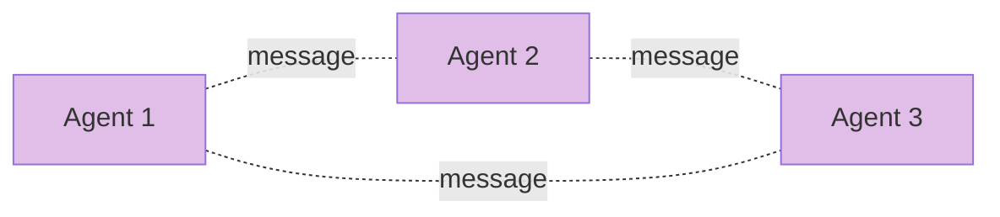

# Day 70: AutoGen 💬

<div class="lesson-meta">
⏱️ 3 ชั่วโมง &nbsp;|&nbsp; 📊 Intermediate &nbsp;|&nbsp; 📋 Prerequisites: Day 68, 69
</div>

## 🎯 Learning Objectives

<ul class="objectives">
<li>เข้าใจ AutoGen conversation paradigm</li>
<li>Build group chat ของ agents</li>
<li>เทียบกับ CrewAI / LangGraph</li>
</ul>

---

## 1. AutoGen Concept



Agents สื่อสารผ่าน **conversation messages** — เหมือน people chatting in a group

---

## 2. Setup (AutoGen v0.4+)

```bash
pip install autogen-agentchat autogen-ext[anthropic]
```

```python
from autogen_agentchat.agents import AssistantAgent
from autogen_ext.models.anthropic import AnthropicChatCompletionClient
import asyncio

model_client = AnthropicChatCompletionClient(
    model="claude-sonnet-4-6",
    api_key="..."
)

researcher = AssistantAgent(
    name="researcher",
    model_client=model_client,
    system_message="You research facts. Output findings then say RESEARCH_DONE."
)

writer = AssistantAgent(
    name="writer",
    model_client=model_client,
    system_message="You write articles from research. Output article then APPROVE if good."
)
```

---

## 3. Round-Robin Group Chat

```python
from autogen_agentchat.teams import RoundRobinGroupChat
from autogen_agentchat.conditions import TextMentionTermination

team = RoundRobinGroupChat(
    participants=[researcher, writer],
    termination_condition=TextMentionTermination("APPROVE")
)

async def main():
    async for msg in team.run_stream(task="Article on AI agents 2026"):
        print(f"{msg.source}: {msg.content}")

asyncio.run(main())
```

---

## 4. Selector Group Chat (Smart Routing)

```python
from autogen_agentchat.teams import SelectorGroupChat

team = SelectorGroupChat(
    participants=[researcher, writer, critic],
    model_client=model_client,  # used to select speaker
    selector_prompt="""Select next speaker. Options: {participants}
Previous: {history}
Choose based on context. Respond with just the name."""
)
```

→ LLM decides next speaker → flexible flow

---

## 5. Human-in-the-Loop

```python
from autogen_agentchat.agents import UserProxyAgent

user = UserProxyAgent("user")

team = RoundRobinGroupChat(
    participants=[researcher, writer, user],  # user joins
    termination_condition=TextMentionTermination("DONE")
)
```

User can interject in conversation — useful for review/approval flows

---

## 6. Tool Use

```python
from autogen_core.tools import FunctionTool

def get_weather(city: str) -> str:
    return f"Sunny in {city}"

weather_tool = FunctionTool(get_weather, description="Get weather for a city")

researcher = AssistantAgent(
    name="researcher",
    model_client=model_client,
    tools=[weather_tool],
    system_message="Use tools when needed."
)
```

---

## 7. AutoGen vs CrewAI vs LangGraph

| | AutoGen | CrewAI | LangGraph |
|--|---------|--------|-----------|
| Paradigm | Conversation | Roles+Tasks | State graph |
| Best for | Free-form | Standard | Custom |
| Setup | Async-first | Simple | Most control |
| Microsoft-backed | ✅ | ❌ | ❌ |
| Community | medium | medium | large |

---

## 8. Use Case: Brainstorming Crew

ในห้อง brainstorm กับ 3 personalities:

```python
optimist = AssistantAgent(name="optimist", model_client=mc, 
    system_message="You're upbeat. Find positive angles.")
pessimist = AssistantAgent(name="pessimist", model_client=mc,
    system_message="Find risks and concerns.")
realist = AssistantAgent(name="realist", model_client=mc,
    system_message="Synthesize practical view from both.")

team = RoundRobinGroupChat(
    [optimist, pessimist, realist],
    termination_condition=TextMentionTermination("DECISION_MADE")
)
```

→ Diverse perspectives → better decisions

---

## 9. When AutoGen ดี

✅ **Fit:**
- Free-form discussion needed
- Microsoft ecosystem (Azure, M365)
- Conversation-as-product (transcript value)
- Research / brainstorm

❌ **Not ideal:**
- Strict deterministic flow
- High throughput (conversations slow)
- Need fine-grained state control

---

## 🛠️ Hands-on Exercise

!!! example "Exercise 1: Two Agent"
    Researcher + Writer + termination → run

!!! example "Exercise 2: Selector"
    Use SelectorGroupChat → compare with RoundRobin

!!! example "Exercise 3: Brainstorm"
    3 personalities discussion on real product decision

---

## ✅ Self-Check Quiz

<div class="quiz">

**Q1:** AutoGen ดีกว่า CrewAI เมื่อ?

??? success "ดูคำตอบ"
    - Free-form conversation (ไม่ใช่ fixed role-task)
    - Need conversation log as artifact
    - Microsoft tooling integration
    - Async-first architecture

**Q2:** ทำไม termination ต้องชัด?

??? success "ดูคำตอบ"
    ไม่งั้น agents คุยกันไม่จบ — เปลือง $$$ + ไม่ได้ output — กำหนด max rounds / keyword ที่หยุด

</div>

---

## 🔍 Cross-check & References

- 📘 [AutoGen Docs](https://microsoft.github.io/autogen/)
- 📺 [AI Agentic Design Patterns with AutoGen (DLAI)](https://www.deeplearning.ai/courses/ai-agentic-design-patterns-with-autogen)
- 📦 [AutoGen examples](https://github.com/microsoft/autogen/tree/main/python/samples)

[ต่อไป → Day 71: Agent Memory :material-arrow-right:](day-71.md){ .md-button .md-button--primary }
