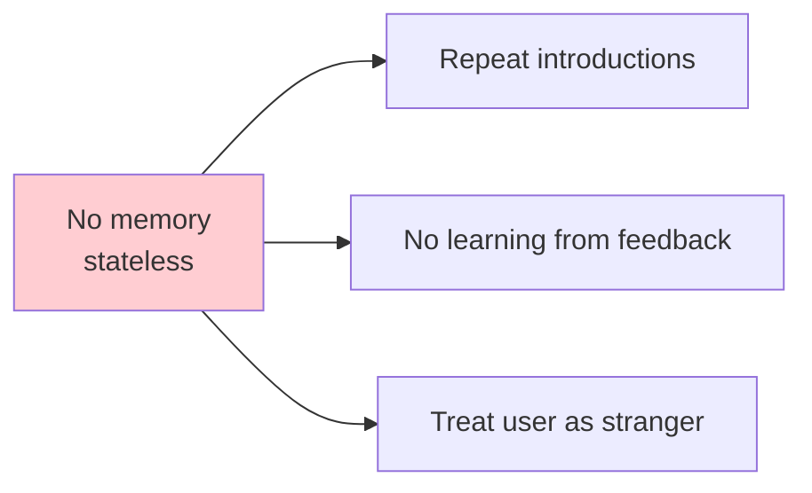
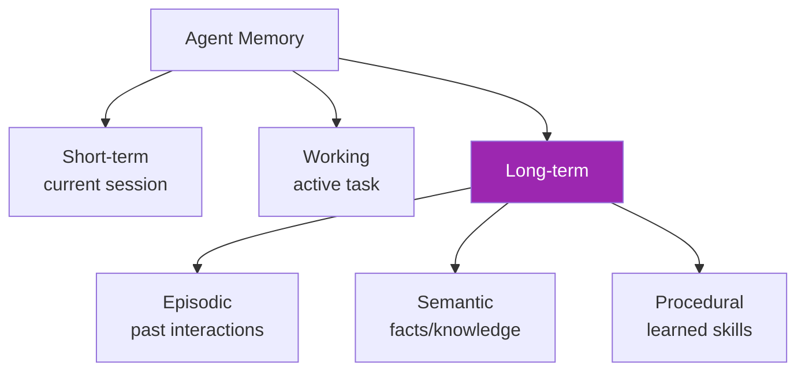
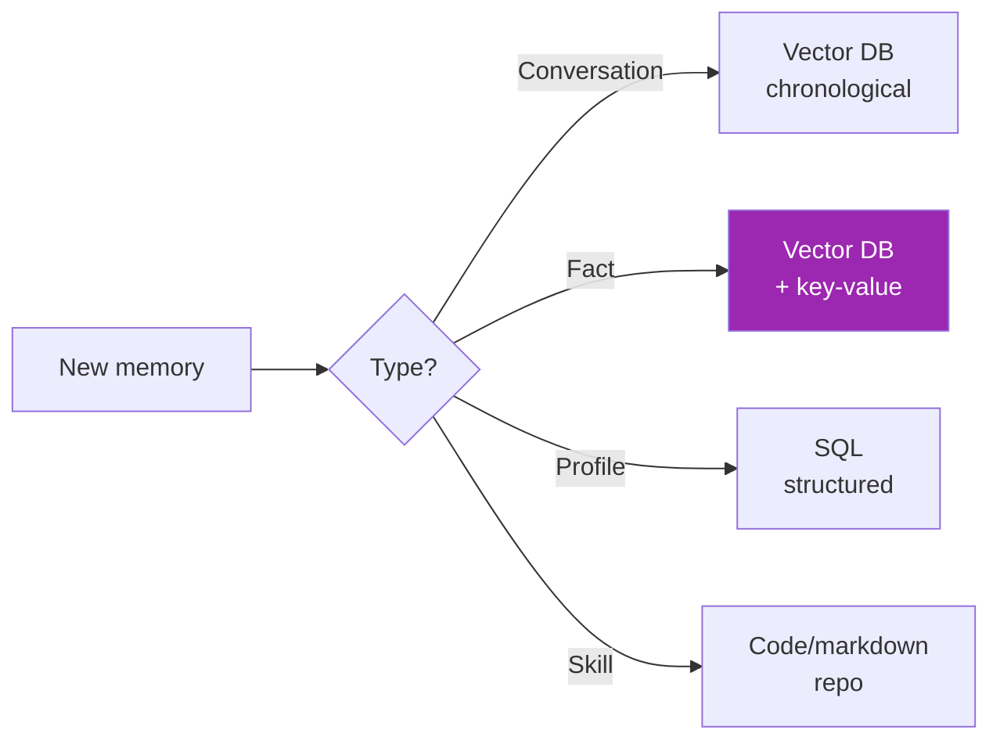
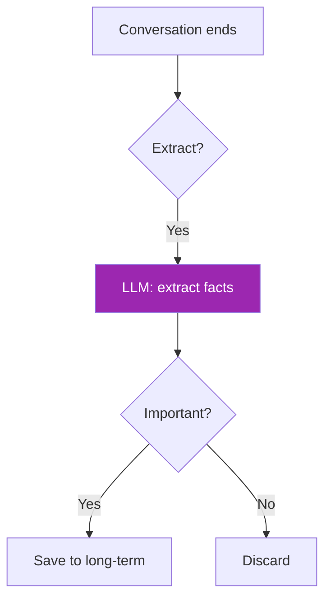

# Day 71: Agent Memory 🧠

<div class="lesson-meta">
⏱️ 3 ชั่วโมง &nbsp;|&nbsp; 📊 Intermediate &nbsp;|&nbsp; 📋 Prerequisites: Day 17 (Sessions)
</div>

## 🎯 Learning Objectives

<ul class="objectives">
<li>เข้าใจ 5 types of agent memory</li>
<li>Design memory architecture</li>
<li>Implement short + long term memory</li>
</ul>

---

## 1. Why Memory Matters



Agents ที่ดี ต้อง remember:
- Past conversations
- User preferences
- Facts learned
- Failed approaches

---

## 2. 5 Memory Types



| Type | Duration | Example |
|------|---------|---------|
| Short-term | Current turn | Recent messages in context |
| Working | Current task | Scratchpad notes during reasoning |
| Episodic | Forever | "User mentioned dog named Rex" |
| Semantic | Forever | "User is a vegetarian" |
| Procedural | Forever | "When user asks for code, format as snippet" |

---

## 3. Short-Term Memory (Conversation)

Simple chronological list:

```python
class Conversation:
    def __init__(self, max_messages=20):
        self.messages = []
        self.max = max_messages
    
    def add(self, role, content):
        self.messages.append({"role": role, "content": content})
        if len(self.messages) > self.max:
            self.messages = self.messages[-self.max:]  # FIFO
    
    def get_context(self):
        return self.messages
```

---

## 4. Working Memory (Scratchpad)

For agent reasoning:

```python
class WorkingMemory:
    def __init__(self):
        self.scratchpad = []
        self.facts_gathered = {}
        self.plan = []
    
    def add_thought(self, thought):
        self.scratchpad.append(thought)
    
    def record_fact(self, key, value):
        self.facts_gathered[key] = value
    
    def render(self) -> str:
        return f"""
## Plan
{self.plan}

## Thoughts so far
{self.scratchpad}

## Facts gathered
{self.facts_gathered}
"""
```

---

## 5. Long-Term Memory — Storage Options



---

## 6. Episodic Memory Implementation

```python
from qdrant_client import QdrantClient
from sentence_transformers import SentenceTransformer
import time

embedder = SentenceTransformer("all-mpnet-base-v2")
qdrant = QdrantClient(":memory:")

class EpisodicMemory:
    def __init__(self, user_id):
        self.user_id = user_id
    
    def remember(self, event: str):
        emb = embedder.encode(event).tolist()
        qdrant.upsert("memories", points=[{
            "id": int(time.time() * 1000),
            "vector": emb,
            "payload": {
                "user_id": self.user_id,
                "event": event,
                "timestamp": time.time()
            }
        }])
    
    def recall(self, query: str, k=5):
        emb = embedder.encode(query).tolist()
        hits = qdrant.search(
            "memories",
            query_vector=emb,
            query_filter={"must": [{"key": "user_id", "match": {"value": self.user_id}}]},
            limit=k
        )
        return [h.payload["event"] for h in hits]

# Use
mem = EpisodicMemory(user_id="alice")
mem.remember("Alice prefers concise answers")
mem.remember("Alice has a dog named Rex")
mem.remember("Alice works in finance")

print(mem.recall("What does Alice work?"))
# → ["Alice works in finance"]
```

---

## 7. Semantic Memory — User Profile

```python
from pydantic import BaseModel

class UserProfile(BaseModel):
    name: str
    role: str
    preferences: dict
    interests: list[str]
    do_not_mention: list[str]

# Stored in PostgreSQL/Redis
def get_profile(user_id) -> UserProfile:
    return db.query(UserProfile, user_id=user_id)

# Inject into system prompt
def build_system_prompt(user_id):
    profile = get_profile(user_id)
    return f"""You're an assistant. User context:
- Name: {profile.name}
- Role: {profile.role}
- Prefers: {profile.preferences}
"""
```

---

## 8. Memory Update Strategies



```python
def extract_and_save(conversation_text, user_id):
    resp = client.messages.create(
        model="claude-sonnet-4-6",
        max_tokens=500,
        system="""Extract memorable facts about the user from conversation.
Output JSON: {"facts": ["...", "..."], "preferences": {...}}
Skip trivial. Focus on long-term-useful info.""",
        messages=[{"role": "user", "content": conversation_text}]
    )
    import json
    data = json.loads(resp.content[0].text)
    for fact in data["facts"]:
        EpisodicMemory(user_id).remember(fact)
    # Merge preferences into profile...
```

---

## 9. Memory Hygiene

| Issue | Solution |
|-------|---------|
| Memory bloat | Decay (older = lower weight) |
| Conflicting facts | Latest wins, or version |
| Privacy (PII) | Mask before save |
| Outdated info | Timestamps + freshness check |
| Hallucinated memories | Source attribution |

---

## 🛠️ Hands-on Exercise

!!! example "Exercise 1: Sliding Window"
    Implement Conversation with max 10 messages — test overflow

!!! example "Exercise 2: Episodic Memory"
    Build EpisodicMemory + retrieval — chat 5 turns + recall

!!! example "Exercise 3: Profile-aware Agent"
    Combine profile + episodic → agent ที่จำ user ข้าม sessions

---

## ✅ Self-Check Quiz

<div class="quiz">

**Q1:** Episodic vs Semantic ต่างกันอย่างไร?

??? success "ดูคำตอบ"
    - **Episodic**: "Alice mentioned dog Rex on March 5" — specific events
    - **Semantic**: "Alice likes dogs" — abstracted facts

**Q2:** เมื่อไหร่ extract facts (live vs end-of-session)?

??? success "ดูคำตอบ"
    - End-of-session: cheaper, batch processing
    - Live extraction: faster recall but expensive
    - Hybrid: live for high-value mentions, batch for the rest

</div>

---

## 🔍 Cross-check & References

- 📺 [Long-term Agentic Memory with LangGraph (DLAI)](https://www.deeplearning.ai/courses/long-term-agentic-memory-with-langgraph)
- 📄 [MemGPT paper](https://arxiv.org/abs/2310.08560)
- 📦 [Mem0](https://github.com/mem0ai/mem0)

[ต่อไป → Day 72: Long-term Memory :material-arrow-right:](day-72.md){ .md-button .md-button--primary }
