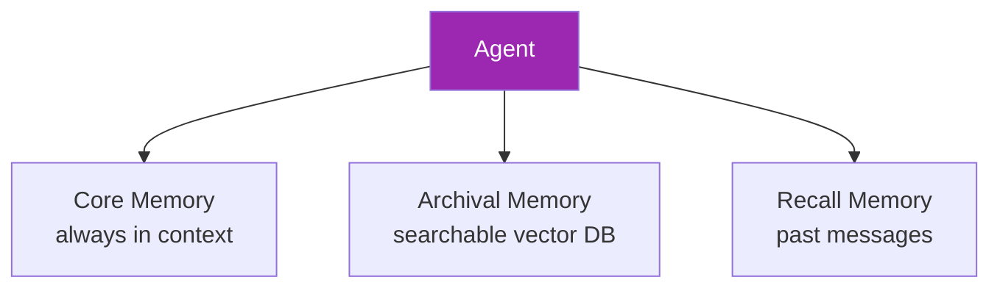
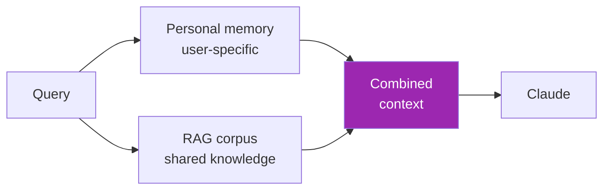

# Day 72: Long-Term Memory Frameworks 💾

<div class="lesson-meta">
⏱️ 3 ชั่วโมง &nbsp;|&nbsp; 📊 Advanced &nbsp;|&nbsp; 📋 Prerequisites: Day 71
</div>

## 🎯 Learning Objectives

<ul class="objectives">
<li>ใช้ Letta (formerly MemGPT) สำหรับ stateful agents</li>
<li>ใช้ LangMem in LangGraph</li>
<li>ใช้ Mem0 across frameworks</li>
<li>เทียบ trade-offs</li>
</ul>

---

## 1. Why Use a Framework

DIY memory (Day 71) ดี แต่:
- Need memory **policies** (when to save/forget)
- Need memory **types** (core, archival, recall)
- Need integration with **multiple agents**
- Need **migration** between systems

Framework abstracts these patterns

---

## 2. Letta (formerly MemGPT)



Letta = 3-tier memory inspired by OS virtual memory

```bash
pip install letta
```

```python
from letta import create_client
client = create_client()

agent = client.create_agent(
    name="my_assistant",
    persona="Friendly helpful AI",
    human="My user is Alice",
    llm_config=LLMConfig(model="claude-sonnet-4-6"),
    embedding_config=EmbeddingConfig(...)
)

# Conversation
resp = client.send_message(
    agent_id=agent.id,
    role="user",
    message="My favorite color is blue"
)

# Later session
resp = client.send_message(
    agent_id=agent.id,
    role="user",
    message="What's my favorite color?"
)
# → "Your favorite color is blue"
```

→ Letta auto-manage memory promotion/demotion

---

## 3. LangMem (in LangGraph)

```python
from langgraph.store.memory import InMemoryStore
from langgraph.checkpoint.memory import MemorySaver
from langchain.embeddings import init_embeddings

# Store with semantic search
store = InMemoryStore(
    index={
        "embed": init_embeddings("openai:text-embedding-3-small"),
        "dims": 1536
    }
)

# Save memory
store.put(
    namespace=("user_123",),
    key="preferences",
    value={"preferred_format": "concise", "topics": ["AI", "music"]}
)

# Retrieve
results = store.search(("user_123",), query="how does user like answers?")
for r in results:
    print(r.value)
```

→ Integrates seamlessly with LangGraph state machines

---

## 4. Mem0 — Framework-Agnostic

```bash
pip install mem0ai
```

```python
from mem0 import Memory

m = Memory()

# Add memory
m.add("Alice loves Italian food and lives in Bangkok", user_id="alice")

# Retrieve
results = m.search("food preferences", user_id="alice")
# → [{"memory": "Alice loves Italian food", ...}]

# Get all
all_mems = m.get_all(user_id="alice")
```

Works with: OpenAI, Anthropic, Gemini, local models

---

## 5. Memory Policies — When to Save

```python
def should_remember(text: str) -> bool:
    resp = client.messages.create(
        model="claude-haiku-4-5-20251001",
        max_tokens=50,
        system="""Is this worth remembering long-term about a user?
Output: YES or NO with 1-line reason.
Memorable: preferences, facts about user, important goals.
Not memorable: greetings, small talk, ephemeral context.""",
        messages=[{"role": "user", "content": text}]
    )
    return "YES" in resp.content[0].text.upper()
```

---

## 6. Memory Decay

```python
import time

def get_relevance(memory) -> float:
    age_seconds = time.time() - memory["timestamp"]
    age_days = age_seconds / 86400
    # Exponential decay
    decay = 0.5 ** (age_days / 30)  # half-life 30 days
    
    # Combine with similarity score
    return memory["similarity"] * decay
```

→ ใช้ rerank ตอน retrieval

---

## 7. Memory + RAG Combined



```python
def grounded_personal_answer(question, user_id):
    # 1. Personal memories
    personal = memory.search(question, user_id=user_id, top_k=3)
    
    # 2. RAG corpus
    docs = vector_db.search(question, top_k=5)
    
    # 3. Combine
    context = f"""
About the user:
{personal}

Relevant docs:
{docs}
"""
    return claude_answer(question, context)
```

---

## 8. Comparison

| | Letta | LangMem | Mem0 |
|--|-------|---------|------|
| Bound to | Standalone | LangGraph | Framework-agnostic |
| Tiered memory | ✅✅ 3 tiers | ⚠️ flat | ⚠️ flat |
| Persistence | ✅ built-in | ✅ via Store | ✅ via providers |
| Multi-tenant | ✅ | ✅ | ✅ |
| Memory ops API | rich | medium | medium |
| Learning curve | steep | moderate | low |

→ **Pick by**:
- LangGraph user → **LangMem**
- Need OS-style tiered memory → **Letta**
- Quick / framework-agnostic → **Mem0**

---

## 9. Privacy & Compliance

⚠️ Long-term memory = persistent **PII**

- **Encryption** at rest (KMS-backed DB)
- **Right to be forgotten** (GDPR) → explicit `forget(user_id)` API
- **Audit log** — who accessed which memory
- **Retention policy** — auto-delete after N days
- **Anonymization** option (replace names with IDs)

```python
def gdpr_forget(user_id):
    m.delete_all(user_id=user_id)
    # Also clear from caches, logs (per GDPR)
    audit_log.write({"action": "forget", "user_id": user_id, "timestamp": time.time()})
```

---

## 🛠️ Hands-on Exercise

!!! example "Exercise 1: Mem0 Quick Start"
    Install Mem0 → add 10 memories → search ทดสอบ recall

!!! example "Exercise 2: Letta Persistent"
    สร้าง Letta agent → chat 3 sessions → verify memory carry over

!!! example "Exercise 3: Memory + RAG"
    Combine personal memory + corpus RAG → personalized Q&A

---

## ✅ Self-Check Quiz

<div class="quiz">

**Q1:** Letta's 3-tier memory คืออะไร?

??? success "ดูคำตอบ"
    - **Core**: ในเชน context เสมอ (persona + user info)
    - **Archival**: searchable vector DB (long-term facts)
    - **Recall**: past messages (chronological)

**Q2:** GDPR + agent memory ต้องคำนึงเรื่องอะไร?

??? success "ดูคำตอบ"
    - Right to be forgotten — must implement `delete_all(user)`
    - Right to access — export user's memories
    - Encryption at rest
    - Audit trail
    - Retention policy

</div>

---

## 🔍 Cross-check & References

- 📘 [Letta Docs](https://docs.letta.com/)
- 📘 [LangMem in LangGraph](https://langchain-ai.github.io/langgraph/concepts/persistence/)
- 📦 [Mem0](https://github.com/mem0ai/mem0)
- 📺 [Long-term Agentic Memory (DLAI)](https://www.deeplearning.ai/courses/long-term-agentic-memory-with-langgraph)

[ต่อไป → Day 73: A2A Protocol :material-arrow-right:](day-73.md){ .md-button .md-button--primary }
