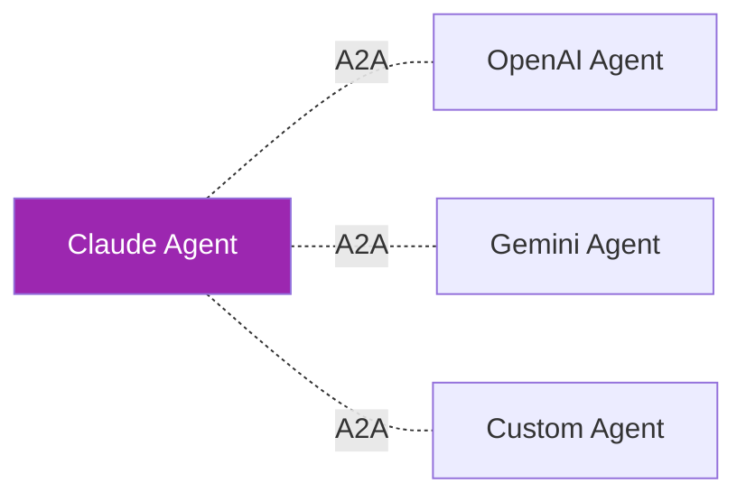
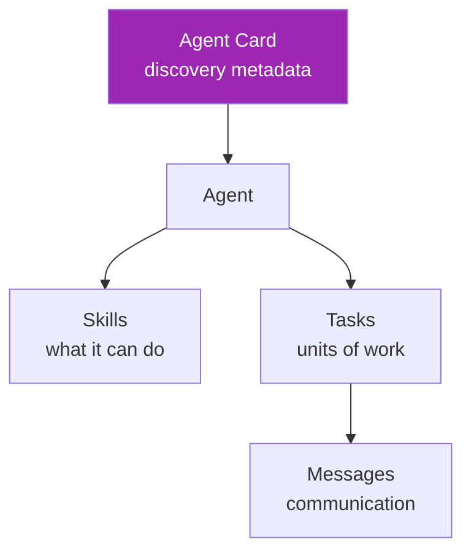
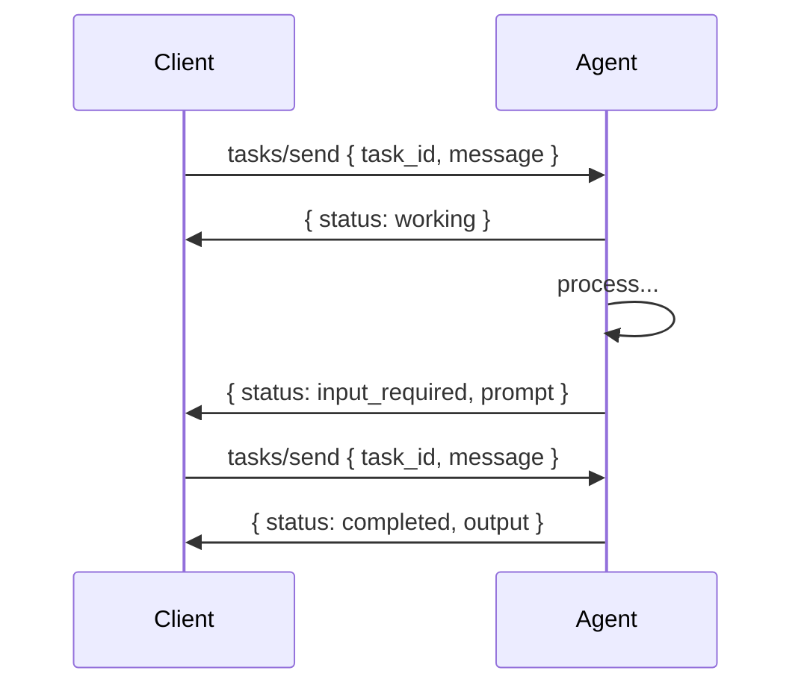
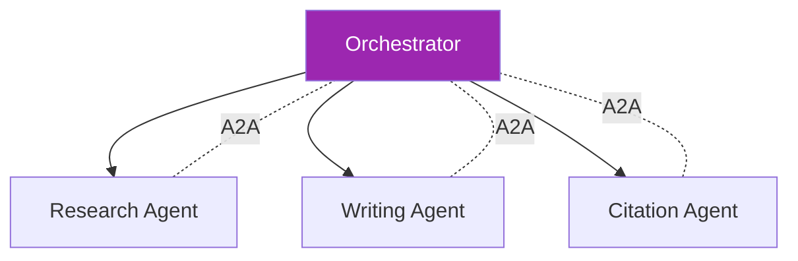
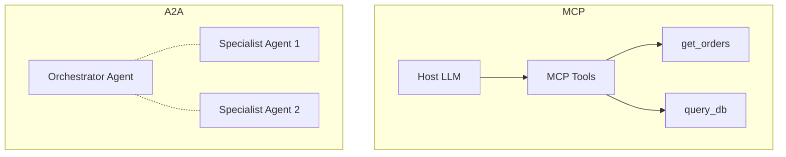

# Day 73: A2A Protocol 🔗

<div class="lesson-meta">
⏱️ 3 ชั่วโมง &nbsp;|&nbsp; 📊 Advanced &nbsp;|&nbsp; 📋 Prerequisites: Day 22 (MCP)
</div>

## 🎯 Learning Objectives

<ul class="objectives">
<li>เข้าใจ A2A vs MCP</li>
<li>Build agent card</li>
<li>Implement A2A server + client</li>
<li>เห็น cross-vendor agent scenarios</li>
</ul>

---

## 1. A2A คืออะไร

**A2A (Agent-to-Agent)** = open protocol สำหรับ agents จาก different vendors คุยกัน



ต่างจาก MCP:
- **MCP** = LLM ↔ Tools/Resources
- **A2A** = Agent ↔ Agent

---

## 2. Use Cases

| Scenario | Why A2A |
|---------|---------|
| Multi-vendor agents | Standardize comm |
| Microservice agents | Decoupled scaling |
| Marketplace of agents | Discoverability |
| Cross-org collaboration | Trust boundary |
| Specialist delegation | Best agent for task |

---

## 3. Core Concepts



### Agent Card (Discovery)

```json
{
  "name": "Research Assistant",
  "description": "Performs web research and synthesis",
  "url": "https://research-agent.example.com",
  "version": "1.0",
  "capabilities": {
    "streaming": true,
    "pushNotifications": false
  },
  "skills": [
    {
      "id": "deep_research",
      "name": "Deep research",
      "description": "Multi-source research with citations",
      "tags": ["research", "synthesis"],
      "examples": ["Research the impact of AI on healthcare"]
    }
  ]
}
```

Published at: `https://<agent>/.well-known/agent.json`

---

## 4. Task Lifecycle



Task states: `submitted` → `working` → (`input_required`) → `completed` / `failed` / `canceled`

---

## 5. Server Implementation (Python)

```bash
pip install python-a2a  # community SDK
```

```python
from python_a2a import A2AServer, AgentCard, Skill

card = AgentCard(
    name="Research Assistant",
    description="Web research and synthesis",
    url="http://localhost:9000",
    version="1.0",
    skills=[
        Skill(
            id="research",
            name="Research topic",
            description="Multi-source research",
            tags=["research"]
        )
    ]
)

class ResearchAgent(A2AServer):
    def __init__(self, card):
        super().__init__(card)
    
    async def handle_task(self, task):
        query = task.history[-1]["content"]
        
        # Do research using Claude
        from anthropic import Anthropic
        client = Anthropic()
        resp = client.messages.create(
            model="claude-sonnet-4-6",
            max_tokens=2000,
            messages=[{"role": "user", "content": f"Research: {query}"}]
        )
        
        return {
            "status": "completed",
            "output": [{"type": "text", "content": resp.content[0].text}]
        }

agent = ResearchAgent(card)
agent.run(host="0.0.0.0", port=9000)
```

---

## 6. Client — Calling Another Agent

```python
from python_a2a import A2AClient

# Discover
client = A2AClient.from_url("http://localhost:9000")
print(client.agent_card.skills)  # see what agent can do

# Send task
result = await client.send_message(
    "Research AI agents in 2026 — focus on enterprise"
)
print(result["output"])
```

---

## 7. Streaming Updates

```python
async for update in client.send_message_streaming(query):
    print(f"[{update.status}] {update.message}")
```

→ See progress (researching → drafting → finalizing)

---

## 8. Auth & Security

A2A supports:
- **API Key** (header `X-A2A-API-Key`)
- **OAuth 2.0** (bearer token)
- **mTLS** (cert-based)

```python
client = A2AClient.from_url(
    url,
    auth={"type": "oauth", "token": "..."}
)
```

---

## 9. Composition Pattern



Orchestrator agent ใช้ A2A เรียก 3 specialist agents:

```python
research = A2AClient.from_url("https://research-agent.com")
writer = A2AClient.from_url("https://writer-agent.com")
citer = A2AClient.from_url("https://citation-agent.com")

async def orchestrate(query):
    research_result = await research.send_message(query)
    draft = await writer.send_message(f"Write article from: {research_result}")
    final = await citer.send_message(f"Add citations to: {draft}")
    return final
```

---

## 10. A2A vs MCP — Side by Side



→ Use **both** in mature systems:
- MCP for tool integration
- A2A for inter-agent communication

---

## 🛠️ Hands-on Exercise

!!! example "Exercise 1: Agent Card"
    Design card สำหรับ specialist agent (e.g., "Code Reviewer")

!!! example "Exercise 2: Server"
    Implement A2A server ที่ใช้ Claude — test ด้วย curl

!!! example "Exercise 3: 2-Agent Composition"
    Orchestrator + Specialist agents — full workflow test

---

## ✅ Self-Check Quiz

<div class="quiz">

**Q1:** เมื่อไหร่ A2A ดีกว่า direct integration?

??? success "ดูคำตอบ"
    - Multi-vendor agents
    - Decoupled microservices (independent deploy/scale)
    - Marketplace patterns (discover agents at runtime)
    - Cross-org collaboration (trust boundary)

**Q2:** Agent Card ใช้เพื่ออะไร?

??? success "ดูคำตอบ"
    - Discovery — client เห็น capabilities ก่อนเรียก
    - Documentation — skills + examples
    - Versioning
    - Authentication info

</div>

---

## 🔍 Cross-check & References

- 📘 [A2A Protocol Spec](https://google.github.io/A2A/)
- 📦 [python-a2a](https://github.com/themanojdesai/python-a2a)
- 📺 [Agent Communication Protocols (course)](https://www.deeplearning.ai/short-courses/)

[ต่อไป → Day 74: Mini-project :material-arrow-right:](day-74.md){ .md-button .md-button--primary }
