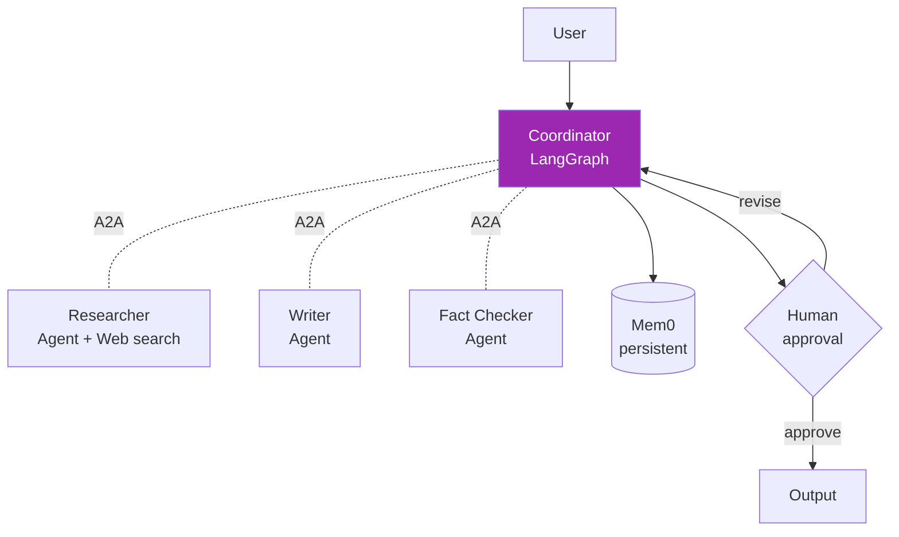

# Day 74: Mini-Project — Multi-Agent Platform 🚀

<div class="lesson-meta">
⏱️ 5 ชั่วโมง &nbsp;|&nbsp; 📊 Project &nbsp;|&nbsp; 📋 Prerequisites: Week 10
</div>

## 🎯 Project Goal

Build **Multi-agent research platform** ที่:

<ul class="objectives">
<li>Coordinator agent ที่ delegate</li>
<li>3 specialist agents (researcher, writer, fact-checker)</li>
<li>Persistent memory (Mem0)</li>
<li>A2A interface สำหรับ specialists</li>
<li>Human-in-the-loop checkpoint</li>
</ul>

---

## 1. Architecture



---

## 2. Setup

```bash
mkdir multi-agent-platform && cd multi-agent-platform
python -m venv venv && source venv/bin/activate
pip install langgraph langchain-anthropic mem0ai python-a2a anthropic
```

Project structure:
```
multi-agent-platform/
├── coordinator/
│   └── graph.py
├── agents/
│   ├── researcher/server.py
│   ├── writer/server.py
│   └── fact_checker/server.py
├── memory/
│   └── store.py
└── tests/
```

---

## 3. Specialist Agents (A2A Servers)

### Researcher

```python
# agents/researcher/server.py
from python_a2a import A2AServer, AgentCard, Skill
from anthropic import Anthropic
import asyncio

client = Anthropic()

card = AgentCard(
    name="Researcher",
    description="Multi-source research with citations",
    url="http://localhost:9001",
    skills=[Skill(id="research", name="Research", description="Deep research")]
)

class Researcher(A2AServer):
    async def handle_task(self, task):
        query = task.history[-1]["content"]
        # Use Claude with web search (tool)
        resp = client.messages.create(
            model="claude-sonnet-4-6",
            max_tokens=2000,
            tools=[{"type": "web_search_20250305", "name": "web_search"}],
            messages=[{"role": "user", "content": f"Research deeply: {query}. Cite sources."}]
        )
        return {"status": "completed", "output": [{"type": "text", "content": str(resp.content)}]}

if __name__ == "__main__":
    Researcher(card).run(host="0.0.0.0", port=9001)
```

### Writer

```python
# agents/writer/server.py
# Similar — accepts research, generates article
```

### Fact Checker

```python
# agents/fact_checker/server.py
# Verifies claims against sources
```

---

## 4. Coordinator (LangGraph)

```python
# coordinator/graph.py
from langgraph.graph import StateGraph, END, START
from typing import TypedDict
from python_a2a import A2AClient
from mem0 import Memory

class State(TypedDict):
    user_id: str
    query: str
    research: str
    draft: str
    fact_check: str
    iteration: int

researcher = A2AClient.from_url("http://localhost:9001")
writer = A2AClient.from_url("http://localhost:9002")
fact_checker = A2AClient.from_url("http://localhost:9003")
memory = Memory()

def research_step(state):
    # Add user context from memory
    user_context = memory.search(state["query"], user_id=state["user_id"])
    enriched = f"{state['query']}\n\nUser context: {user_context}"
    result = asyncio.run(researcher.send_message(enriched))
    return {"research": result["output"][0]["content"]}

def write_step(state):
    result = asyncio.run(writer.send_message(
        f"Write article from: {state['research']}"
    ))
    return {"draft": result["output"][0]["content"]}

def factcheck_step(state):
    result = asyncio.run(fact_checker.send_message(
        f"Verify claims in: {state['draft']}\n\nSources: {state['research']}"
    ))
    fact_result = result["output"][0]["content"]
    return {"fact_check": fact_result, "iteration": state["iteration"] + 1}

def decide_after_check(state):
    if "ISSUES_FOUND" in state["fact_check"] and state["iteration"] < 3:
        return "rewrite"
    return "save_memory"

def save_memory(state):
    # Extract learnings
    memory.add(
        f"User asked about {state['query']}. Final answer included key fact-checks.",
        user_id=state["user_id"]
    )
    return {}

# Build graph
g = StateGraph(State)
g.add_node("research", research_step)
g.add_node("write", write_step)
g.add_node("factcheck", factcheck_step)
g.add_node("save_memory", save_memory)

g.add_edge(START, "research")
g.add_edge("research", "write")
g.add_edge("write", "factcheck")
g.add_conditional_edges("factcheck", decide_after_check, {
    "rewrite": "write",
    "save_memory": "save_memory"
})
g.add_edge("save_memory", END)

# Human-in-loop checkpoint before save
from langgraph.checkpoint.memory import MemorySaver
app = g.compile(checkpointer=MemorySaver(), interrupt_before=["save_memory"])
```

---

## 5. Run

### Terminal 1, 2, 3 — agents
```bash
python agents/researcher/server.py
python agents/writer/server.py
python agents/fact_checker/server.py
```

### Terminal 4 — coordinator
```python
config = {"configurable": {"thread_id": "session-1"}}
state = {
    "user_id": "alice",
    "query": "AI agents in healthcare 2026",
    "research": "",
    "draft": "",
    "fact_check": "",
    "iteration": 0
}

# Run until pause
final_state = app.invoke(state, config)
print("Draft:", final_state["draft"])

# Human review
input_review = input("Approve? (y/n): ")
if input_review == "y":
    final = app.invoke(None, config)  # resume
    print("Final saved to memory")
```

---

## 6. Tests

```python
# tests/test_e2e.py
def test_full_flow():
    state = run_pipeline("Quantum computing market 2026", user_id="test")
    assert len(state["draft"]) > 500
    assert "ISSUES_FOUND" not in state["fact_check"] or state["iteration"] > 1

def test_memory_persistence():
    run_pipeline("Topic A", user_id="test")
    run_pipeline("Topic B", user_id="test")
    memories = memory.get_all(user_id="test")
    assert len(memories) >= 2

def test_a2a_fallback():
    # Kill researcher → expect graceful error
    ...
```

---

## 7. Observability

```python
# Add LangSmith tracing
import os
os.environ["LANGCHAIN_TRACING_V2"] = "true"

# Add A2A call logging
import logging
logging.basicConfig(level=logging.INFO)

# Metrics
from prometheus_client import Counter, Histogram
agent_calls = Counter("a2a_calls_total", "Total A2A calls", ["agent"])
latency = Histogram("agent_latency_seconds", "Agent latency", ["agent"])
```

---

## 8. Deliverables

!!! example "Submit GitHub repo + writeup"
    1. 3 agent servers (A2A)
    2. Coordinator graph (LangGraph)
    3. Memory integration (Mem0)
    4. Tests (≥ 10)
    5. Demo video (5 min) showing full flow including HITL
    6. Architecture document
    7. Trade-off analysis (what's good, what to improve)

---

## 9. Scoring Rubric

| เกณฑ์ | คะแนน |
|------|------|
| 3 A2A agents working | / 20 |
| Coordinator orchestrate flow | / 20 |
| Memory persist + retrieval | / 15 |
| Human-in-the-loop checkpoint | / 10 |
| Tests + observability | / 15 |
| Documentation + diagram | / 10 |
| Code quality | / 10 |
| **รวม** | **/ 100** |

---

## ✅ Week 10 Self-Check

- [x] CrewAI, LangGraph, AutoGen — เลือกได้
- [x] Agent memory (short, long, episodic, semantic)
- [x] Long-term memory frameworks
- [x] A2A protocol — agent communication
- [x] Production multi-agent system

---

## 🔍 Cross-check & References

- 📺 [Multi AI Agent Systems (DLAI)](https://www.deeplearning.ai/courses/multi-ai-agent-systems-with-crewai)
- 📘 [LangGraph Multi-Agent](https://langchain-ai.github.io/langgraph/concepts/multi_agent/)

---

:material-check-decagram: **จบ Week 10!** ก้าวเข้าสู่ LLMOps

[ต่อไป → Week 11: LLMOps :material-arrow-right:](../week-11/index.md){ .md-button .md-button--primary }
