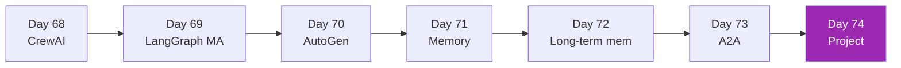

# Week 10: Multi-Agent Systems 🤝

หลาย agents ทำงานร่วมกัน — สำคัญสำหรับ complex enterprise workflows

| Day | หัวข้อ | เวลา |
|-----|--------|------|
| 68 | CrewAI — role-based agents | 4h |
| 69 | LangGraph multi-agent patterns | 4h |
| 70 | AutoGen (Microsoft) | 3h |
| 71 | Agent memory architectures | 3h |
| 72 | Long-term memory (Letta, LangMem) | 3h |
| 73 | A2A Protocol — deep | 3h |
| 74 | Mini-project — multi-agent system | 5h |

[เริ่ม Day 68 :material-arrow-right:](day-68.md){ .md-button .md-button--primary }
