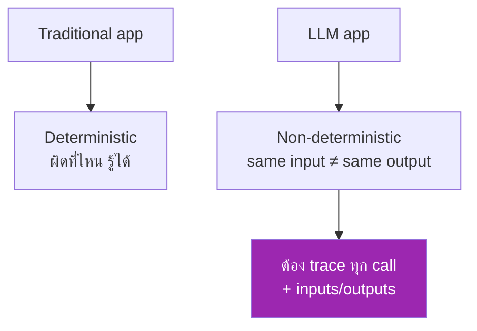
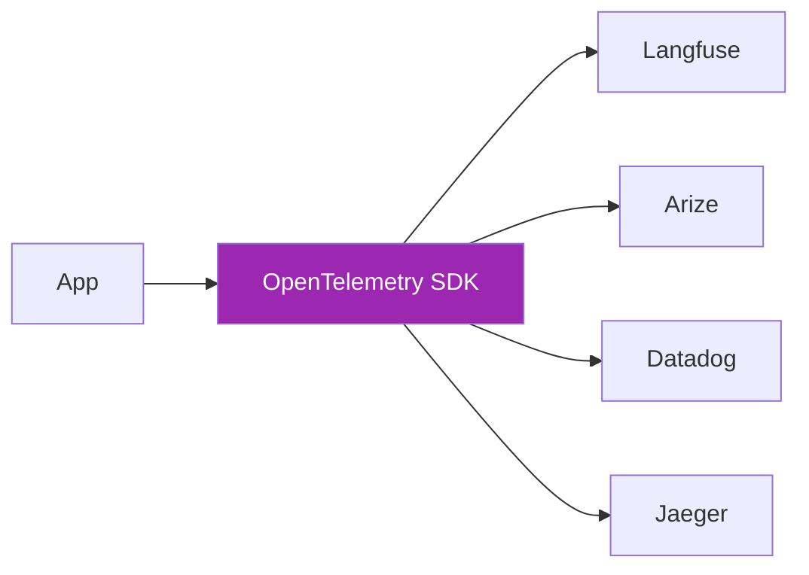

# Day 75: Observability 🔍

<div class="lesson-meta">
⏱️ 4 ชั่วโมง &nbsp;|&nbsp; 📊 Advanced &nbsp;|&nbsp; 📋 Prerequisites: Day 11 (API)
</div>

## 🎯 Learning Objectives

<ul class="objectives">
<li>เข้าใจ 3 pillars: Logs, Metrics, Traces</li>
<li>Setup Langfuse / Arize Phoenix</li>
<li>Trace multi-step agent calls</li>
<li>Alert บน anomaly</li>
</ul>

---

## 1. ทำไม Observability ใน LLM ต่าง



LLM apps ต่าง:
- Non-deterministic → ต้องเก็บ I/O ทุก call
- Multi-step → trace dependencies
- Token cost → ต้อง track per request
- Quality drift → ต้อง measure ต่อเนื่อง

---

## 2. Tools Landscape

| Tool | Strength | Pricing |
|------|---------|---------|
| **Langfuse** | Open source, self-host | Free / cloud paid |
| **Arize Phoenix** | OSS, OpenTelemetry-native | Free / cloud paid |
| **LangSmith** | Best LangChain integration | Paid |
| **W&B Weave** | ML team friendly | Paid |
| **Helicone** | Proxy-based simple | Free tier |
| **DataDog LLM** | Enterprise observability | $$$ |
| **Anthropic Console** | Native, basic | Free |

---

## 3. Langfuse Setup (Self-host)

```bash
# Docker compose self-host
git clone https://github.com/langfuse/langfuse
cd langfuse
docker compose up -d
# Open http://localhost:3000
```

หรือใช้ cloud (langfuse.com)

```python
pip install langfuse
```

```python
from langfuse import Langfuse
from anthropic import Anthropic
import os

os.environ["LANGFUSE_PUBLIC_KEY"] = "pk-..."
os.environ["LANGFUSE_SECRET_KEY"] = "sk-..."
os.environ["LANGFUSE_HOST"] = "http://localhost:3000"

langfuse = Langfuse()
anthropic = Anthropic()

# Trace a request
@langfuse.observe()
def answer_question(question: str):
    resp = anthropic.messages.create(
        model="claude-sonnet-4-6",
        max_tokens=500,
        messages=[{"role": "user", "content": question}]
    )
    return resp.content[0].text

answer_question("What is RAG?")
# → Trace shows in Langfuse UI
```

---

## 4. Tracing Multi-Step Agents

```python
@langfuse.observe(as_type="generation")
def llm_call(prompt: str):
    return anthropic.messages.create(...)

@langfuse.observe(as_type="span")
def retrieve(query: str):
    return vector_db.search(query)

@langfuse.observe()  # parent trace
def rag_pipeline(question):
    docs = retrieve(question)         # span
    prompt = format_prompt(docs, question)
    answer = llm_call(prompt)         # generation
    return answer
```

→ UI แสดง tree: pipeline → retrieve / llm_call

---

## 5. Custom Metadata

```python
@langfuse.observe()
def chat(user_id, question):
    langfuse.update_current_observation(
        user_id=user_id,
        session_id=f"{user_id}-session",
        tags=["customer-support", "tier-1"],
        metadata={"feature": "chatbot", "version": "v2"}
    )
    return llm_call(question)
```

→ Filter/group by user, session, feature

---

## 6. Quality Scoring

```python
# After response → score
trace_id = langfuse.get_current_trace_id()

langfuse.score(
    trace_id=trace_id,
    name="user_feedback",
    value=1,  # 1 = good, 0 = bad
    comment="user clicked thumbs up"
)

langfuse.score(
    trace_id=trace_id,
    name="llm_judge",
    value=0.85,
    data_type="NUMERIC"  # 0-1
)
```

→ UI shows quality over time, regressions

---

## 7. Arize Phoenix Alternative

```bash
pip install arize-phoenix arize-phoenix-otel
```

```python
import phoenix as px
from phoenix.otel import register

# Start Phoenix locally
px.launch_app()

# Auto-instrument
tracer_provider = register(project_name="my-app")
from openinference.instrumentation.anthropic import AnthropicInstrumentor
AnthropicInstrumentor().instrument(tracer_provider=tracer_provider)

# Now all Claude calls auto-traced
from anthropic import Anthropic
client = Anthropic()
client.messages.create(...)  # ← logged

# View at http://localhost:6006
```

→ OpenTelemetry-based → integrates with existing observability stack

---

## 8. OpenTelemetry Standard



OTel = vendor-neutral standard — switch backends without code change

---

## 9. Key Metrics to Track

| Metric | Why |
|--------|-----|
| **Request count** | Volume |
| **Latency P50/95/99** | UX |
| **Token usage** | Cost |
| **Error rate** | Reliability |
| **Cost per request** | Unit economics |
| **Cache hit rate** | Optimization |
| **User feedback score** | Quality |
| **LLM judge score** | Quality (autonomous) |
| **Cost per user** | Business |

---

## 10. Alerts Configuration

```python
# Pseudo-code for alert rules

if error_rate_5min > 5%:
    alert("HIGH_ERROR_RATE", page=oncall)

if p95_latency_5min > 10000:  # 10s
    alert("HIGH_LATENCY")

if cost_per_user_24h > $5:
    alert("COST_RUNAWAY")

if user_feedback_24h < 0.6:
    alert("QUALITY_DROP")
```

→ Hook into PagerDuty / Slack / Email

---

## 🛠️ Hands-on Exercise

!!! example "Exercise 1: Langfuse Setup"
    Self-host Langfuse + trace Day 35 RAG pipeline → review UI

!!! example "Exercise 2: Multi-Step Trace"
    Trace Day 23 agent (multi-tool) → verify all spans visible

!!! example "Exercise 3: Quality Score"
    Add user feedback button → record scores → trend chart

---

## ✅ Self-Check Quiz

<div class="quiz">

**Q1:** ทำไม LLM ต้อง trace ทุก I/O?

??? success "ดูคำตอบ"
    - Non-deterministic — same input อาจให้ output ต่าง — debug ต้องดู actual response
    - Quality drift — ต้องวัดต่อเนื่อง
    - Cost attribution per user/feature
    - Compliance audit

**Q2:** Langfuse vs Phoenix?

??? success "ดูคำตอบ"
    - Langfuse: full-featured UI, custom scoring, easier for non-ML team
    - Phoenix: OTel-native, free, ML-research friendly

</div>

---

## 🔍 Cross-check & References

- 📘 [Langfuse Docs](https://langfuse.com/docs)
- 📘 [Arize Phoenix](https://docs.arize.com/phoenix)
- 📘 [OpenTelemetry GenAI](https://opentelemetry.io/docs/specs/semconv/gen-ai/)
- 📺 [LLMOps (DLAI)](https://www.deeplearning.ai/courses/llmops)

[ต่อไป → Day 76: Evaluation :material-arrow-right:](day-76.md){ .md-button .md-button--primary }
