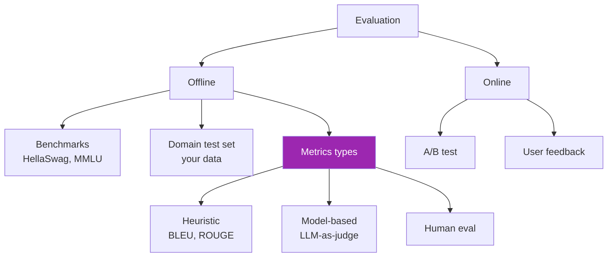
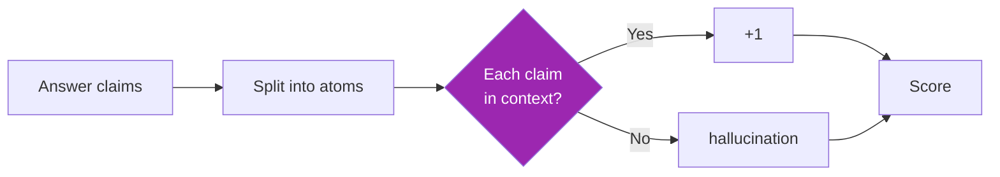

# Day 76: Evaluation 📏

<div class="lesson-meta">
⏱️ 4 ชั่วโมง &nbsp;|&nbsp; 📊 Advanced &nbsp;|&nbsp; 📋 Prerequisites: Day 18, 35
</div>

## 🎯 Learning Objectives

<ul class="objectives">
<li>เข้าใจ evaluation taxonomy</li>
<li>ใช้ Ragas สำหรับ RAG evaluation</li>
<li>ใช้ DeepEval สำหรับ general eval</li>
<li>Build LLM-as-judge pipeline</li>
</ul>

---

## 1. Evaluation Taxonomy



---

## 2. RAG-Specific Metrics (Ragas)

```bash
pip install ragas datasets
```

```python
from ragas import evaluate
from ragas.metrics import (
    faithfulness,        # answer grounded in context?
    answer_relevancy,    # answer relevant to question?
    context_precision,   # retrieved chunks relevant?
    context_recall,      # ground truth covered?
)
from datasets import Dataset

# Prepare data
data = Dataset.from_dict({
    "question": ["What is RAG?"],
    "answer": ["RAG is..."],  # generated by your system
    "contexts": [["Retrieved chunk 1", "Retrieved chunk 2"]],
    "ground_truth": ["RAG stands for Retrieval-Augmented Generation"]
})

result = evaluate(
    data,
    metrics=[faithfulness, answer_relevancy, context_precision, context_recall]
)
print(result)
# → {"faithfulness": 0.85, "answer_relevancy": 0.90, ...}
```

→ Ragas ทำงานบน 4 columns: question, answer, contexts, ground_truth

---

## 3. Faithfulness Explained

**Faithfulness** = "answer claims supported by context"



→ Low faithfulness = hallucination

---

## 4. DeepEval — Broader Framework

```bash
pip install deepeval
```

```python
from deepeval import evaluate
from deepeval.metrics import AnswerRelevancyMetric, HallucinationMetric
from deepeval.test_case import LLMTestCase

test_case = LLMTestCase(
    input="What is RAG?",
    actual_output="RAG combines retrieval with generation...",
    expected_output="Retrieval-Augmented Generation",
    context=["RAG = Retrieval-Augmented Generation"]
)

metrics = [
    AnswerRelevancyMetric(threshold=0.7),
    HallucinationMetric(threshold=0.5)
]

evaluate([test_case], metrics)
```

→ มี metrics หลากหลายกว่า: bias, toxicity, summarization quality, etc.

---

## 5. LLM-as-Judge Pattern

```python
def llm_judge(question, answer, criteria):
    """Use Claude to grade answer"""
    prompt = f"""You are an evaluator. Grade this answer.

Question: {question}
Answer: {answer}

Criteria: {criteria}

Output JSON:
{{
  "score": 0-10,
  "reasoning": "...",
  "issues": ["...","..."]
}}"""
    
    resp = anthropic.messages.create(
        model="claude-opus-4-7",  # use strong model as judge
        max_tokens=500,
        messages=[{"role": "user", "content": prompt}]
    )
    import json
    return json.loads(resp.content[0].text)

# ใช้
result = llm_judge(
    "What is RAG?",
    "RAG is a music genre.",
    "Accuracy on AI/ML topics"
)
# → {"score": 1, "reasoning": "Completely wrong...", "issues": [...]}
```

---

## 6. Judge Best Practices

- Use **stronger model** เป็น judge (Opus judge Sonnet)
- **Multiple judges** → average (reduces bias)
- **Pairwise comparison** > absolute score (more reliable)
- **Calibrate** with human-labeled examples first
- **Persist** judge outputs (for audit)

### Pairwise Example

```python
def pairwise_judge(question, answer_a, answer_b):
    prompt = f"""Compare 2 answers. Output the better one: A or B (or TIE).

Q: {question}
A: {answer_a}
B: {answer_b}

Better answer:"""
    # ...
```

---

## 7. Building a Test Set

```python
# Use Claude to generate synthetic test set from your docs
def generate_test_qa(doc: str, n=20):
    resp = anthropic.messages.create(
        model="claude-opus-4-7",
        max_tokens=2000,
        system="""Generate Q&A pairs from this document. Mix difficulty: 30% easy, 40% medium, 30% hard.
Output JSON list: [{"question": "...", "ground_truth": "...", "difficulty": "...", "type": "factual|reasoning|edge_case"}]""",
        messages=[{"role": "user", "content": doc[:50000]}]
    )
    import json
    return json.loads(resp.content[0].text)
```

→ Synthetic test set ที่ Claude สร้าง → human review → use

---

## 8. Continuous Eval (Production)

```python
import random

def maybe_eval(request, response, sample_rate=0.05):
    """Sample 5% of requests for eval"""
    if random.random() < sample_rate:
        score = llm_judge(request, response, criteria="...")
        log_eval_score(request, response, score)

# Or schedule batch eval daily
def daily_eval():
    sample = sample_recent_requests(n=100)
    for req, resp in sample:
        score = llm_judge(req, resp, criteria="...")
        store_in_dashboard(score)
```

→ Detect quality drift early

---

## 9. CI Eval Gate

```yaml
# .github/workflows/eval.yml
name: Eval
on: [pull_request]
jobs:
  eval:
    runs-on: ubuntu-latest
    steps:
      - uses: actions/checkout@v4
      - run: pip install -r requirements.txt
      - run: python eval.py --threshold=0.8
        env:
          ANTHROPIC_API_KEY: ${{ secrets.ANTHROPIC_API_KEY }}
```

```python
# eval.py
def main(threshold):
    results = run_eval()
    avg = mean(results)
    print(f"Average score: {avg}")
    if avg < threshold:
        sys.exit(1)  # block PR
```

→ Block merge ถ้า quality regress

---

## 🛠️ Hands-on Exercise

!!! example "Exercise 1: Ragas"
    Run Ragas บน RAG ของ Day 35 → 20 test cases → 4 metrics

!!! example "Exercise 2: LLM Judge"
    Build llm_judge() + เปรียบเทียบ 2 models บน 50 questions

!!! example "Exercise 3: CI Eval Gate"
    เพิ่ม GitHub Action ที่ run eval + block PR ถ้า score < 0.8

---

## ✅ Self-Check Quiz

<div class="quiz">

**Q1:** Faithfulness vs Answer Relevancy ต่างกัน?

??? success "ดูคำตอบ"
    - Faithfulness: answer claims based on context? (anti-hallucination)
    - Answer Relevancy: answer addresses question? (on-topic check)

**Q2:** Pairwise > absolute score เพราะ?

??? success "ดูคำตอบ"
    - Judges drift in absolute scoring scale
    - "Better than X" easier than "X is 7/10"
    - More signal per evaluation
    - Less affected by judge bias

</div>

---

## 🔍 Cross-check & References

- 📘 [Ragas Docs](https://docs.ragas.io/)
- 📘 [DeepEval](https://docs.confident-ai.com/)
- 📺 [Building & Evaluating Advanced RAG (DLAI)](https://www.deeplearning.ai/courses/building-evaluating-advanced-rag)
- 📺 [Evaluating AI Agents (DLAI)](https://www.deeplearning.ai/courses/evaluating-ai-agents)

[ต่อไป → Day 77: CI/CD :material-arrow-right:](day-77.md){ .md-button .md-button--primary }
