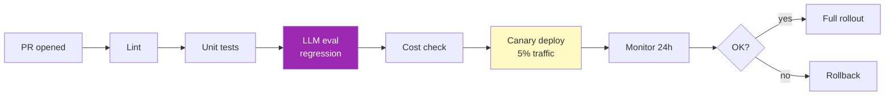
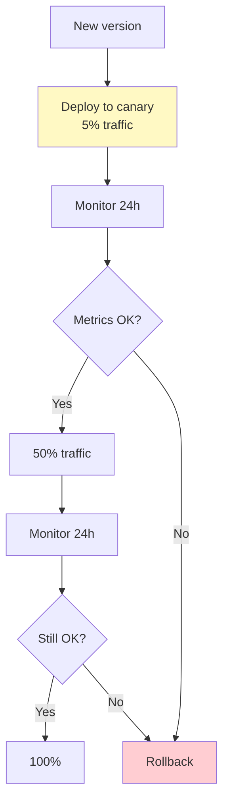

# Day 77: CI/CD for LLM Apps 🚢

<div class="lesson-meta">
⏱️ 3 ชั่วโมง &nbsp;|&nbsp; 📊 Advanced &nbsp;|&nbsp; 📋 Prerequisites: Day 76
</div>

## 🎯 Learning Objectives

<ul class="objectives">
<li>Version prompts + models + eval sets</li>
<li>Setup eval-as-CI gate</li>
<li>Canary deploy LLM features</li>
<li>Rollback strategy</li>
</ul>

---

## 1. ทำไม CI/CD ต้อง adapt สำหรับ LLM

ปกติ CI/CD เน้น:
- Unit tests
- Integration tests
- Build artifacts
- Deploy

แต่ LLM apps เพิ่ม:
- **Prompt** เป็น artifact (versioned)
- **Eval set** เป็น regression test
- **Model version** เป็นตัวแปร
- **Cost guardrails** ใน CI

---

## 2. Prompt as Code

โครงสร้าง:

```
prompts/
├── customer_support/
│   ├── v1.md
│   ├── v2.md
│   └── current → v2.md (symlink)
├── classification/
│   └── v1.md
└── README.md
```

```python
# prompts.py
from pathlib import Path

class PromptRegistry:
    def __init__(self, base_path="prompts"):
        self.base = Path(base_path)
    
    def get(self, name, version="current"):
        path = self.base / name / f"{version}.md"
        return path.read_text()

prompts = PromptRegistry()
system = prompts.get("customer_support", version="v2")
```

→ Git diff = prompt change diff = code review possible

---

## 3. Pipeline Stages



---

## 4. GitHub Actions Example

```yaml
# .github/workflows/llm-ci.yml
name: LLM CI/CD

on:
  pull_request:
    paths:
      - 'src/**'
      - 'prompts/**'
      - 'eval/**'

jobs:
  test:
    runs-on: ubuntu-latest
    steps:
      - uses: actions/checkout@v4
      - uses: actions/setup-python@v5
        with: { python-version: '3.12' }
      
      - run: pip install -r requirements.txt
      
      - name: Unit tests
        run: pytest tests/unit -v
      
      - name: LLM regression eval
        run: python eval/regression.py --baseline=main --threshold=0.85
        env:
          ANTHROPIC_API_KEY: ${{ secrets.ANTHROPIC_API_KEY }}
      
      - name: Cost gate
        run: python eval/cost_check.py --max-per-1k=2.5
      
      - name: Comment on PR
        if: always()
        uses: actions/github-script@v7
        with:
          script: |
            // Post eval scores to PR
```

---

## 5. Regression Eval

```python
# eval/regression.py
import json
import subprocess

BASELINE_BRANCH = "main"
TEST_SET = "eval/test_set.json"
THRESHOLD = 0.85

def get_baseline_scores():
    """Run eval on baseline (main branch) and current"""
    # Checkout baseline → run → record
    # Checkout HEAD → run → record
    pass

def main(threshold):
    test_cases = json.load(open(TEST_SET))
    
    current = run_eval(test_cases)
    baseline = load_or_compute_baseline()
    
    delta = current["avg_score"] - baseline["avg_score"]
    print(f"Current: {current['avg_score']:.3f}")
    print(f"Baseline: {baseline['avg_score']:.3f}")
    print(f"Delta: {delta:+.3f}")
    
    # Find regressions per case
    regressions = []
    for case_id in current:
        if current[case_id]["score"] < baseline[case_id]["score"] - 0.1:
            regressions.append(case_id)
    
    if regressions:
        print(f"❌ {len(regressions)} regressions: {regressions[:5]}")
        sys.exit(1)
    if current["avg_score"] < threshold:
        print(f"❌ Below threshold {threshold}")
        sys.exit(1)
    print("✅ Passed")
```

---

## 6. Canary Deploy



```python
# Feature flag controlled routing
def get_model_for_user(user_id):
    # 5% to new version
    if hash(user_id) % 100 < 5:
        return "claude-sonnet-4-6-experiment"
    return "claude-sonnet-4-6-stable"
```

ใช้ feature flag tools: LaunchDarkly, Unleash, Flagsmith

---

## 7. Shadow Mode

ก่อน canary → run new version "in shadow" (no user-facing impact):

```python
def respond(question):
    # Production response
    answer = production_chain(question)
    
    # Shadow: also run candidate (async)
    asyncio.create_task(shadow_compare(question, answer))
    
    return answer

async def shadow_compare(question, prod_answer):
    candidate_answer = candidate_chain(question)
    # Log both, judge offline
    log_shadow_result(question, prod_answer, candidate_answer)
```

→ Collect comparison data ก่อนเสี่ยง users

---

## 8. Rollback Strategy

| Trigger | Action |
|---------|--------|
| Error rate > 5x baseline | Auto rollback |
| Cost > 2x baseline | Auto rollback |
| User feedback < 0.5 | Auto rollback |
| Latency P95 > 2x | Auto rollback |

```python
def monitor_and_rollback():
    metrics = get_metrics(version="canary", duration="1h")
    if metrics["error_rate"] > 5 * baseline["error_rate"]:
        rollback_to(version="stable")
        page_oncall(f"Auto rollback: error rate {metrics['error_rate']}")
```

---

## 9. Version Pinning

```python
# Production config — pin everything
PRODUCTION = {
    "model": "claude-sonnet-4-6",
    "system_prompt_version": "v2.3",
    "tools_version": "v1.5",
    "eval_set_version": "v3.0",
    "deployment_timestamp": "2026-05-20T10:00:00Z"
}

# Audit trail
audit_log({"deployed": PRODUCTION, "by": "user@company.com"})
```

→ Reproduce any past behavior

---

## 🛠️ Hands-on Exercise

!!! example "Exercise 1: Prompt Registry"
    Setup prompts/ folder with versioning → switch via env var

!!! example "Exercise 2: GitHub Action"
    Create .github/workflows/llm-ci.yml with eval gate

!!! example "Exercise 3: Shadow Mode"
    Implement shadow comparison → 1 day → analyze divergence

---

## ✅ Self-Check Quiz

<div class="quiz">

**Q1:** ทำไม shadow mode สำคัญ?

??? success "ดูคำตอบ"
    - Compare candidates without affecting users
    - Find edge cases ก่อน canary
    - Calibrate expected change in production data distribution

**Q2:** Rollback criteria ต้องรวมอะไร?

??? success "ดูคำตอบ"
    - Quality (user feedback, judge scores)
    - Reliability (errors, latency)
    - Cost (budget runaway)
    - Multiple signals — not just one

</div>

---

## 🔍 Cross-check & References

- 📺 [LLMOps (DLAI)](https://www.deeplearning.ai/courses/llmops)
- 📘 [Prompt versioning best practices (Anthropic)](https://docs.claude.com/en/docs/build-with-claude/prompt-engineering/overview)

[ต่อไป → Day 78: Red Teaming :material-arrow-right:](day-78.md){ .md-button .md-button--primary }
