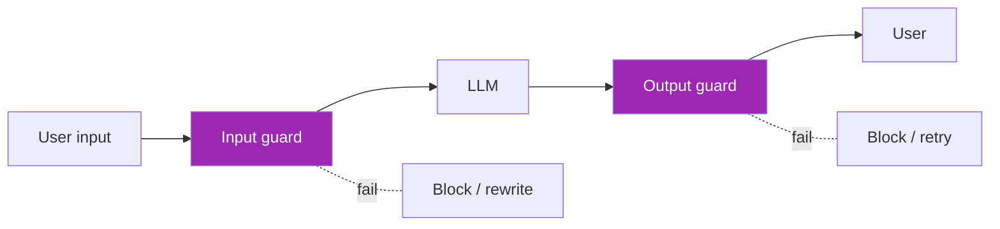
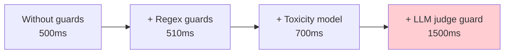

# Day 79: Guardrails 🚧

<div class="lesson-meta">
⏱️ 3 ชั่วโมง &nbsp;|&nbsp; 📊 Advanced &nbsp;|&nbsp; 📋 Prerequisites: Day 78
</div>

## 🎯 Learning Objectives

<ul class="objectives">
<li>เข้าใจ Guardrails pattern</li>
<li>ใช้ GuardrailsAI</li>
<li>ใช้ NeMo Guardrails (NVIDIA)</li>
<li>เลือกใช้ guard vs hardened prompt</li>
</ul>

---

## 1. Guardrails Concept



→ Programmable rules ที่บังคับ behavior ของ LLM

---

## 2. GuardrailsAI

```bash
pip install guardrails-ai
guardrails configure  # one-time API setup
```

```python
from guardrails import Guard
from guardrails.hub import RegexMatch, ToxicLanguage, DetectPII

# Compose guards
guard = Guard().use_many(
    RegexMatch(regex=r"^[\w\s.,!?'-]+$", on_fail="reject"),  # safe chars only
    ToxicLanguage(threshold=0.5, on_fail="reject"),
    DetectPII(pii_entities=["EMAIL_ADDRESS", "PHONE_NUMBER"], on_fail="redact")
)

# Apply to LLM call
result = guard(
    llm_api=anthropic.messages.create,
    model="claude-sonnet-4-6",
    max_tokens=500,
    messages=[{"role": "user", "content": question}]
)

if result.validation_passed:
    print(result.validated_output)
else:
    print("Failed:", result.errors)
```

---

## 3. Validators Available

GuardrailsAI Hub มี validators เช่น:

| Validator | What |
|-----------|------|
| `ToxicLanguage` | Detect toxic content |
| `DetectPII` | Find/redact PII |
| `RegexMatch` | Match required pattern |
| `ValidJSON` | Output must be JSON |
| `ProvenanceLLM` | Check citations valid |
| `SimilarToDocument` | Output must be similar to ref |
| `IsHighQualityTranslation` | Translation quality |
| `BugFreeSQL` | SQL syntax check |
| `CompetitorCheck` | Not mention competitor names |

---

## 4. Custom Validator

```python
from guardrails.validators import Validator, register_validator, FailResult, PassResult

@register_validator(name="company_policy_compliant", data_type="string")
class CompanyPolicyValidator(Validator):
    def validate(self, value: str, metadata: dict):
        forbidden = ["guarantee", "promise", "100% safe"]
        for f in forbidden:
            if f in value.lower():
                return FailResult(
                    error_message=f"Output contains forbidden term: {f}",
                    fix_value=value.replace(f, "[REDACTED]")
                )
        return PassResult()

guard = Guard().use(CompanyPolicyValidator(on_fail="fix"))
```

---

## 5. NeMo Guardrails (NVIDIA)

```bash
pip install nemoguardrails
```

NeMo ใช้ Colang language — DSL สำหรับ define rails:

```yaml
# config.yml
models:
  - type: main
    engine: anthropic
    model: claude-sonnet-4-6
```

```colang
# rails.co
define user ask about competitors
  "What about OpenAI?"
  "How does this compare to ChatGPT?"
  "Is X better than Anthropic?"

define bot refuse competitor
  "I focus on helping you with our product. I can't comment on competitors."

define flow competitor handling
  user ask about competitors
  bot refuse competitor

# Avoid harmful topics
define user ask harmful
  "How to make a weapon"
  "Self-harm methods"

define bot refuse harmful
  "I can't help with that. If you're in distress, please contact..."

define flow safety
  user ask harmful
  bot refuse harmful
```

```python
from nemoguardrails import LLMRails, RailsConfig

config = RailsConfig.from_path("./config")
rails = LLMRails(config)

resp = rails.generate(messages=[{"role": "user", "content": "How does ChatGPT compare?"}])
print(resp)
# → "I focus on helping you with our product..."
```

→ NeMo ใช้สำหรับ dialog policy management

---

## 6. Hardened Prompt vs Guard

| Approach | Pro | Con |
|----------|-----|-----|
| **Hardened system prompt** | Free, simple | LLM can ignore |
| **Input/output guard** | Deterministic | Slow, false positives |
| **LLM judge guard** | Flexible | Expensive, adds latency |

→ ใช้ **all three** for defense in depth

---

## 7. Latency Trade-off



→ Tier guards by severity — fast checks first, expensive only if needed

---

## 8. Real-world Example: Healthcare Chatbot

```python
HEALTHCARE_GUARDS = [
    DetectPII(["PERSON", "EMAIL", "PHONE", "MEDICAL_RECORD"], on_fail="redact"),
    ToxicLanguage(threshold=0.3, on_fail="reject"),  # strict
    # Custom: no diagnosis claims
    NoMedicalDiagnosis(on_fail="rewrite"),
    # Custom: include disclaimer
    RequireDisclaimer(text="Not a substitute for medical advice", on_fail="prepend"),
    # Custom: cite source for medical claims
    CitedClaims(on_fail="reject"),
]
```

---

## 9. Combine with Bedrock Guardrails

AWS Bedrock มี built-in guardrails ใน managed service:

```python
import boto3
bedrock = boto3.client("bedrock")

# Create guardrail
resp = bedrock.create_guardrail(
    name="ClaudeHealthcare",
    description="Healthcare guardrails",
    topicPolicyConfig={
        "topicsConfig": [
            {"name": "Diagnosis", "definition": "Claiming to diagnose conditions", "type": "DENY"}
        ]
    },
    contentPolicyConfig={
        "filtersConfig": [
            {"type": "SEXUAL", "inputStrength": "HIGH", "outputStrength": "HIGH"},
            {"type": "HATE", "inputStrength": "HIGH", "outputStrength": "HIGH"},
            {"type": "VIOLENCE", "inputStrength": "HIGH", "outputStrength": "HIGH"}
        ]
    },
    wordPolicyConfig={
        "wordsConfig": [{"text": "competitor_name"}]
    },
    sensitiveInformationPolicyConfig={
        "piiEntitiesConfig": [
            {"type": "EMAIL", "action": "ANONYMIZE"}
        ]
    },
    blockedInputMessaging="Cannot answer this",
    blockedOutputsMessaging="Response not appropriate"
)

# Apply during invoke
runtime = boto3.client("bedrock-runtime")
resp = runtime.converse(
    modelId="anthropic.claude-sonnet-4-6-v1:0",
    messages=[...],
    guardrailConfig={"guardrailIdentifier": guardrail_id, "guardrailVersion": "1"}
)
```

---

## 🛠️ Hands-on Exercise

!!! example "Exercise 1: GuardrailsAI"
    Wrap your app กับ PII + toxicity → test 20 inputs

!!! example "Exercise 2: Custom Validator"
    Build CompetitorCheck or NoLegalAdvice validator

!!! example "Exercise 3: NeMo Rails"
    Define 3 flows (greeting, off-topic refusal, escalation)

---

## ✅ Self-Check Quiz

<div class="quiz">

**Q1:** Guards vs hardened prompt — เลือกตอนไหน?

??? success "ดูคำตอบ"
    - Guards: deterministic enforcement (compliance-critical)
    - Hardened prompt: cheap default behavior
    - **Use both**: prompt = soft, guards = hard

**Q2:** Bedrock Guardrails ดีกว่า self-managed?

??? success "ดูคำตอบ"
    - Pro: managed (no infra), tight Bedrock integration, AWS-native
    - Con: vendor lock-in, limited customization, AWS-only

</div>

---

## 🔍 Cross-check & References

- 📘 [GuardrailsAI](https://www.guardrailsai.com/docs)
- 📘 [NeMo Guardrails](https://docs.nvidia.com/nemo/guardrails/)
- 📘 [Bedrock Guardrails](https://docs.aws.amazon.com/bedrock/latest/userguide/guardrails.html)
- 📺 [Safe and Reliable AI via Guardrails (DLAI)](https://www.deeplearning.ai/courses/safe-and-reliable-ai-via-guardrails)

[ต่อไป → Day 80: Cost Optimization :material-arrow-right:](day-80.md){ .md-button .md-button--primary }
