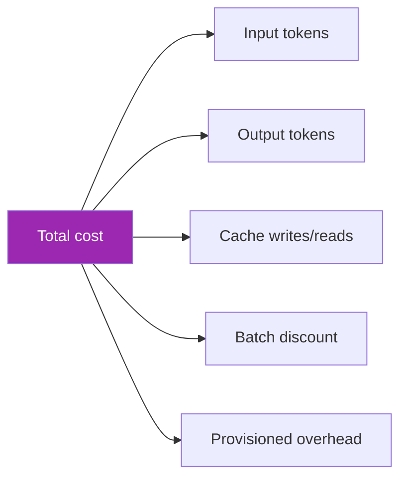
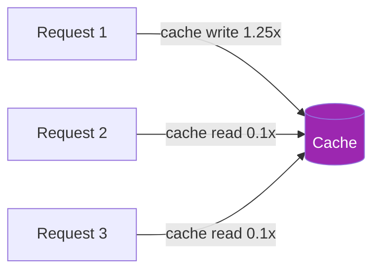
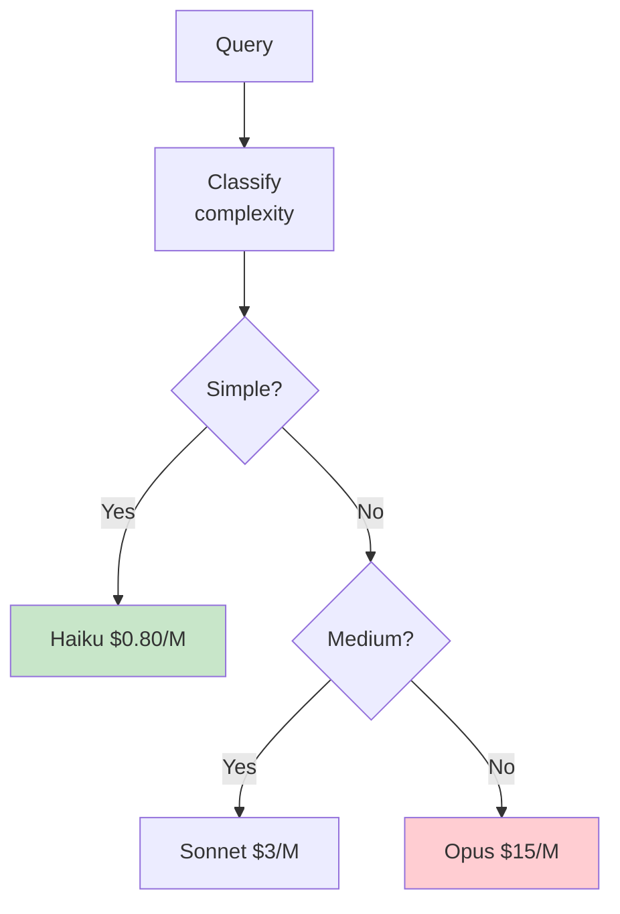

# Day 80: Cost Optimization 💰

<div class="lesson-meta">
⏱️ 3 ชั่วโมง &nbsp;|&nbsp; 📊 Advanced &nbsp;|&nbsp; 📋 Prerequisites: Day 16 (Streaming, Cost)
</div>

## 🎯 Learning Objectives

<ul class="objectives">
<li>คำนวณ cost per request accurately</li>
<li>Apply prompt caching</li>
<li>Implement semantic cache</li>
<li>Model routing strategy</li>
<li>Batch inference for offline work</li>
</ul>

---

## 1. Cost Components



**Pricing reference** (verify on Anthropic pricing page):
- Input: ~$3-15/M tokens (varies by model)
- Output: ~$15-75/M tokens
- Cache write: typically 1.25× input
- Cache read: typically 0.1× input (~10x cheaper)
- Batch: typically 50% off

---

## 2. Prompt Caching

ใช้ caching เมื่อมี **static large context** ที่ reuse ข้าม requests:

```python
response = anthropic.messages.create(
    model="claude-sonnet-4-6",
    max_tokens=1024,
    system=[
        {
            "type": "text",
            "text": "You are a helpful assistant."  # short, no cache
        },
        {
            "type": "text",
            "text": LARGE_KNOWLEDGE_BASE,  # 50K tokens of docs
            "cache_control": {"type": "ephemeral"}  # cache!
        }
    ],
    messages=[{"role": "user", "content": question}]
)
```



→ Break-even: 2-3 calls if same context

---

## 3. Semantic Cache

Different question, same answer? Detect with embedding similarity

```python
from sentence_transformers import SentenceTransformer
import numpy as np

embedder = SentenceTransformer("all-mpnet-base-v2")
cache = {}  # in-memory; use Redis in prod

def semantic_cache_get(query, threshold=0.92):
    if not cache: return None
    q_emb = embedder.encode(query)
    
    best_score = 0
    best_answer = None
    for cached_q, (cached_emb, ans) in cache.items():
        sim = np.dot(q_emb, cached_emb) / (np.linalg.norm(q_emb) * np.linalg.norm(cached_emb))
        if sim > best_score and sim > threshold:
            best_score = sim
            best_answer = ans
    return best_answer

def answer_with_cache(question):
    cached = semantic_cache_get(question)
    if cached:
        return cached, "cache_hit"
    
    answer = anthropic_call(question)
    cache[question] = (embedder.encode(question), answer)
    return answer, "cache_miss"
```

→ Hit rate ใน production typically 20-50% for FAQ-like apps

---

## 4. Prompt Compression

```bash
pip install llmlingua
```

```python
from llmlingua import PromptCompressor

compressor = PromptCompressor(model_name="microsoft/llmlingua-2")

# Compress long prompts
compressed = compressor.compress_prompt(
    very_long_prompt,
    rate=0.5  # keep 50%
)
# → Send compressed["compressed_prompt"] to Claude
```

→ Useful for RAG with many docs — keep semantic info, drop fillers
→ Test: quality drop should be < 5% for 50% compression typically

---

## 5. Model Routing



```python
def route_model(question):
    # Use Haiku to classify
    classifier_resp = anthropic.messages.create(
        model="claude-haiku-4-5-20251001",
        max_tokens=20,
        system="Classify complexity: SIMPLE, MEDIUM, COMPLEX. One word only.",
        messages=[{"role": "user", "content": question}]
    )
    level = classifier_resp.content[0].text.strip().upper()
    return {
        "SIMPLE": "claude-haiku-4-5-20251001",
        "MEDIUM": "claude-sonnet-4-6",
        "COMPLEX": "claude-opus-4-7"
    }.get(level, "claude-sonnet-4-6")

# Cost savings: route 70% to Haiku, 25% Sonnet, 5% Opus
# vs all Opus = 60-80% cost reduction
```

---

## 6. Batch Inference

For offline / overnight workloads:

```python
import anthropic

client = anthropic.Anthropic()

# Submit batch
batch = client.messages.batches.create(
    requests=[
        {
            "custom_id": f"req-{i}",
            "params": {
                "model": "claude-sonnet-4-6",
                "max_tokens": 500,
                "messages": [{"role": "user", "content": q}]
            }
        }
        for i, q in enumerate(my_1000_questions)
    ]
)

# Poll
import time
while True:
    status = client.messages.batches.retrieve(batch.id)
    if status.processing_status == "ended":
        break
    time.sleep(60)

# Get results
results = client.messages.batches.results(batch.id)
```

→ ~50% off vs real-time API — but max 24h delay

---

## 7. Streaming UX Trick

```python
# Stream so user sees response immediately
# No cost savings but PERCEIVED faster → better UX

with client.messages.stream(...) as stream:
    for text in stream.text_stream:
        yield text
```

---

## 8. Token Limit Strategies

```python
def trim_context(context, max_tokens=4000):
    """Aggressive context trimming"""
    # Keep most relevant chunks only
    # Use re-ranker to score
    # ...

def summarize_chat_history(history):
    """Long sessions: summarize old messages"""
    if len(history) > 20:
        old = history[:-10]
        summary = summarize_with_claude(old)
        return [{"role": "system", "content": f"Summary: {summary}"}] + history[-10:]
    return history
```

---

## 9. Cost Dashboard

| Metric | Target |
|--------|--------|
| Cost per request | < $X |
| Cost per user/day | < $Y |
| Cache hit rate | > 30% |
| Routing accuracy | > 90% (right model) |
| Haiku/Sonnet/Opus ratio | 70/25/5 |
| Average input tokens | declining trend |

```python
# Daily cost report
def daily_report():
    return {
        "total_cost": get_cost_today(),
        "by_model": cost_by_model(),
        "by_feature": cost_by_feature(),
        "cost_per_user": total_cost / unique_users,
        "cache_hit_rate": cache_hits / total_requests,
        "anomalies": find_outliers()
    }
```

---

## 10. Real-world Savings Example

Before optimization (all Opus, no cache):
- 100K requests/day, 5K avg input, 500 avg output
- Cost: ~$15K/day

After:
- Route 70% to Haiku, 25% Sonnet, 5% Opus
- Enable prompt caching (large system context)
- Semantic cache (30% hit)
- Compress prompts 30%

Estimated: $2-4K/day (significant reduction). Verify with actual measurement in your application.

→ 75-85% reduction is achievable in many workloads (but always measure!)

---

## 🛠️ Hands-on Exercise

!!! example "Exercise 1: Prompt Cache"
    Enable cache for system prompt 30K tokens → measure 100 requests

!!! example "Exercise 2: Semantic Cache"
    Build semantic cache + measure hit rate over 200 queries

!!! example "Exercise 3: Model Router"
    Implement router → 100 mixed queries → compare cost vs all-Opus

---

## ✅ Self-Check Quiz

<div class="quiz">

**Q1:** Prompt cache คุ้มเมื่อ?

??? success "ดูคำตอบ"
    - Large static context (system prompt, KB)
    - Same context used ≥ 2-3 times
    - TTL ของ cache > inter-request gap

**Q2:** Batch API ใช้ตอนไหน?

??? success "ดูคำตอบ"
    - Offline processing (data analysis, eval)
    - OK กับ delay < 24h
    - Volume ใหญ่
    - Cost-sensitive

</div>

---

## 🔍 Cross-check & References

- 📘 [Anthropic Prompt Caching](https://docs.claude.com/en/docs/build-with-claude/prompt-caching)
- 📘 [Batch API](https://docs.claude.com/en/docs/build-with-claude/batch-processing)
- 📦 [LLMLingua](https://github.com/microsoft/LLMLingua)

[ต่อไป → Day 81: Production Runbook :material-arrow-right:](day-81.md){ .md-button .md-button--primary }
