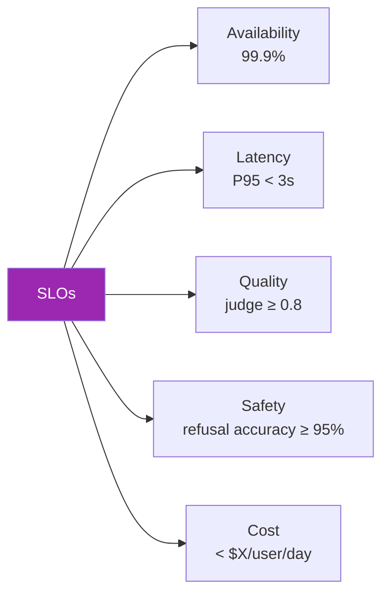
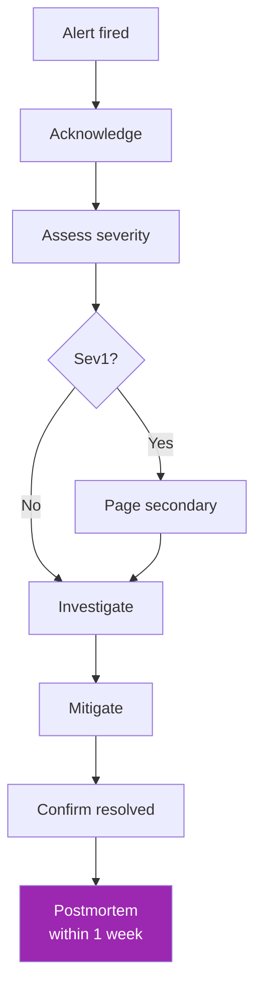

# Day 81: Production Runbook 📕

<div class="lesson-meta">
⏱️ 3 ชั่วโมง &nbsp;|&nbsp; 📊 SRE &nbsp;|&nbsp; 📋 Prerequisites: Day 75-80
</div>

## 🎯 Learning Objectives

<ul class="objectives">
<li>เขียน SLO ที่เหมาะกับ LLM service</li>
<li>Build on-call runbook</li>
<li>Incident management ของ LLM apps</li>
<li>Postmortem template</li>
</ul>

---

## 1. SLOs for LLM Services

SLO ปกติ: availability, latency  
LLM เพิ่ม: **quality, cost, safety**



### Example SLO Doc

```markdown
# Customer Support Bot — SLOs

## Availability
- SLI: % requests with 2xx response
- SLO: 99.5% over rolling 30-day window
- Error budget: 0.5% = ~3.6 hours/month

## Latency  
- SLI: P95 latency end-to-end
- SLO: < 3000ms

## Quality
- SLI: LLM-judge score on 5% sample
- SLO: avg ≥ 0.80, no day < 0.75

## Cost
- SLI: cost per active user per day
- SLO: < $0.50

## Safety
- SLI: % of red-team attacks that bypass guards
- SLO: < 2%
```

---

## 2. Production Checklist

ก่อน launch:

- [ ] Tests: unit + integration + eval ครบ
- [ ] CI gates: eval threshold, cost gate
- [ ] Observability: traces + metrics + logs
- [ ] Alerts configured (latency, errors, cost, quality)
- [ ] Rate limits + circuit breakers
- [ ] Retry logic with backoff
- [ ] Multi-region (or failover region) setup
- [ ] Guardrails active (input + output)
- [ ] Red team scan: severity ≤ Medium
- [ ] Privacy review: PII handling, retention
- [ ] Cost projection + budget alert
- [ ] Runbook written + reviewed
- [ ] On-call rotation defined
- [ ] Documentation: user-facing + ops
- [ ] Rollback procedure tested

---

## 3. On-Call Runbook Template

```markdown
# On-Call Runbook — Customer Support Bot

## Owner
Team: AI Platform  
Slack: #ai-platform-oncall  
Escalation: @manager

## Architecture
[Diagram]

## Key Dashboards
- Langfuse: <link>
- CloudWatch: <link>
- Cost: <link>

## Common Alerts

### `HighErrorRate`
**Symptom**: > 5% errors over 5 min  
**Likely causes**:
1. Anthropic API outage → check status.anthropic.com
2. Rate limit hit → check quota, scale up
3. Bad prompt deploy → rollback recent change

**Steps**:
1. Check status.anthropic.com
2. Open dashboard <link>
3. If recent deploy → rollback via [feature flag]
4. If API issue → enable degraded mode
5. Notify users via status page

### `HighLatency`
**Symptom**: P95 > 8s  
**Likely**: streaming buffering, RAG retrieval slow, vendor issue  
**Steps**: ...

### `CostSpike`
**Symptom**: hourly cost > 5x baseline  
**Likely**: prompt injection causing loops, cache miss, leak  
**Steps**:
1. Identify high-cost requests in observability
2. If injection → disable affected feature
3. Notify finance team if > $X impact

### `QualityRegression`
...

## Degraded Modes

### "RAG-only" (skip Claude)
For partial outage:
- Return retrieved chunks verbatim
- Banner: "Service degraded, showing raw sources"

### "Cached-only"
Serve only from semantic cache + canned responses

## Escalation
- Sev1 (production down): page security@ + manager
- Sev2 (degraded): notify within 30min
- Sev3 (warning): handle next business day
```

---

## 4. Incident Response Flow



---

## 5. Postmortem Template

```markdown
# Postmortem: <Incident>

**Date**: 2026-05-15  
**Duration**: 14:00-15:23 UTC (1h 23m)  
**Severity**: Sev2  
**Impact**: 8,400 users saw degraded responses  
**Authors**: @alice, @bob

## Summary
1-paragraph plain English: what happened + impact.

## Timeline (UTC)
- 13:55 — Deploy v2.3 (prompt update)
- 14:00 — Latency P95 alert
- 14:05 — Quality drop alert
- 14:12 — On-call acknowledges
- 14:30 — Identified prompt token bloat
- 14:45 — Rollback to v2.2
- 15:23 — Metrics recovered

## Root Cause
Prompt v2.3 added context that grew tokens 3x → cache misses + latency spike.

## What went well
- Alert fired within 5min
- Rollback feature flag worked

## What went poorly  
- Eval set didn't catch token bloat
- No cost gate in CI

## Action Items
| Item | Owner | Due | Status |
|------|-------|-----|--------|
| Add token size CI check | @alice | 2026-05-22 | open |
| Add cost regression eval | @bob | 2026-06-01 | open |
| Update runbook with this scenario | @alice | 2026-05-25 | open |

## Lessons
- ...
```

---

## 6. Status Page

User-facing:

```markdown
# Status

## Customer Support Bot
🟢 Operational

## Document Q&A
🟡 Degraded — RAG retrieval slower than normal (investigating)

## Latest Incidents
- 2026-05-15: Resolved — Performance degradation (postmortem)
```

→ Tools: Statuspage, Better Uptime, Atlassian Statuspage

---

## 7. Feature Flag Discipline

```python
# Wrap risky features in flags
if feature_flag("use_new_rag_v3", user_id=user.id):
    answer = rag_v3(question)
else:
    answer = rag_v2(question)
```

Best practices:
- Every deploy = behind flag
- Gradual rollout: 1% → 5% → 25% → 100%
- Kill switch tested
- Old code path retained for rollback
- Cleanup flags after 100% rollout > 30 days

---

## 8. Capacity Planning

```python
# Forecast monthly cost + usage
def capacity_forecast():
    growth_rate = 0.10  # 10% / month
    current_dau = 50000
    cost_per_user_day = 0.50
    
    for month in range(12):
        users = current_dau * (1 + growth_rate) ** month
        cost = users * cost_per_user_day * 30
        print(f"Month {month}: {users:,.0f} users, ${cost:,.0f}/mo")
```

→ Negotiate Anthropic tier upgrades / Bedrock PT before need

---

## 9. Documentation Hierarchy

```
docs/
├── user-guide.md          # for end users
├── developer/             # for builders  
│   ├── getting-started.md
│   ├── api-reference.md
│   └── examples.md
├── operations/            # for ops/SRE
│   ├── runbook.md
│   ├── slos.md
│   ├── architecture.md
│   └── postmortems/
└── compliance/            # for legal/audit
    ├── data-flow.md
    ├── privacy.md
    └── certifications.md
```

---

## 🛠️ Hands-on Exercise

!!! example "Exercise 1: Write SLOs"
    เขียน SLO doc สำหรับ project ของคุณ — 5 SLIs

!!! example "Exercise 2: Runbook"
    Write runbook with 3 common alerts + degraded modes

!!! example "Exercise 3: Postmortem Practice"
    Imagine an incident → fill template (good practice)

---

## ✅ Week 11 Self-Check

- [x] Observability ครบ (traces, metrics, scores)
- [x] Eval pipeline + CI gate
- [x] CI/CD with prompt versioning
- [x] Red team + guardrails
- [x] Cost optimization (cache + routing + batch)
- [x] Runbook + SLO + postmortem template

---

## 🔍 Cross-check & References

- 📘 [Google SRE Book](https://sre.google/sre-book/)
- 📘 [Anthropic — Building Effective Agents (production)](https://www.anthropic.com/research/building-effective-agents)

---

:material-check-decagram: **จบ Week 11!** Production-ready ครบ — เริ่ม Capstone v2

[ต่อไป → Week 12: Capstone v2 :material-arrow-right:](../week-12/index.md){ .md-button .md-button--primary }
