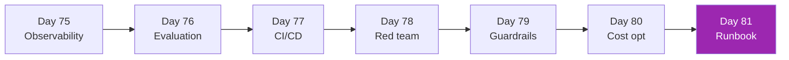

# Week 11: LLMOps in Production 🏭

เปลี่ยน prototype → production-grade service

| Day | หัวข้อ | เวลา |
|-----|--------|------|
| 75 | Observability (Langfuse/Arize) | 4h |
| 76 | Evaluation frameworks (Ragas, DeepEval) | 4h |
| 77 | CI/CD for LLM apps | 3h |
| 78 | Red teaming (Giskard) | 3h |
| 79 | Guardrails (NeMo, GuardrailsAI) | 3h |
| 80 | Cost optimization deep | 3h |
| 81 | Production runbook | 3h |

[เริ่ม Day 75 :material-arrow-right:](day-75.md){ .md-button .md-button--primary }
