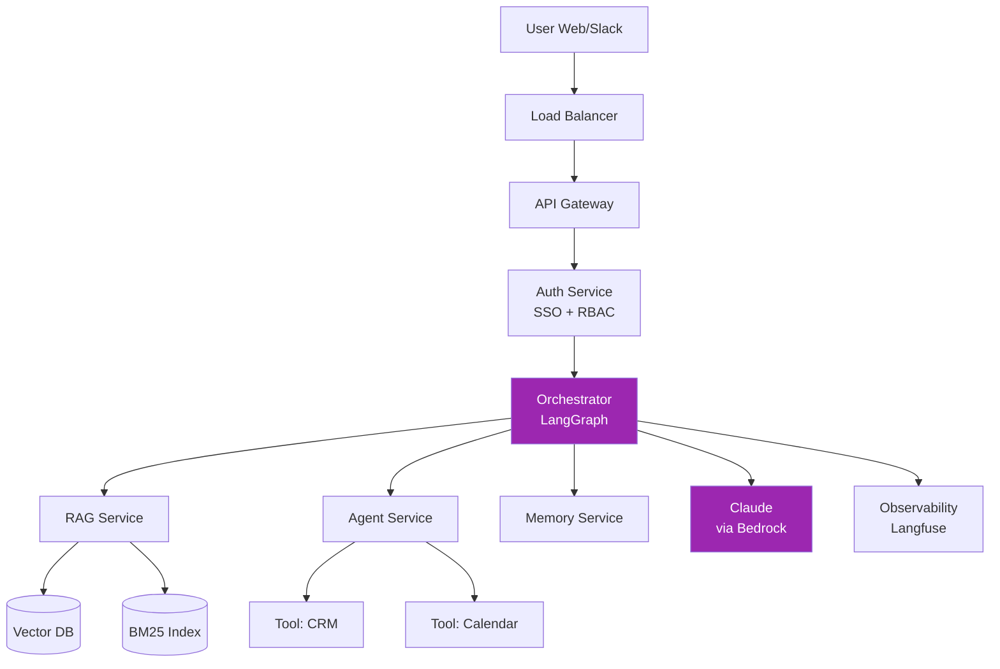
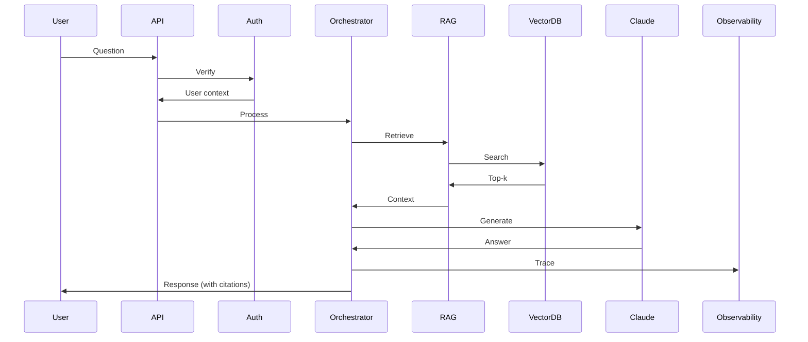

# Day 82: Capstone Design — Phase 1 📐

<div class="lesson-meta">
⏱️ 4 ชั่วโมง &nbsp;|&nbsp; 📊 Project &nbsp;|&nbsp; 📋 Prerequisites: Month 1-3
</div>

## 🎯 Goal

เลือก project + เขียน **PRD + High-level Architecture**

---

## 1. Project Templates

เลือก 1 ของ:

### Template A: Enterprise Knowledge Assistant
- Indexed Confluence + GitHub wiki
- Multi-tenant (departments)
- RAG + agentic
- Cited responses
- Slack + Web UI

### Template B: Customer Support Copilot
- Triage tickets
- Suggest responses
- Auto-resolve common issues
- Escalation logic
- CRM integration

### Template C: Code Intelligence Platform
- Repo Q&A
- PR review agent
- Doc generation
- Test generation
- Security scan

### Template D: Sales Intelligence
- CRM enrichment
- Email drafting
- Meeting prep
- Pipeline analysis
- Outbound personalization

### Template E: Your Own (with approval)
Real product idea จากงานคุณ

---

## 2. PRD Template

```markdown
# PRD: <Project Name>

## Problem
Currently <users> can't <do X> because <reason>. They workaround by <hack>.

## Goal
Enable <users> to <X> in <Y time> with <Z quality>.

## Users / Personas
- Persona 1: <role, goals, pain>
- Persona 2: ...

## User Stories
1. As <user>, I want to <X>, so that <benefit>
2. ...

## Non-Goals (out of scope v1)
- ...

## Metrics of Success
- Adoption: X% MAU within 3mo
- Quality: ≥ Y satisfaction
- Cost: < $Z per user
- Time saved: ≥ N min per task

## Non-functional
- Latency P95 < X ms
- Availability 99.5%
- Security: SOC 2 controls
- Compliance: PDPA / GDPR / ...

## Risks
- ...

## Timeline
- v1: ...
- v2: ...
```

---

## 3. Architecture Decision Records (ADR)

Start a `decisions/` folder. ADRs to write:

| ADR | Topic |
|-----|-------|
| 001 | RAG architecture (vector / hybrid / GraphRAG) |
| 002 | Cloud provider (Direct API / Bedrock / Vertex) |
| 003 | Framework stack (LangChain / LangGraph / LlamaIndex) |
| 004 | Model selection (Haiku / Sonnet / Opus mix) |
| 005 | Vector DB choice |
| 006 | Auth (SSO, RBAC) |
| 007 | Observability stack |
| 008 | Eval framework |

### ADR Template

```markdown
# ADR-001: Use Hybrid RAG (vector + BM25 + rerank)

## Status
Proposed

## Context
We need to retrieve from 50K docs across departments. Tested vector-only (Day 35) — 65% accuracy on test set. Goal ≥ 80%.

## Decision  
Use hybrid retrieval: BM25 + dense vector + Cohere rerank.

## Consequences
- + Higher recall on keyword queries
- + Better on rare terminology
- − More infrastructure (BM25 service)
- − Cost: +$200/month rerank API

## Alternatives Considered
| Option | Pro | Con |
|--------|-----|-----|
| Vector-only | Simple | 65% acc, miss keywords |
| BM25-only | Cheap | Miss semantic |
| GraphRAG | Best on global Q | Heavy build, KG maintenance |
```

---

## 4. High-Level Architecture Diagram



---

## 5. Data Flow



---

## 6. Tech Stack Sheet

```markdown
# Tech Stack — v1

## Compute
- API: FastAPI + Uvicorn on ECS (or Cloud Run)
- Workers: Async with Celery / Cloud Tasks

## Storage
- Vector DB: Qdrant (self-host) OR Pinecone managed
- Operational DB: PostgreSQL (RDS)
- Cache: Redis (ElastiCache)
- Object: S3 / GCS

## AI
- Inference: Claude via AWS Bedrock (Sonnet primary, Haiku routing)
- Embeddings: Cohere Embed v3
- Re-rank: Cohere Rerank v3

## Auth
- SSO: Okta / Azure AD
- Authorization: OPA / Cedar

## Observability
- Tracing: Langfuse self-host
- Metrics: Prometheus + Grafana
- Logs: CloudWatch
- Alerts: PagerDuty

## CI/CD
- VCS: GitHub
- CI: GitHub Actions
- IaC: Terraform
- Container: Docker → ECR
```

---

## 🛠️ Deliverables (Day 82)

1. **PRD** (1-2 pages)
2. **Architecture diagram** (Mermaid)
3. **Data flow sequence diagram**
4. **Tech stack sheet**
5. **Initial 8 ADRs** (skeleton; can refine Day 83)

Save in `capstone/docs/`

---

## ✅ Self-Check Quiz

<div class="quiz">

**Q1:** ทำไม PRD ต้องเขียนก่อน Architecture?

??? success "ดูคำตอบ"
    Architecture serves the problem — without clear problem, arch becomes vague + over-engineered

**Q2:** ADR ต่างจาก documentation ทั่วไป?

??? success "ดูคำตอบ"
    - ADR captures the **decision** + **rationale** + **alternatives**
    - Time-stamped + immutable (superseded but not deleted)
    - Helps onboarding + post-mortem

</div>

[ต่อไป → Day 83 :material-arrow-right:](day-83.md){ .md-button .md-button--primary }
