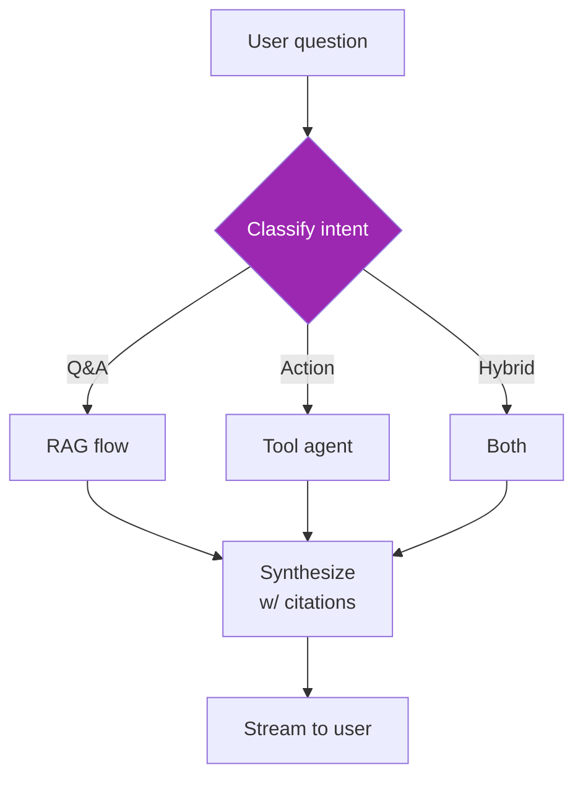

# Day 85: Build — Agent Layer 🤖

<div class="lesson-meta">
⏱️ 5 ชั่วโมง &nbsp;|&nbsp; 📊 Project &nbsp;|&nbsp; 📋 Prerequisites: Day 84
</div>

## 🎯 Goal

Build orchestrator that:
- Routes between retrieval and tools
- Maintains memory per user
- Falls back to retrieval if tool fails
- Streams answers with citations

---

## 1. Orchestrator Architecture



---

## 2. State Definition

```python
# orchestrator/state.py
from typing import TypedDict, Annotated
import operator

class AppState(TypedDict):
    user_id: str
    session_id: str
    question: str
    intent: str
    retrieved: list
    tool_results: list
    answer: str
    citations: list
    messages: Annotated[list, operator.add]
```

---

## 3. Intent Router

```python
# orchestrator/router.py
from anthropic import Anthropic
import json

client = Anthropic()

def classify_intent(state: AppState) -> dict:
    resp = client.messages.create(
        model="claude-haiku-4-5-20251001",
        max_tokens=50,
        system="""Classify intent. Output one of:
- QA: question about company knowledge
- ACTION: user wants to do something (create, send, schedule)
- HYBRID: needs info + action
- CHIT_CHAT: greeting / smalltalk

Just output the label.""",
        messages=[{"role": "user", "content": state["question"]}]
    )
    return {"intent": resp.content[0].text.strip()}
```

---

## 4. Tools

```python
# orchestrator/tools.py
from datetime import datetime, timedelta

def create_jira_ticket(title: str, description: str, priority: str = "Medium") -> dict:
    # Real impl: jira_client.create_issue(...)
    return {"ticket_id": "ABC-123", "url": "https://jira/..."}

def schedule_meeting(attendees: list[str], duration_min: int, subject: str) -> dict:
    # Real impl: Google Calendar API
    return {"event_id": "ev-xyz", "time": (datetime.now() + timedelta(days=1)).isoformat()}

def send_slack(channel: str, message: str) -> dict:
    # Real impl: slack_client.chat.postMessage(...)
    return {"ts": "1234567890.1234", "channel": channel}

TOOL_DEFS = [
    {
        "name": "create_jira_ticket",
        "description": "Create a JIRA ticket for tracking work",
        "input_schema": {
            "type": "object",
            "properties": {
                "title": {"type": "string"},
                "description": {"type": "string"},
                "priority": {"type": "string", "enum": ["Low", "Medium", "High"]}
            },
            "required": ["title", "description"]
        }
    },
    {
        "name": "schedule_meeting",
        "description": "Schedule a calendar meeting",
        "input_schema": {
            "type": "object",
            "properties": {
                "attendees": {"type": "array", "items": {"type": "string"}},
                "duration_min": {"type": "integer"},
                "subject": {"type": "string"}
            },
            "required": ["attendees", "duration_min", "subject"]
        }
    },
    # ... more tools
]

TOOL_MAP = {
    "create_jira_ticket": create_jira_ticket,
    "schedule_meeting": schedule_meeting,
    "send_slack": send_slack,
}
```

---

## 5. RAG Node

```python
def rag_step(state: AppState) -> dict:
    retrieved = retriever.retrieve(state["question"], top_k=5)
    context, citations = format_for_llm(retrieved)
    return {"retrieved": retrieved, "citations": citations}

def generate_with_citations(state: AppState) -> dict:
    # Personalize
    profile = get_profile(state["user_id"])
    
    context = "\n\n".join([f"[{c['id']}] {c.get('title', '')}" for c in state["citations"]])
    
    resp = client.messages.create(
        model="claude-sonnet-4-6",
        max_tokens=1500,
        system=f"""You're an enterprise assistant. User context:
- Department: {profile.department}
- Role: {profile.role}

Answer using ONLY provided context. Cite sources using [N] format. 
If context insufficient, say so.""",
        messages=[{"role": "user", "content": f"Q: {state['question']}\n\nContext:\n{context}"}]
    )
    return {"answer": resp.content[0].text, "messages": [{"role": "assistant", "content": resp.content[0].text}]}
```

---

## 6. Tool Agent Node

```python
def tool_agent(state: AppState) -> dict:
    msgs = [{"role": "user", "content": state["question"]}]
    tool_results = []
    
    for _ in range(5):  # max 5 tool iterations
        resp = client.messages.create(
            model="claude-sonnet-4-6",
            max_tokens=1000,
            tools=TOOL_DEFS,
            messages=msgs
        )
        
        if resp.stop_reason == "end_turn":
            return {"tool_results": tool_results, "answer": resp.content[0].text}
        
        # tool_use
        msgs.append({"role": "assistant", "content": resp.content})
        result_blocks = []
        for block in resp.content:
            if block.type == "tool_use":
                # Audit log
                log_tool_call(state["user_id"], block.name, block.input)
                
                # Execute
                fn = TOOL_MAP[block.name]
                result = fn(**block.input)
                tool_results.append({"name": block.name, "input": block.input, "output": result})
                
                result_blocks.append({
                    "type": "tool_result",
                    "tool_use_id": block.id,
                    "content": json.dumps(result)
                })
        msgs.append({"role": "user", "content": result_blocks})
    
    return {"tool_results": tool_results, "answer": "[Max tool iterations]"}
```

---

## 7. LangGraph Wire-up

```python
# orchestrator/graph.py
from langgraph.graph import StateGraph, END, START

def route_after_classify(state: AppState) -> str:
    intent = state["intent"]
    if intent == "QA":
        return "rag_step"
    if intent == "ACTION":
        return "tool_agent"
    if intent == "HYBRID":
        return "rag_step"  # do RAG first, then action below
    return END  # chit-chat

def after_rag_route(state: AppState) -> str:
    if state["intent"] == "HYBRID":
        return "tool_agent"
    return "generate"

g = StateGraph(AppState)
g.add_node("classify", classify_intent)
g.add_node("rag_step", rag_step)
g.add_node("generate", generate_with_citations)
g.add_node("tool_agent", tool_agent)

g.add_edge(START, "classify")
g.add_conditional_edges("classify", route_after_classify, {
    "rag_step": "rag_step",
    "tool_agent": "tool_agent",
    END: END
})
g.add_conditional_edges("rag_step", after_rag_route, {
    "tool_agent": "tool_agent",
    "generate": "generate"
})
g.add_edge("generate", END)
g.add_edge("tool_agent", END)

# Memory checkpoint
from langgraph.checkpoint.postgres import PostgresSaver
import psycopg
conn = psycopg.connect("postgresql://...")
checkpointer = PostgresSaver(conn)
checkpointer.setup()

app = g.compile(checkpointer=checkpointer)
```

---

## 8. Streaming

```python
# api/streaming.py
async def stream_answer(question, user_id, session_id):
    config = {"configurable": {"thread_id": session_id}}
    
    initial = {
        "user_id": user_id,
        "session_id": session_id,
        "question": question,
        "intent": "",
        "retrieved": [],
        "tool_results": [],
        "answer": "",
        "citations": [],
        "messages": []
    }
    
    # Stream events
    async for event in app.astream_events(initial, config, version="v2"):
        if event["event"] == "on_chat_model_stream":
            chunk = event["data"]["chunk"].content
            if chunk:
                yield {"type": "text", "content": chunk}
        elif event["event"] == "on_chain_start":
            yield {"type": "status", "node": event["name"]}
    
    # Final citations
    final_state = await app.aget_state(config)
    yield {"type": "citations", "data": final_state.values["citations"]}
```

---

## 9. Tests

```python
def test_qa_intent():
    result = app.invoke({"question": "What's our PTO policy?", ...})
    assert result["intent"] == "QA"
    assert len(result["citations"]) >= 1

def test_action_intent():
    result = app.invoke({"question": "Schedule a meeting with @bob tomorrow at 2pm", ...})
    assert result["intent"] == "ACTION"
    assert len(result["tool_results"]) >= 1

def test_hybrid():
    result = app.invoke({"question": "Find PTO policy and create JIRA to update it", ...})
    assert len(result["citations"]) >= 1
    assert len(result["tool_results"]) >= 1
```

---

## 🛠️ Day 85 Deliverables

- [ ] Intent router (Haiku-based)
- [ ] RAG node + generation with citations
- [ ] Tool agent with ≥ 3 real tools
- [ ] LangGraph orchestrator wired up
- [ ] Postgres checkpointer (session persistence)
- [ ] Streaming endpoint
- [ ] Tests pass (≥ 10 cases)

[ต่อไป → Day 86 :material-arrow-right:](day-86.md){ .md-button .md-button--primary }
