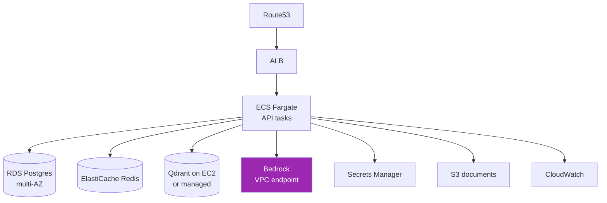

# Day 87: Deploy — Cloud + IaC 🚀

<div class="lesson-meta">
⏱️ 4 ชั่วโมง &nbsp;|&nbsp; 📊 Project &nbsp;|&nbsp; 📋 Prerequisites: Day 86
</div>

## 🎯 Goal

Deploy to cloud with:
- Terraform IaC
- Container orchestration
- Bedrock for Claude
- Secrets manager
- Multi-AZ HA

---

## 1. Architecture (AWS example)



---

## 2. Terraform Structure

```
infra/
├── envs/
│   ├── dev/
│   │   ├── main.tf
│   │   └── terraform.tfvars
│   ├── staging/
│   └── prod/
├── modules/
│   ├── vpc/
│   ├── ecs-service/
│   ├── rds/
│   ├── qdrant/
│   └── bedrock/
└── README.md
```

---

## 3. VPC Module

```hcl
# modules/vpc/main.tf
resource "aws_vpc" "main" {
  cidr_block           = "10.0.0.0/16"
  enable_dns_support   = true
  enable_dns_hostnames = true
  tags = { Name = "${var.env}-vpc" }
}

resource "aws_subnet" "private" {
  count             = 3
  vpc_id            = aws_vpc.main.id
  cidr_block        = cidrsubnet("10.0.0.0/16", 8, count.index)
  availability_zone = data.aws_availability_zones.available.names[count.index]
}

resource "aws_subnet" "public" {
  count                   = 3
  vpc_id                  = aws_vpc.main.id
  cidr_block              = cidrsubnet("10.0.0.0/16", 8, count.index + 10)
  availability_zone       = data.aws_availability_zones.available.names[count.index]
  map_public_ip_on_launch = true
}

# NAT, IGW, route tables...
```

---

## 4. Bedrock VPC Endpoint

```hcl
# modules/bedrock/main.tf
resource "aws_vpc_endpoint" "bedrock_runtime" {
  vpc_id              = var.vpc_id
  service_name        = "com.amazonaws.${var.region}.bedrock-runtime"
  vpc_endpoint_type   = "Interface"
  subnet_ids          = var.subnet_ids
  security_group_ids  = [aws_security_group.bedrock_endpoint.id]
  private_dns_enabled = true
}

resource "aws_security_group" "bedrock_endpoint" {
  vpc_id = var.vpc_id
  ingress {
    from_port       = 443
    to_port         = 443
    protocol        = "tcp"
    security_groups = [var.app_sg_id]
  }
}
```

→ App ใน private subnet เรียก Claude โดยไม่ออก internet

---

## 5. ECS Service

```hcl
# modules/ecs-service/main.tf
resource "aws_ecs_cluster" "main" {
  name = "${var.env}-cluster"
}

resource "aws_ecs_task_definition" "app" {
  family                   = "${var.env}-api"
  network_mode             = "awsvpc"
  requires_compatibilities = ["FARGATE"]
  cpu                      = "1024"
  memory                   = "2048"
  execution_role_arn       = aws_iam_role.execution.arn
  task_role_arn            = aws_iam_role.task.arn
  
  container_definitions = jsonencode([{
    name      = "api"
    image     = "${var.ecr_repo}:${var.image_tag}"
    essential = true
    portMappings = [{ containerPort = 8000 }]
    environment = [
      { name = "AWS_REGION", value = var.region },
      { name = "BEDROCK_MODEL_ID", value = "anthropic.claude-sonnet-4-6-v1:0" }
    ]
    secrets = [
      { name = "DB_PASSWORD", valueFrom = aws_secretsmanager_secret.db.arn },
      { name = "JWT_SECRET", valueFrom = aws_secretsmanager_secret.jwt.arn }
    ]
    logConfiguration = {
      logDriver = "awslogs"
      options = {
        awslogs-group         = aws_cloudwatch_log_group.api.name
        awslogs-region        = var.region
        awslogs-stream-prefix = "api"
      }
    }
  }])
}

resource "aws_ecs_service" "app" {
  name            = "api"
  cluster         = aws_ecs_cluster.main.id
  task_definition = aws_ecs_task_definition.app.arn
  desired_count   = 3
  launch_type     = "FARGATE"
  
  network_configuration {
    subnets          = var.private_subnet_ids
    security_groups  = [aws_security_group.app.id]
  }
  
  load_balancer {
    target_group_arn = var.alb_target_group_arn
    container_name   = "api"
    container_port   = 8000
  }
}
```

---

## 6. IAM Policy for Bedrock

```hcl
resource "aws_iam_role_policy" "bedrock" {
  role = aws_iam_role.task.id
  policy = jsonencode({
    Version = "2012-10-17"
    Statement = [{
      Effect = "Allow"
      Action = [
        "bedrock:Converse",
        "bedrock:ConverseStream",
        "bedrock:InvokeModel",
        "bedrock:InvokeModelWithResponseStream"
      ]
      Resource = [
        "arn:aws:bedrock:${var.region}::foundation-model/anthropic.claude-sonnet-4-6-v1:0",
        "arn:aws:bedrock:${var.region}::foundation-model/anthropic.claude-haiku-4-5-v1:0",
        "arn:aws:bedrock:${var.region}::foundation-model/anthropic.claude-opus-4-7-v1:0"
      ]
    }]
  })
}
```

---

## 7. Secrets Manager

```hcl
resource "aws_secretsmanager_secret" "db" {
  name = "${var.env}/db-password"
}

resource "aws_secretsmanager_secret_version" "db" {
  secret_id     = aws_secretsmanager_secret.db.id
  secret_string = random_password.db.result
}

resource "random_password" "db" {
  length  = 32
  special = true
}
```

---

## 8. RDS

```hcl
resource "aws_db_instance" "postgres" {
  identifier             = "${var.env}-db"
  engine                 = "postgres"
  engine_version         = "16"
  instance_class         = "db.t4g.medium"
  allocated_storage      = 100
  storage_encrypted      = true
  multi_az               = var.env == "prod"
  
  username               = "appuser"
  password               = random_password.db.result
  
  db_subnet_group_name   = aws_db_subnet_group.main.name
  vpc_security_group_ids = [aws_security_group.db.id]
  
  backup_retention_period = 7
  skip_final_snapshot     = var.env != "prod"
}
```

---

## 9. Deploy Script

```bash
#!/bin/bash
# scripts/deploy.sh
set -e

ENV=$1
IMAGE_TAG=$(git rev-parse --short HEAD)

# Build & push
docker build -t api:$IMAGE_TAG .
docker tag api:$IMAGE_TAG $ECR_URI:$IMAGE_TAG
aws ecr get-login-password --region $REGION | docker login --username AWS --password-stdin $ECR_URI
docker push $ECR_URI:$IMAGE_TAG

# Deploy via Terraform
cd infra/envs/$ENV
terraform init -reconfigure
terraform apply -var "image_tag=$IMAGE_TAG" -auto-approve

# Wait for ECS to stabilize
aws ecs wait services-stable --cluster $ENV-cluster --services api
echo "✅ Deployed $IMAGE_TAG to $ENV"
```

---

## 10. Smoke Tests Post-Deploy

```python
# scripts/smoke_test.py
import requests, time

BASE_URL = "https://api.your-domain.com"

def smoke():
    # Health
    r = requests.get(f"{BASE_URL}/health")
    assert r.status_code == 200
    
    # Auth flow (simulated with test token)
    r = requests.post(f"{BASE_URL}/api/chat", 
                      headers={"Cookie": f"session={TEST_JWT}"},
                      json={"question": "What's our PTO policy?"})
    assert r.status_code == 200
    
    # Verify streaming works
    print("✅ Smoke tests passed")

smoke()
```

---

## 🛠️ Day 87 Deliverables

- [ ] Terraform modules ครบ (VPC, ECS, RDS, Bedrock endpoint, etc.)
- [ ] 3 envs: dev, staging, prod
- [ ] Deploy script: `./scripts/deploy.sh staging`
- [ ] Smoke tests pass post-deploy
- [ ] Verify: app live, Claude calls work, DB connected
- [ ] Cost tags on all resources

[ต่อไป → Day 88 :material-arrow-right:](day-88.md){ .md-button .md-button--primary }
