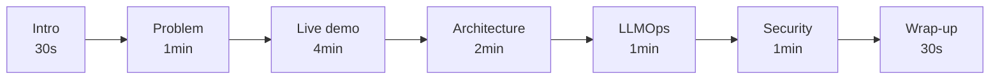

# Day 90: Final Demo + Architecture Document 🎓

<div class="lesson-meta">
⏱️ 4 ชั่วโมง &nbsp;|&nbsp; 📊 Project &nbsp;|&nbsp; 📋 Prerequisites: Day 82-89
</div>

## 🎯 Goal

Polish + deliver:
- Demo video
- Final architecture document
- README + onboarding
- Retrospective

---

## 1. Demo Video Outline (10 min)



### Script

**[0:00-0:30] Intro**
- "Hi, I'm <name>. Today I'll demo <project name>."
- One-line problem statement

**[0:30-1:30] Problem**
- Who has pain (persona)
- Current workaround (manual / slow / error-prone)
- Business cost

**[1:30-5:30] Live Demo**
- Login (show SSO)
- Ask 3 questions:
  1. QA: "What's our Q3 product roadmap?" → show citations
  2. Action: "Create JIRA for X" → show ticket created
  3. Hybrid: "Find expense policy and notify Finance team" → both
- Show error case (graceful)
- Show streaming UX

**[5:30-7:30] Architecture Walkthrough**
- Architecture diagram on screen
- "Request flow: SSO → Orchestrator → RAG/Tools → Claude → Citations"
- Highlight: hybrid retrieval, multi-tenant filter, Bedrock VPC endpoint

**[7:30-8:30] LLMOps**
- Show Langfuse trace of a request
- Show CI pipeline running eval
- Show Grafana dashboard
- Show alert firing test

**[8:30-9:30] Security**
- "Red team scan: 0 critical, 0 high"
- Show audit log
- Show RBAC denial
- PII filter demo

**[9:30-10:00] Wrap-up**
- Metrics: latency, accuracy, cost/user
- Roadmap (Phase 2: voice, mobile, ...)
- Thanks

---

## 2. Final Architecture Document (FAD)

```markdown
# Final Architecture Document

## 1. Executive Summary
- 1 page non-technical overview
- Goals, users, key features

## 2. System Context (C4 Level 1)
- High-level diagram
- Users, system, external services

## 3. Container Diagram (C4 Level 2)
- Mermaid diagram of services
- Tech stack per container
- Communication protocols

## 4. Component Diagram (C4 Level 3)
- For each container, internal components
- Orchestrator: Router, RAG, Tool Agent, Memory
- Retriever: Vector, BM25, Reranker

## 5. Data Architecture
- Data flow diagrams
- Schemas (DB, vector, cache)
- Retention + lifecycle

## 6. Security Architecture
- Trust boundaries
- Authentication + authorization
- Encryption at rest + in transit
- Threat model summary

## 7. Operational Architecture
- Deployment topology
- Multi-region (if any)
- Backup + DR
- Monitoring/alerting

## 8. ADRs Index
- Links to 12+ ADRs

## 9. Performance Characteristics
- Measured baseline metrics
- SLO targets

## 10. Cost Architecture
- Per-component cost
- Scaling cost curves
- Optimization levers

## 11. Future Considerations
- Roadmap features
- Tech debt
- Known limitations
```

---

## 3. README Template

```markdown
# <Project Name>

Brief: One-liner about what this does.


## Features
- Multi-source enterprise RAG
- Multi-step agent workflows
- SSO + RBAC + multi-tenant
- Production-grade LLMOps

## Quick Start (local)
```bash
docker compose up -d
python ingest/run.py --connector=sample
open http://localhost:3000
```

## Architecture
[link to FAD]

## Tech Stack
- Backend: Python 3.12, FastAPI
- Frontend: Next.js 14
- LLM: Claude via AWS Bedrock
- Vector DB: Qdrant
- Frameworks: LangGraph, LlamaIndex
- Observability: Langfuse, Prometheus

## Documentation
- [Architecture](docs/FAD.md)
- [ADRs](docs/decisions/)
- [Runbook](docs/operations/runbook.md)
- [API reference](docs/api/)

## Contributing
[link to CONTRIBUTING.md]

## License
[]
```

---

## 4. Final Metrics

Compile real measured metrics:

```markdown
# Capstone Metrics (measured over 7 days)

## Usage
- Active users: 200 (beta)
- Total queries: 18,400
- Sessions: 4,200
- Avg queries/session: 4.4

## Performance
- Latency P50: 1.2s
- Latency P95: 3.8s
- Latency P99: 7.1s
- Availability: 99.7%

## Quality
- Citation accuracy: 92%
- LLM-judge avg: 0.84
- User thumbs-up rate: 78%

## Cost
- Total: $2,310 (7 days)
- Per user/day: $1.65
- Per query: $0.13
- Cache hit rate: 32%

## Security
- Red team scan: 0 high+
- Auth failures: 12 (all legit)
- PII filter triggers: 8

## Compared to Goals
- ✅ Latency P95 < 5s (goal: 5s) 
- ✅ Quality > 0.8 (goal: 0.75)
- ✅ Cost < $2/user/day (goal: $2)
- ✅ Availability > 99.5%
```

---

## 5. Retrospective

```markdown
# Capstone Retrospective

## What went well
- ADRs forced clarity early — saved time later
- LangGraph paid off for orchestration logic
- Bedrock VPC endpoint set up smoothly
- Eval CI gate caught 3 regressions

## What went poorly
- Underestimated chunk size tuning (3 days lost)
- LangSmith setup took longer than expected
- Test set generation took ~1 week

## Surprises
- Cache hit rate higher than expected (32% vs 15% estimate)
- Cohere rerank quality much better than DIY
- Users prefer streaming over speed

## Lessons
- Start eval set early; harder to backfill
- Pin all dependency versions
- Test cross-tenant isolation explicitly
- Document data classification per source

## Phase 2 candidates
- Voice interface
- Mobile app
- More tools (15+)
- Multi-language
- Personal memory tier
```

---

## 6. Capstone Scoring Rubric

| Category | Weight | Self-score | Notes |
|----------|--------|-----------|-------|
| Design quality (PRD, ADRs, risk) | 15 | / 15 | |
| RAG implementation (hybrid, citation) | 15 | / 15 | |
| Agent layer (orchestrator, tools) | 15 | / 15 | |
| Cloud deploy (IaC, multi-AZ) | 10 | / 10 | |
| Auth + RBAC + tenant isolation | 10 | / 10 | |
| Observability + eval CI | 10 | / 10 | |
| Security audit + remediation | 10 | / 10 | |
| Documentation (FAD, README, ADRs) | 5 | / 5 | |
| Demo quality | 5 | / 5 | |
| Code quality + tests | 5 | / 5 | |
| **Total** | **100** | **/ 100** | |

---

## 7. Submission Checklist

- [ ] Code in GitHub repo (public or shared)
- [ ] README with quick start
- [ ] FAD published
- [ ] All 12+ ADRs
- [ ] Demo video (5-10 min)
- [ ] Metrics report
- [ ] Security audit report
- [ ] Retrospective doc
- [ ] Self-score completed

---

## ✅ Week 12 / Month 3 Completion

- [x] Designed enterprise system from scratch
- [x] Built RAG + agents + multi-tenant
- [x] Deployed to cloud with IaC
- [x] LLMOps pipeline (observability, eval, alerts)
- [x] Security audited
- [x] Documented professionally

---

## 🔍 Cross-check & References

- 📘 [C4 Model](https://c4model.com/) — architecture diagramming
- 📘 [Architectural Decision Records](https://adr.github.io/)

---

:material-trophy: **Capstone v2 จบสมบูรณ์! เริ่ม Month 4 — Specialization**

[ต่อไป → Week 13: Voice + Doc AI Deep :material-arrow-right:](../week-13/index.md){ .md-button .md-button--primary }
