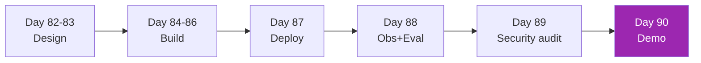

# Week 12: Enterprise Capstone v2 🏆

รวมทุกอย่างจาก Month 1-3 → Build production-grade enterprise system

| Day | หัวข้อ | เวลา |
|-----|--------|------|
| 82 | Design — requirements + architecture | 4h |
| 83 | Design — ADR + risk assessment | 3h |
| 84 | Build — RAG core | 5h |
| 85 | Build — Agent layer | 5h |
| 86 | Build — UI + auth | 4h |
| 87 | Deploy — cloud + IaC | 4h |
| 88 | Observability + eval pipeline | 4h |
| 89 | Red team + security audit | 3h |
| 90 | Demo + final architecture doc | 4h |

[เริ่ม Day 82 :material-arrow-right:](day-82.md){ .md-button .md-button--primary }
