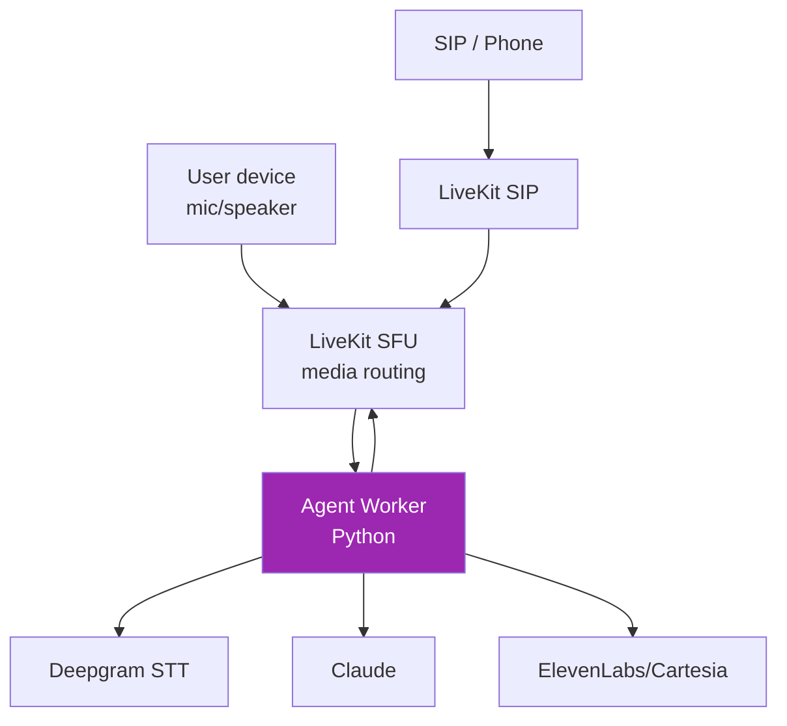

# Day 91: LiveKit Agents 🎤

<div class="lesson-meta">
⏱️ 4 ชั่วโมง &nbsp;|&nbsp; 📊 Advanced &nbsp;|&nbsp; 📋 Prerequisites: Day 67
</div>

## 🎯 Learning Objectives

<ul class="objectives">
<li>เข้าใจ LiveKit architecture (SFU + Agents)</li>
<li>Build voice agent ที่ deploy ได้</li>
<li>Handle turn-taking, interruption, tool calls</li>
<li>Setup telephony bridge (SIP)</li>
</ul>

---

## 1. LiveKit Stack



- **SFU**: Selective Forwarding Unit — routes audio bytes
- **Agent Worker**: Python process listening for sessions
- **SIP Gateway**: bridge to PSTN/phone

---

## 2. Setup

```bash
pip install "livekit-agents[anthropic,deepgram,elevenlabs,silero]"
```

```bash
# Self-host LiveKit
docker run -d \
  -p 7880:7880 -p 7881:7881 -p 50000-60000:50000-60000/udp \
  livekit/livekit-server --dev

# Or LiveKit Cloud
```

Environment:
```bash
export LIVEKIT_URL=ws://localhost:7880
export LIVEKIT_API_KEY=devkey
export LIVEKIT_API_SECRET=devsecret
export ANTHROPIC_API_KEY=...
export DEEPGRAM_API_KEY=...
export ELEVENLABS_API_KEY=...
```

---

## 3. Minimal Agent

```python
# agent.py
from livekit.agents import JobContext, WorkerOptions, cli, llm
from livekit.agents.voice_assistant import VoiceAssistant
from livekit.plugins import anthropic, deepgram, elevenlabs, silero

async def entrypoint(ctx: JobContext):
    await ctx.connect()

    initial_ctx = llm.ChatContext().append(
        role="system",
        text="You are a helpful voice assistant. Keep replies under 3 sentences."
    )

    assistant = VoiceAssistant(
        vad=silero.VAD.load(),
        stt=deepgram.STT(),
        llm=anthropic.LLM(model="claude-haiku-4-5-20251001"),
        tts=elevenlabs.TTS(voice="...voice_id..."),
        chat_ctx=initial_ctx,
    )

    assistant.start(ctx.room)
    await assistant.say("Hi! How can I help?", allow_interruptions=True)

if __name__ == "__main__":
    cli.run_app(WorkerOptions(entrypoint_fnc=entrypoint))
```

```bash
python agent.py dev  # development mode
python agent.py start  # production
```

---

## 4. Frontend (Web)

```bash
npm install @livekit/components-react livekit-client
```

```tsx
import { LiveKitRoom, useVoiceAssistant, BarVisualizer } from "@livekit/components-react";

export default function VoiceUI() {
  const token = useFetchToken();  // your backend mints token

  return (
    <LiveKitRoom serverUrl={LIVEKIT_URL} token={token} connect={true} audio={true}>
      <VoiceUI />
    </LiveKitRoom>
  );
}

function VoiceUI() {
  const { state, audioTrack } = useVoiceAssistant();
  return (
    <div>
      <BarVisualizer state={state} trackRef={audioTrack} />
      <p>{state}</p>
    </div>
  );
}
```

---

## 5. Token Server

```python
# backend.py
from livekit import api

def mint_token(user_id, room="voice-room"):
    token = api.AccessToken(LIVEKIT_API_KEY, LIVEKIT_API_SECRET)
    token.with_identity(user_id)
    token.with_grants(api.VideoGrants(
        room_join=True,
        room=room,
        can_publish=True,
        can_subscribe=True
    ))
    return token.to_jwt()
```

---

## 6. Function Tools in Voice

```python
from livekit.agents import llm

class Tools(llm.FunctionContext):
    @llm.ai_callable(description="Get current weather for a city")
    async def get_weather(self, city: str):
        # call API
        return f"It's 28°C in {city}"

    @llm.ai_callable(description="Book a meeting")
    async def book_meeting(self, time: str, attendee: str):
        # ...
        return f"Booked at {time} with {attendee}"

assistant = VoiceAssistant(
    ...,
    fnc_ctx=Tools()
)
```

→ Claude เรียก function — LiveKit handles end-to-end

---

## 7. Interruption Handling

LiveKit จัดการให้แล้ว:
- VAD (Silero) detects user speech start
- Assistant stops TTS playback
- Cancels in-flight LLM generation
- Listens to new user input

```python
# Tuning
from livekit.agents.voice_assistant import VoiceAssistant

assistant = VoiceAssistant(
    ...,
    interrupt_speech_duration=0.5,  # seconds of speech to consider interruption
    interrupt_min_words=2,
    allow_interruptions=True
)
```

---

## 8. Telephony (SIP)

```bash
# Setup SIP trunk (Twilio / Telnyx / etc.)
livekit-cli sip create-trunk \
  --name "my-trunk" \
  --numbers "+14155551234" \
  --auth-username "user" \
  --auth-password "..."
```

```python
# Inbound call dispatch
livekit-cli sip create-dispatch \
  --rule-name "main-dispatch" \
  --trunk-ids "trunk-id" \
  --agent-name "voice-assistant"
```

→ User โทร → ringing → answered by agent

---

## 9. Production Best Practices

- **Latency**: Haiku for LLM, streaming TTS, voice activity detection tuning
- **Cost**: $0.03-0.06/min — set max session duration
- **Quality**: test ทุกอย่าง — voice quality crucial
- **Failure**: graceful disconnect, retry, escalation to human
- **Privacy**: opt-in recording, delete on demand
- **Compliance**: PCI/HIPAA care if discussing protected info

---

## 🛠️ Hands-on Exercise

!!! example "Exercise 1: Voice Hello"
    LiveKit dev server + agent + simple web client → talk

!!! example "Exercise 2: Tools"
    Add 2 function tools → test voice flow

!!! example "Exercise 3: SIP"
    (Optional) Setup SIP trunk + receive call

---

## ✅ Self-Check Quiz

<div class="quiz">

**Q1:** ทำไม SFU ไม่ใช่ MCU?

??? success "ดูคำตอบ"
    - SFU = routing (cheap, scalable, per-client decoding)
    - MCU = mix audio centrally (expensive, latency)
    - Voice agents need low latency → SFU

**Q2:** Haiku ใน voice ทำไมเหมาะ?

??? success "ดูคำตอบ"
    - TTFB ต่ำสุด — สำคัญที่สุดใน voice
    - Cost ต่ำ — voice เปลือง $$
    - คำตอบสั้น = conversational

</div>

---

## 🔍 Cross-check & References

- 📘 [LiveKit Agents Docs](https://docs.livekit.io/agents/)
- 📦 [LiveKit Agents GitHub](https://github.com/livekit/agents)
- 📺 [Voice AI w/ LiveKit (DLAI)](https://www.deeplearning.ai/courses/)

[ต่อไป → Day 92: Google ADK :material-arrow-right:](day-92.md){ .md-button .md-button--primary }
