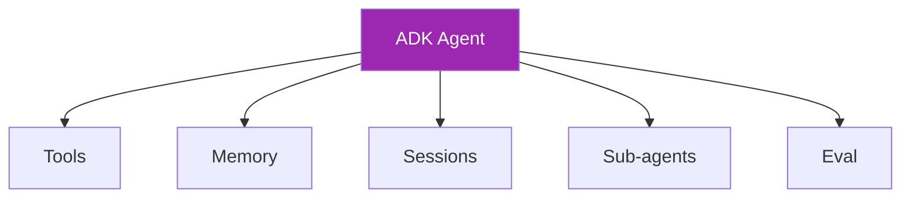

# Day 92: Google ADK 🅖

<div class="lesson-meta">
⏱️ 3 ชั่วโมง &nbsp;|&nbsp; 📊 Intermediate &nbsp;|&nbsp; 📋 Prerequisites: Day 67, 91
</div>

## 🎯 Learning Objectives

<ul class="objectives">
<li>เข้าใจ ADK architecture</li>
<li>Build agent ด้วย ADK</li>
<li>เห็นจุดที่ ADK ดีกว่า / ด้อยกว่า framework อื่น</li>
</ul>

---

## 1. ADK Overview

ADK = Google's open-source agent framework, Python-first
- Multi-modal (text, voice, vision)
- Multi-agent orchestration
- Built-in eval framework
- Works with any LLM (Gemini, **Claude**, OpenAI, etc.)
- Deployable to Vertex AI Agent Engine



---

## 2. Setup

```bash
pip install google-adk
```

```python
# my_agent/agent.py
from google.adk.agents import Agent
from google.adk.tools import google_search

agent = Agent(
    name="research_agent",
    model="claude-sonnet-4-6",  # via LiteLLM
    description="Helps with research",
    instruction="You are a research assistant. Use search when needed.",
    tools=[google_search]
)
```

```bash
# Run locally
adk web  # interactive UI
adk run my_agent  # CLI
```

---

## 3. Custom Tools

```python
from google.adk.tools import FunctionTool

def get_user_profile(user_id: str) -> dict:
    """Get user profile by ID."""
    # impl
    return {"name": "Alice", "department": "Engineering"}

agent = Agent(
    name="hr_bot",
    model="claude-sonnet-4-6",
    tools=[FunctionTool(get_user_profile)]
)
```

→ Auto-generates tool schema from type hints + docstring

---

## 4. Multi-Agent

```python
from google.adk.agents import Agent, SequentialAgent, ParallelAgent

researcher = Agent(name="researcher", ..., tools=[google_search])
writer = Agent(name="writer", ...)
critic = Agent(name="critic", ...)

# Sequential
pipeline = SequentialAgent(
    name="article_pipeline",
    sub_agents=[researcher, writer, critic]
)

# Parallel
fact_check_pool = ParallelAgent(
    name="fact_check",
    sub_agents=[checker_1, checker_2, checker_3]
)
```

---

## 5. Voice Support

ADK มี voice flows built-in:

```python
from google.adk.agents import LlmAgent

voice_agent = LlmAgent(
    name="voice_assistant",
    model="claude-haiku-4-5-20251001",
    instruction="Voice-first assistant. Be brief."
)

# Run as voice
adk run voice_agent --voice
```

→ Suitable for proof-of-concept; production-grade voice ยังนิยม LiveKit/Pipecat

---

## 6. Memory & Sessions

```python
from google.adk.sessions import InMemorySessionService

session_svc = InMemorySessionService()

# Or Vertex managed
from google.adk.sessions import VertexAiSessionService
session_svc = VertexAiSessionService(agent_engine_id="...")
```

```python
# Per-conversation memory + cross-session knowledge
agent = Agent(
    ...,
    memory_service=session_svc
)
```

---

## 7. Eval Framework

```python
# eval/cases.yaml
- name: "qa-basic"
  input: "What's the capital of Thailand?"
  expected_substring: "Bangkok"

- name: "tool-use"
  input: "Search for AI news"
  expected_tools: ["google_search"]
```

```bash
adk eval my_agent eval/cases.yaml
# Reports pass/fail + detailed traces
```

---

## 8. Deploy to Vertex Agent Engine

```bash
adk deploy cloud_run \
  --service_name=my-agent \
  --region=us-east5 \
  --project=$PROJECT
```

Or:
```python
from vertexai.preview.reasoning_engines import AdkApp
import vertexai

vertexai.init(project="...", location="us-east5")
app = AdkApp(agent=my_agent)
deployed = app.deploy()
print(deployed.resource_name)
```

→ Managed scaling, monitoring, integration with Vertex AI Agent Builder UI

---

## 9. ADK vs Alternatives

| | ADK | LiveKit | LangGraph | Pipecat |
|--|-----|---------|-----------|---------|
| Voice-first | ⚠️ basic | ✅✅ | ❌ | ✅✅ |
| Multi-agent | ✅ | ❌ | ✅✅ | ❌ |
| Eval framework | ✅✅ | ❌ | ❌ | ❌ |
| GCP integration | ✅✅ | ⚠️ | ⚠️ | ⚠️ |
| Cloud-agnostic | ✅ | ✅ | ✅ | ✅ |

→ Use **ADK** for: GCP-native, eval-heavy, multi-agent + light voice
→ Use **LiveKit/Pipecat** for: production voice with telephony

---

## 🛠️ Hands-on Exercise

!!! example "Exercise 1: ADK Hello"
    Install ADK + run hello agent via `adk web`

!!! example "Exercise 2: Tool + Sub-agent"
    Add 2 tools + 1 sub-agent → test orchestration

!!! example "Exercise 3: Eval"
    Write 10 eval cases + run `adk eval`

---

## ✅ Self-Check Quiz

<div class="quiz">

**Q1:** ADK ใช้ Claude ได้อย่างไร?

??? success "ดูคำตอบ"
    ADK ใช้ LiteLLM ใต้ — รองรับ provider strings like `claude-sonnet-4-6`, `anthropic/claude-sonnet-4-6`, ฯลฯ — abstract over any LLM

**Q2:** ADK ดีกว่า raw LangGraph เมื่อไหร่?

??? success "ดูคำตอบ"
    - Need built-in eval framework
    - Deploy to Vertex Agent Engine (managed)
    - Light voice support out-of-the-box
    - Sequential/Parallel patterns boilerplate-free

</div>

---

## 🔍 Cross-check & References

- 📘 [Google ADK Docs](https://google.github.io/adk-docs/)
- 📦 [ADK GitHub](https://github.com/google/adk-python)

[ต่อไป → Day 93: Voice Production :material-arrow-right:](day-93.md){ .md-button .md-button--primary }
