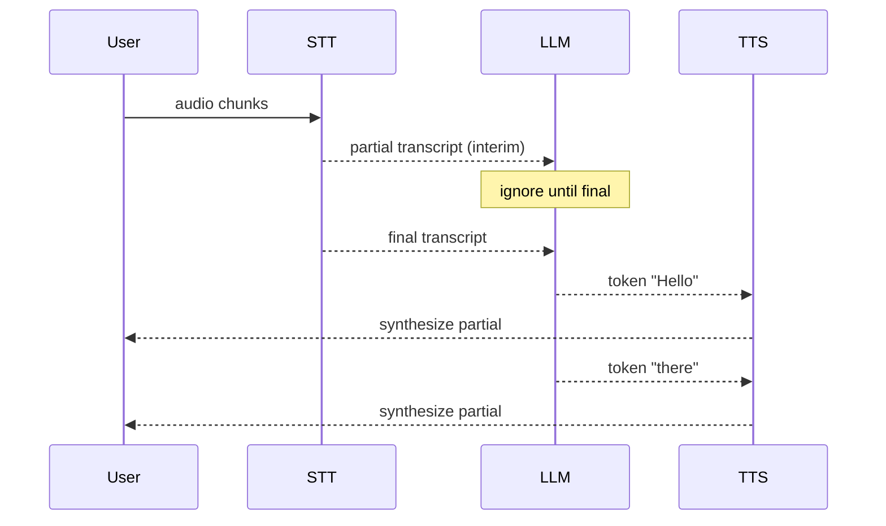

# Day 93: Voice in Production 🏭

<div class="lesson-meta">
⏱️ 3 ชั่วโมง &nbsp;|&nbsp; 📊 Advanced &nbsp;|&nbsp; 📋 Prerequisites: Day 91-92
</div>

## 🎯 Learning Objectives

<ul class="objectives">
<li>Tune voice latency to < 1s</li>
<li>Setup voice-specific observability</li>
<li>Handle compliance (recording consent, PCI redaction)</li>
<li>Multi-language support</li>
</ul>

---

## 1. Latency Budget Drilldown

```
End-to-end target: 800ms (excellent), 1500ms (acceptable)

  Audio capture+chunking:    50ms
  STT first interim:        150ms
  Endpoint detection:       200ms (silence threshold)
  LLM TTFB:                 400ms ← biggest controllable
  TTS first audio:          150ms
  Audio playback start:      50ms
  ─────────────────────────────────
  Total:                  ~1000ms
```

**Optimization levers:**

| Lever | Saves |
|-------|-------|
| Haiku vs Sonnet | 200-500ms |
| Streaming TTS (sentence) | 200-400ms |
| Endpoint detection tuning | 100-200ms |
| Prewarm STT session | 50-100ms |
| Co-locate services same region | 50-150ms |
| Cache responses for FAQ | up to 1s saved |
| Speculative TTS (start TTS on partial LLM) | 100-300ms |

---

## 2. Streaming Everywhere



→ Pipecat / LiveKit จัดการให้

---

## 3. Voice Observability

```python
# Track voice-specific metrics
from prometheus_client import Histogram, Counter

VOICE_TTFB = Histogram("voice_ttfb_seconds", "Time to first byte (audio)", ["agent"])
INTERRUPTIONS = Counter("voice_interruptions_total", "User interrupted bot")
SESSION_DURATION = Histogram("voice_session_seconds", "Session length")
HANDOFF_TO_HUMAN = Counter("voice_handoff_total", "Escalated to human")
```

```python
# Custom span
@langfuse.observe(name="voice_turn")
async def handle_turn(transcript):
    langfuse.update_current_observation(
        input={"transcript": transcript},
        metadata={"channel": "voice"}
    )
    response = await llm_call(transcript)
    return response
```

---

## 4. Recording & Consent

```python
# Capture consent before recording
async def on_call_start(ctx):
    await assistant.say(
        "This call may be recorded for quality. Press 1 to consent, 2 to opt out.",
        wait_for_response=True
    )
    
    response = await wait_for_dtmf(timeout=10)
    if response == "2":
        ctx.metadata["recording"] = False
    else:
        ctx.metadata["recording"] = True
        start_recording(ctx)
```

Recording storage:
- S3 with encryption
- Retention policy (auto-delete after N days)
- Access control + audit log

---

## 5. PCI / Sensitive Data Redaction

If voice agent might hear credit cards / SSN:

```python
PII_PATTERNS = [
    (r"\b\d{4}[\s-]?\d{4}[\s-]?\d{4}[\s-]?\d{4}\b", "[CC]"),
    (r"\b\d{3}-\d{2}-\d{4}\b", "[SSN]"),
]

def redact_transcript(text):
    for pattern, replacement in PII_PATTERNS:
        text = re.sub(pattern, replacement, text)
    return text

# Redact BEFORE storing or logging
audit_log({"transcript": redact_transcript(text)})
```

Even better: **don't capture** if you know PCI scope:
```python
# Detect intent
if intent == "payment":
    await assistant.say("Transferring to secure payment system")
    transfer_to_pci_compliant_ivr()  # different system
```

---

## 6. Multi-Language

```python
# Auto-detect language
from livekit.plugins import deepgram

stt = deepgram.STT(
    model="nova-3",
    detect_language=True  # auto-detect
)

# Or fixed language
stt_thai = deepgram.STT(language="th")

# TTS in matching language
tts = elevenlabs.TTS(model_id="eleven_multilingual_v2")
```

System prompt should handle:
```
"Respond in the same language as the user. Default to English if unclear."
```

---

## 7. Escalation to Human

```python
class Tools(llm.FunctionContext):
    @llm.ai_callable(description="Escalate to human agent when user is angry or asks for human")
    async def escalate(self, reason: str):
        # Notify human queue
        await notify_human_queue(reason, transcript=ctx.transcript)
        
        await assistant.say(
            "I'll connect you with a human agent. Please hold."
        )
        # Transfer via SIP
        await ctx.room.disconnect_and_transfer(human_queue_sip)
        return "transferred"
```

Triggers for escalation:
- Explicit request ("speak to human")
- Sentiment analysis detecting frustration
- Repeated misunderstanding (3+ "I don't understand")
- High-risk topic (medical emergency)

---

## 8. Reliability Patterns

### Retry / Fallback

```python
async def llm_with_fallback(prompt):
    try:
        return await claude_haiku(prompt, timeout=2)
    except (TimeoutError, ProviderError):
        # Quick filler
        await tts_play("One moment please")
        try:
            return await claude_sonnet(prompt, timeout=5)
        except:
            return "I'm sorry, can you repeat that?"
```

### Circuit Breaker

```python
from circuitbreaker import circuit

@circuit(failure_threshold=5, recovery_timeout=30)
async def call_llm(prompt):
    return await client.messages.create(...)
```

---

## 9. Cost Controls

```python
# Per-session limits
MAX_SESSION_DURATION = 600  # 10 min
MAX_TURNS = 30
MAX_TOKENS_PER_SESSION = 50000

async def check_limits(session):
    if session.duration > MAX_SESSION_DURATION:
        await assistant.say("We've been chatting for a while. Let me transfer you to summarize.")
        return False
    if session.turns > MAX_TURNS:
        return False
    return True
```

```python
# Daily budget alert
@app.middleware
async def cost_guard(request, call_next):
    if today_cost() > DAILY_BUDGET * 0.9:
        await pagerduty.alert("Approaching budget cap")
    if today_cost() > DAILY_BUDGET:
        return JSONResponse({"error": "Service paused for budget"}, 503)
```

---

## 10. Compliance Checklist

- [ ] Recording consent prominent + recorded
- [ ] PII/PCI scrubbing before logs
- [ ] Encryption at rest + in transit
- [ ] Retention policy enforced
- [ ] Right-to-delete (GDPR/PDPA)
- [ ] Audit log of access to recordings
- [ ] No cross-tenant audio routing
- [ ] Geographic data residency (esp. EU, healthcare)
- [ ] PCI scope minimization (transfer for payments)
- [ ] HIPAA BAA if healthcare

---

## 🛠️ Hands-on Exercise

!!! example "Exercise 1: Latency Measurement"
    Add Prometheus metrics for TTFB → measure → optimize 1 lever

!!! example "Exercise 2: Redaction"
    Add PII regex redaction → test with credit-card-like input

!!! example "Exercise 3: Escalation"
    Add escalate tool + sentiment trigger → test

---

## ✅ Self-Check Quiz

<div class="quiz">

**Q1:** Streaming partial LLM token → TTS — risk?

??? success "ดูคำตอบ"
    - LLM may revise (rarely, but possible)
    - TTS may say partial sentence weirdly
    - Better: batch on sentence boundaries → TTS sentence-by-sentence

**Q2:** PCI scope minimization คือ?

??? success "ดูคำตอบ"
    Don't bring CC data into your system if avoidable — transfer to vetted payment IVR for the transaction → reduces audit scope dramatically

</div>

---

## 🔍 Cross-check & References

- 📘 [LiveKit production guide](https://docs.livekit.io/agents/build/turns/)
- 📘 [Voice agent latency tuning](https://docs.livekit.io/agents/build/audio/latency/)
- 📺 [Building AI Voice Agents (DLAI)](https://www.deeplearning.ai/courses/building-ai-voice-agents-for-production)

[ต่อไป → Day 94: Agentic Doc Extract :material-arrow-right:](day-94.md){ .md-button .md-button--primary }
