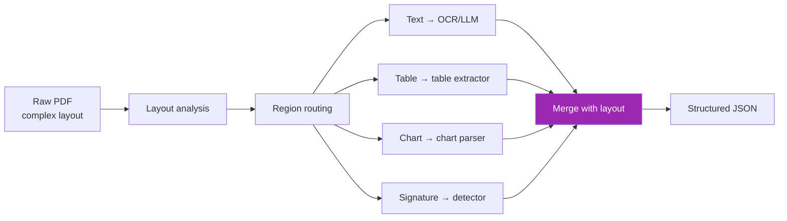
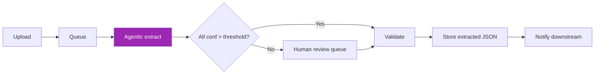

# Day 94: Agentic Document Extraction 📄

<div class="lesson-meta">
⏱️ 4 ชั่วโมง &nbsp;|&nbsp; 📊 Advanced &nbsp;|&nbsp; 📋 Prerequisites: Day 66
</div>

## 🎯 Learning Objectives

<ul class="objectives">
<li>เข้าใจ "agentic" extraction (vs OCR/LLM-only)</li>
<li>ใช้ LandingAI Agentic Doc Extraction</li>
<li>Build hybrid pipeline (preprocess + LLM)</li>
</ul>

---

## 1. ทำไม "Agentic" Document Extraction



→ Multi-step pipeline orchestrated by agents — each region uses best tool

ต่างจาก:
- **Plain OCR**: text blob, layout lost
- **Plain LLM vision**: high cost, may hallucinate exact numbers

---

## 2. LandingAI Agentic Doc Extraction

```bash
pip install agentic-doc
```

```python
from agentic_doc.parse import parse_documents

# Parse PDF, images, mixed
results = parse_documents(
    documents=["invoice.pdf", "receipt.jpg"],
    api_key=LANDINGAI_KEY  # set or env var
)

for r in results:
    print(r.markdown)        # readable summary
    print(r.chunks)          # structured chunks with bounding boxes
    print(r.json)            # full extraction
```

Returns:
- **Markdown** — human-readable
- **Chunks** — each with bounding box, type (text/table/figure)
- **JSON** — structured data

---

## 3. Use Cases

| Document | Why agentic |
|---------|-------------|
| Invoices | Mixed text + tables + totals + signatures |
| Insurance forms | Forms + checkboxes + handwriting |
| Lab reports | Numbers + units + ranges + figures |
| Contracts | Long, nested clauses, signatures, dates |
| Bank statements | Tables that span pages |
| Research papers | Equations + figures + citations |

---

## 4. Claude-Powered DIY Pipeline

If you want to roll your own:

```python
from anthropic import Anthropic
import base64
from pydantic import BaseModel

client = Anthropic()

class Invoice(BaseModel):
    invoice_number: str
    vendor: str
    date: str
    line_items: list[dict]
    subtotal: float
    tax: float
    total: float

def extract_invoice(pdf_path):
    with open(pdf_path, "rb") as f:
        data = base64.standard_b64encode(f.read()).decode()
    
    resp = client.messages.create(
        model="claude-sonnet-4-6",
        max_tokens=2000,
        tools=[{
            "name": "save_invoice",
            "description": "Save extracted invoice fields",
            "input_schema": Invoice.model_json_schema()
        }],
        tool_choice={"type": "tool", "name": "save_invoice"},
        messages=[{
            "role": "user",
            "content": [
                {"type": "document", "source": {"type": "base64", "media_type": "application/pdf", "data": data}},
                {"type": "text", "text": "Extract invoice. Preserve exact amounts. Skip ads/promos."}
            ]
        }]
    )
    
    for block in resp.content:
        if block.type == "tool_use":
            return Invoice(**block.input)
```

---

## 5. Hybrid Pipeline (Best of Both)

```python
def hybrid_extract(pdf):
    # Step 1: Agentic extraction (structure + layout)
    agent_result = parse_documents([pdf])[0]
    
    # Step 2: Per-region refinement with Claude
    refined = {}
    for chunk in agent_result.chunks:
        if chunk.type == "table" and chunk.confidence < 0.85:
            # Re-extract uncertain tables with Claude vision
            refined[chunk.id] = claude_refine_table(chunk.image_b64)
        else:
            refined[chunk.id] = chunk
    
    # Step 3: Validation
    validated = validate_with_business_rules(refined)
    
    return validated
```

---

## 6. Confidence Scoring

```python
def extract_with_confidence(pdf):
    result = parse_documents([pdf])[0]
    
    output = {
        "data": result.json,
        "confidence": {},
        "needs_review": []
    }
    
    for chunk in result.chunks:
        output["confidence"][chunk.id] = chunk.confidence
        if chunk.confidence < 0.7:
            output["needs_review"].append({
                "chunk_id": chunk.id,
                "type": chunk.type,
                "bbox": chunk.bbox,
                "extracted": chunk.text
            })
    
    return output
```

→ Route low-confidence chunks to human review

---

## 7. Production Pipeline



```python
from celery import Celery

app = Celery("doc_extract")

@app.task
def extract_doc(doc_id, file_path):
    result = parse_documents([file_path])[0]
    
    db.update_doc_status(doc_id, "extracted")
    
    # Low confidence → route to humans
    low_conf = [c for c in result.chunks if c.confidence < 0.7]
    if low_conf:
        create_review_task(doc_id, low_conf)
    
    return result.json
```

---

## 8. Validation Rules

```python
def validate_invoice(invoice: Invoice):
    errors = []
    
    # Math check
    computed = sum(item["total"] for item in invoice.line_items)
    if abs(computed - invoice.subtotal) > 0.01:
        errors.append(f"Subtotal mismatch: {computed} != {invoice.subtotal}")
    
    # Tax check (Thailand VAT 7%)
    expected_tax = round(invoice.subtotal * 0.07, 2)
    if abs(invoice.tax - expected_tax) > 0.05:
        errors.append(f"Tax unusual: {invoice.tax} vs {expected_tax}")
    
    # Date check
    if not is_valid_date(invoice.date):
        errors.append(f"Invalid date: {invoice.date}")
    
    return errors
```

→ Catch extraction errors before storing

---

## 9. Cost vs Accuracy

| Approach | Cost/page | Accuracy | Best for |
|----------|-----------|----------|----------|
| pypdf | $0 | 60-70% (text only) | Born-digital simple |
| Tesseract OCR | ~$0 | 70-85% | Self-host, simple |
| Claude vision | ~$0.05 | 90-95% | Mixed, low volume |
| LandingAI Agentic | ~$0.10 | 95-99% | Complex, structured |
| Hybrid + human review | ~$0.20 | 99%+ | Compliance-critical |

→ Don't over-engineer simple cases

---

## 🛠️ Hands-on Exercise

!!! example "Exercise 1: LandingAI"
    Sign up + parse 5 sample invoices → review JSON output

!!! example "Exercise 2: Pydantic Extract"
    Build Pydantic invoice extractor with Claude → run on same 5 → compare

!!! example "Exercise 3: Validation"
    Add business rule validation → catch 3 deliberately-bad documents

---

## ✅ Self-Check Quiz

<div class="quiz">

**Q1:** Agentic extraction ดีกว่า LLM vision เพียวเมื่อ?

??? success "ดูคำตอบ"
    - Layout-heavy docs (forms, tables crossing pages)
    - Mix of regions ที่ต้อง specialized tools
    - High accuracy needs (compliance)
    - Cost matters at scale (specialized < vision cost on long docs)

**Q2:** ทำไม validation สำคัญ?

??? success "ดูคำตอบ"
    - Catches hallucinated/wrong numbers
    - Business rules > LLM common sense
    - Prevents downstream issues (wrong payment, wrong dosage)
    - Cheap insurance vs incident cost

</div>

---

## 🔍 Cross-check & References

- 📘 [LandingAI Agentic Doc Extraction](https://va.landing.ai/agentic-document-extraction)
- 📦 [agentic-doc Python lib](https://github.com/landing-ai/agentic-doc)
- 📘 [Claude PDF Support](https://docs.claude.com/en/docs/build-with-claude/pdf-support)
- 📺 [Document Analysis (DLAI)](https://www.deeplearning.ai/short-courses/document-analysis-with-llamaindex)

[ต่อไป → Day 95: Tables & Forms :material-arrow-right:](day-95.md){ .md-button .md-button--primary }
