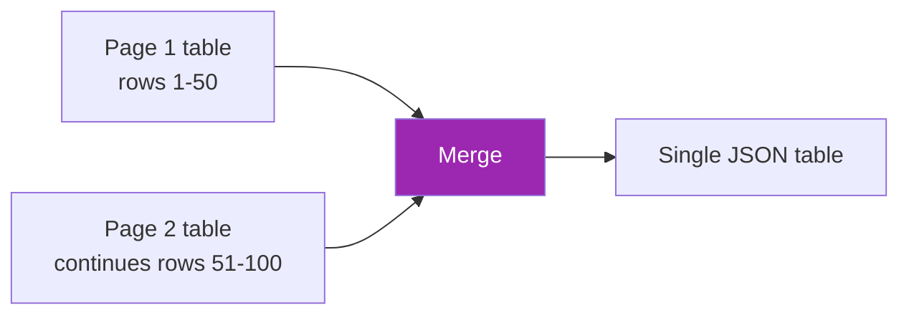

# Day 95: Tables, Forms, Key-Value 📋

<div class="lesson-meta">
⏱️ 3 ชั่วโมง &nbsp;|&nbsp; 📊 Advanced &nbsp;|&nbsp; 📋 Prerequisites: Day 94
</div>

## 🎯 Learning Objectives

<ul class="objectives">
<li>Extract tables (spanning pages, merged cells)</li>
<li>Process forms (checkboxes, signatures)</li>
<li>Key-value extraction (labels + values)</li>
</ul>

---

## 1. Tables — Common Challenges

- Multi-page tables
- Merged cells
- Nested headers
- Rotated text
- No visible borders
- Numeric values with currency / units



---

## 2. Claude Vision Table Extraction

```python
TABLE_PROMPT = """Extract ALL tables in this document.

For each table, output:
{
  "title": "...",
  "headers": ["col1", "col2", ...],
  "rows": [[v1, v2, ...], ...],
  "page_numbers": [1, 2],
  "notes": "any caveats"
}

Rules:
- If table continues on next page, merge them
- Preserve currency symbols and units in values
- Use null for empty cells (don't skip)
- For merged header cells, repeat parent header
- Output JSON array of all tables
"""

resp = client.messages.create(
    model="claude-sonnet-4-6",
    max_tokens=4000,
    messages=[{
        "role": "user",
        "content": [
            {"type": "document", "source": {...}},
            {"type": "text", "text": TABLE_PROMPT}
        ]
    }]
)
```

---

## 3. Structured Output with Pydantic

```python
from pydantic import BaseModel
from typing import Optional

class TableCell(BaseModel):
    value: Optional[str]
    raw_text: Optional[str]

class Table(BaseModel):
    title: str
    headers: list[str]
    rows: list[list[Optional[str]]]
    page_numbers: list[int]
    notes: Optional[str] = None

class DocumentExtract(BaseModel):
    tables: list[Table]

tools = [{
    "name": "extract_tables",
    "description": "Extract all tables",
    "input_schema": DocumentExtract.model_json_schema()
}]
```

---

## 4. Forms — Checkboxes & Selections

```python
FORM_PROMPT = """Extract all form fields. For each field:
- label
- type (text, checkbox, radio, signature, date)
- value (transcribed text OR true/false for checkboxes)
- confidence (high/medium/low)
- bounding_box (if visible)

Special handling:
- Checkboxes: extract checked/unchecked state
- Radio groups: identify which option is selected
- Signatures: note presence, not transcription
- Initials: same as signature

Output JSON: {"fields": [...]}
"""
```

### Checkbox detection

Claude can identify ☑ ☐ ☒ but tricky on:
- Custom symbols
- Faint marks
- Stamps overlap

→ Validate critical checkboxes manually for compliance docs

---

## 5. Key-Value Extraction

```python
KV_PROMPT = """Extract all labeled key-value pairs.

Example: "Order #: ABC123" → {"key": "Order #", "value": "ABC123"}

For each pair:
{
  "key": "label name",
  "value": "extracted value",
  "value_type": "string|number|date|email|phone|currency",
  "confidence": 0.0-1.0,
  "section": "section name if visible"
}

Skip body text — only extract labeled fields.
"""
```

For consistent enterprise docs, prefer schema-driven:

```python
class CustomerForm(BaseModel):
    customer_name: str
    customer_id: Optional[str]
    email: str
    phone: str
    address_line1: str
    address_line2: Optional[str]
    city: str
    state: Optional[str]
    postal_code: str
    country: str
```

→ Field-by-field extraction more reliable than open KV

---

## 6. Handwriting

```python
HANDWRITING_PROMPT = """This document contains handwritten text.

For each handwritten field:
{
  "field_name": "...",
  "transcription": "best guess",
  "confidence": 0.0-1.0,
  "alternatives": ["alt1", "alt2"],  // if low confidence
  "notes": "ambiguous / illegible / etc"
}

Be honest about uncertainty. Don't guess for illegible text — mark it.
"""
```

→ Always include confidence + alternatives for handwriting; route low confidence to human

---

## 7. Validation Pipeline

```python
def validate_form(form: CustomerForm):
    issues = []
    
    # Email format
    if "@" not in form.email:
        issues.append({"field": "email", "issue": "invalid format"})
    
    # Phone format (Thailand)
    if not re.match(r"^(\+66|0)\d{8,9}$", form.phone.replace("-", "").replace(" ", "")):
        issues.append({"field": "phone", "issue": "invalid TH phone"})
    
    # Postal code (5 digits TH)
    if not re.match(r"^\d{5}$", form.postal_code):
        issues.append({"field": "postal_code", "issue": "invalid TH postal code"})
    
    # Cross-field checks
    if form.country == "Thailand" and not form.postal_code:
        issues.append({"field": "postal_code", "issue": "required for Thailand"})
    
    return issues
```

---

## 8. Page-Spanning Table Handling

```python
def extract_and_merge_tables(pdf_pages):
    all_tables = []
    
    for i, page_imgs in enumerate(pdf_pages):
        page_tables = extract_tables_one_page(page_imgs)
        for t in page_tables:
            t["page"] = i + 1
            all_tables.append(t)
    
    # Merge: if next page table has no header + same column count
    merged = []
    i = 0
    while i < len(all_tables):
        current = all_tables[i]
        j = i + 1
        while j < len(all_tables):
            nxt = all_tables[j]
            # Heuristic: similar column count, no fresh header
            if len(nxt["headers"]) == len(current["headers"]) and nxt.get("is_continuation"):
                current["rows"].extend(nxt["rows"])
                current["page_numbers"].extend(nxt["page_numbers"])
                j += 1
            else:
                break
        merged.append(current)
        i = j
    
    return merged
```

---

## 9. Choosing Right Tool

| Doc type | Recommended |
|---------|-------------|
| Simple invoice | Claude vision + Pydantic |
| Complex multi-page contract | Agentic Doc Extract (LandingAI) |
| Form with checkboxes | Claude vision (good with simple shapes) |
| Heavy handwriting | Specialized OCR + Claude validate |
| Numerical financial | Agentic + math validation |
| Scientific paper | Claude vision + reference extractor |

---

## 🛠️ Hands-on Exercise

!!! example "Exercise 1: Table Extraction"
    Take a multi-page PDF with tables → extract → verify accuracy

!!! example "Exercise 2: Schema-Driven Form"
    Define Pydantic schema → extract from 5 form docs → validate

!!! example "Exercise 3: Handwriting"
    Try handwritten note → confidence + alternatives output

---

## ✅ Self-Check Quiz

<div class="quiz">

**Q1:** ทำไม schema-driven KV ดีกว่า open extraction?

??? success "ดูคำตอบ"
    - Predictable structure → downstream code reliable
    - Forces missing-field handling
    - Easier validation
    - Better for production pipelines

**Q2:** Handwriting extraction — strategy?

??? success "ดูคำตอบ"
    - Always return confidence + alternatives
    - Route low-confidence to human queue
    - For critical fields (legal signature) — visual verify, don't transcribe

</div>

---

## 🔍 Cross-check & References

- 📘 [Claude vision capabilities](https://docs.claude.com/en/docs/build-with-claude/vision)
- 📘 [LandingAI tables](https://va.landing.ai/agentic-document-extraction)

[ต่อไป → Day 96: Charts & Multi-modal :material-arrow-right:](day-96.md){ .md-button .md-button--primary }
