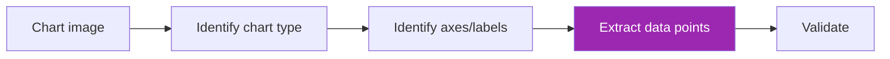
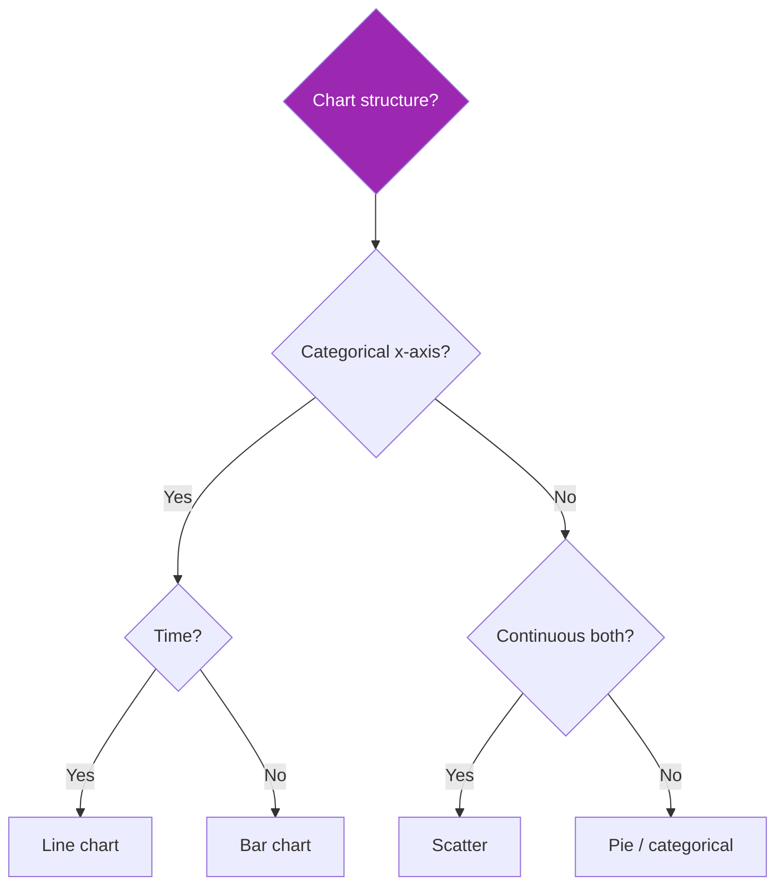

# Day 96: Charts, Diagrams & Multi-Modal 📊

<div class="lesson-meta">
⏱️ 3 ชั่วโมง &nbsp;|&nbsp; 📊 Advanced &nbsp;|&nbsp; 📋 Prerequisites: Day 95
</div>

## 🎯 Learning Objectives

<ul class="objectives">
<li>Extract data from charts</li>
<li>Interpret architecture/flow diagrams</li>
<li>Multi-document cross-referencing</li>
</ul>

---

## 1. Chart Extraction Patterns



### Prompt

```python
CHART_PROMPT = """For each chart in the document:

1. Type: bar / line / pie / scatter / area / stacked / heatmap / other
2. Title (if present)
3. Axis labels (X and Y) with units
4. Legend / categories
5. Data extraction:
   - For bar/line: rough values for each data point
   - For pie: percentages or values per slice
   - For scatter: representative points
6. Trend/insight in 1 sentence

Caveats:
- For small/cramped charts, estimate (note as estimate)
- If chart shows ranges/error bars, capture them
- For dual-axis, capture both

Output JSON: {"charts": [...]}
"""
```

---

## 2. Chart Type Decision Tree



→ Helps Claude classify correctly

---

## 3. Numerical Precision Caveat

Claude vision is good at:
- Chart type identification ✅✅
- Trend / shape ✅✅
- Approximate values ✅
- **Exact values without grid** ⚠️

For exact numbers:
- Add explicit instructions to **estimate ranges**
- Cross-validate against accompanying text
- For ground truth, use specialized chart parsers (e.g., DePlot, MatCha)

```python
CHART_EXACT_PROMPT = """Read the chart values precisely.

For each data point:
- If gridlines visible: use them to read values
- If not: provide range estimate (e.g., "70-75")
- If number labels printed on bars: use those exactly

Do NOT invent precise values. If uncertain, say so.
"""
```

---

## 4. Diagram Interpretation

```python
DIAGRAM_PROMPT = """This document contains technical diagrams.

For each diagram:
1. Type: architecture / sequence / class / flowchart / network / mind map / other
2. Title
3. Nodes/components (list with descriptions)
4. Edges/connections (list with direction + label if any)
5. Layers/groups (if visible)
6. Overall purpose in 2-3 sentences

Output as JSON. For flowcharts, include the sequence of steps.
"""
```

### Use case: extract architecture from PRD

```python
def extract_architecture(prd_pdf):
    result = client.messages.create(
        model="claude-opus-4-7",
        max_tokens=3000,
        messages=[{
            "role": "user",
            "content": [
                {"type": "document", "source": prd_pdf},
                {"type": "text", "text": DIAGRAM_PROMPT + "\n\nThen output as Mermaid diagram code."}
            ]
        }]
    )
    return result.content[0].text  # contains mermaid code block
```

→ Useful: convert legacy doc diagrams → text-versioned Mermaid

---

## 5. Cross-Modal Reasoning

Question requires combining: text + table + chart

```python
QA_PROMPT = """Answer the question using ALL relevant parts of the document:
- Text body
- Tables (if numbers needed)
- Charts (for trends)
- Diagrams (for relationships)

Cite which part of the document supports each claim.

Question: {question}
"""

# Send full PDF
resp = client.messages.create(
    model="claude-sonnet-4-6",
    max_tokens=2000,
    messages=[{
        "role": "user",
        "content": [
            {"type": "document", "source": pdf},
            {"type": "text", "text": QA_PROMPT.format(question="Was revenue higher in Q3 than Q2, and what's the reason from the report?")}
        ]
    }]
)
```

---

## 6. Multi-Document Cross-Referencing

```python
def compare_documents(doc_paths, query):
    docs_content = []
    for i, path in enumerate(doc_paths):
        with open(path, "rb") as f:
            docs_content.append({
                "type": "document",
                "source": {"type": "base64", "media_type": "application/pdf",
                          "data": base64.b64encode(f.read()).decode()},
                "title": f"Doc {i+1}: {os.path.basename(path)}"
            })
        docs_content.append({"type": "text", "text": f"\n--- Document {i+1} above ---\n"})
    
    docs_content.append({
        "type": "text",
        "text": f"Compare these {len(doc_paths)} documents. {query}\n\nCite specific document numbers."
    })
    
    resp = client.messages.create(
        model="claude-sonnet-4-6",
        max_tokens=3000,
        messages=[{"role": "user", "content": docs_content}]
    )
    return resp.content[0].text
```

Use cases:
- Compare 3 vendor proposals
- Diff 2 versions of contract
- Aggregate 5 quarterly reports

⚠️ Watch context limits — large multi-doc may need RAG instead

---

## 7. Layout-Aware OCR Combo

For dense scientific or legal docs:

```python
# Use Mathpix / Nougat for math
# Use specialized for citations
# Use Claude for synthesis

def process_research_paper(pdf):
    # Layer 1: Mathpix for equations
    equations = mathpix_extract(pdf)
    
    # Layer 2: Reference parsing
    references = grobid_extract_refs(pdf)
    
    # Layer 3: Claude for narrative + figures
    narrative = claude_summarize(pdf)
    
    return {
        "summary": narrative,
        "equations": equations,
        "references": references
    }
```

---

## 8. Common Failure Modes

| Failure | Mitigation |
|---------|-----------|
| Wrong chart values | Use grids/labels; estimate ranges |
| Misread table column alignment | Test on representative samples |
| Missing parts of merged tables | Validate with column count |
| Hallucinated text in fuzzy areas | Mark low-confidence regions |
| Wrong diagram direction (arrow) | Provide reference examples in prompt |
| Multi-page context overflow | Chunk + RAG instead |

---

## 9. Validation with External Data

```python
def validate_extracted(extracted_data, ground_truth_source):
    """Cross-check extracted numbers against authoritative source"""
    issues = []
    
    for key, value in extracted_data.items():
        if key in ground_truth_source:
            expected = ground_truth_source[key]
            if abs(value - expected) / max(abs(expected), 1) > 0.05:  # 5% tolerance
                issues.append({
                    "field": key,
                    "extracted": value,
                    "expected": expected,
                    "diff_pct": (value - expected) / expected * 100
                })
    return issues
```

→ For SEC filings, government forms, audited reports — always validate against source

---

## 🛠️ Hands-on Exercise

!!! example "Exercise 1: Chart Extract"
    PDF with 5 charts → extract data → cross-check against text mentions

!!! example "Exercise 2: Diagram → Mermaid"
    Convert architecture diagram in PDF → Mermaid code → render → compare

!!! example "Exercise 3: Multi-doc Compare"
    Compare 3 vendor docs on same criteria

---

## ✅ Self-Check Quiz

<div class="quiz">

**Q1:** ทำไมเลข chart ต้องเป็น "range estimate"?

??? success "ดูคำตอบ"
    Claude vision อ่านพิกัด pixel แล้วประมาณ — gridlines/labels ช่วยให้แม่นยำขึ้น แต่บางทีไม่มี ก็ต้อง estimate ขอบเขต ตรงไปตรงมาดีกว่า invent ตัวเลข

**Q2:** Multi-doc context overflow — แก้ยังไง?

??? success "ดูคำตอบ"
    - Chunk + RAG
    - Summarize per doc → compare summaries
    - Specific sections only (not full docs)
    - Multi-step: extract → analyze → synthesize (each step shorter context)

</div>

---

## 🔍 Cross-check & References

- 📘 [Claude Vision Docs](https://docs.claude.com/en/docs/build-with-claude/vision)
- 📄 [DePlot paper](https://arxiv.org/abs/2212.10505)
- 📘 [Mathpix API](https://docs.mathpix.com/)

[ต่อไป → Day 97: Mini-project :material-arrow-right:](day-97.md){ .md-button .md-button--primary }
